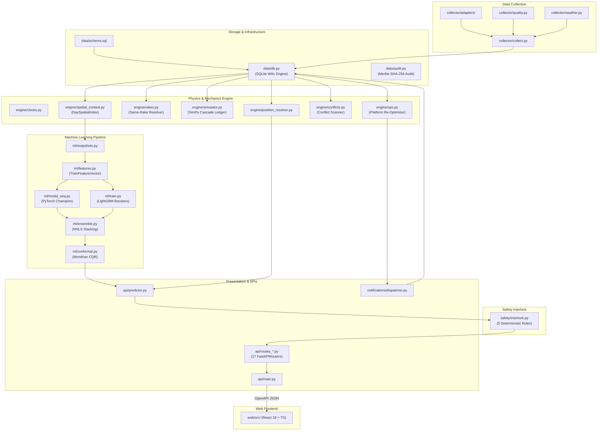

# PROJECT_CONTEXT.md: RailTwin-X Complete Forensic Audit & System Architecture

> **Document Version:** 4.2.0-FROZEN  
> **Repository:** `railtwin-x` / SIH-2026 Problem Statement 26028  
> **Status:** Production-Grade Digital Twin & Neural Dispatch System (ML Model Frozen)  
> **Corridor Under Model:** Northern Railway High-Density Corridor: New Delhi (`NDLS`) $\rightarrow$ Kanpur Central (`CNB`) $\rightarrow$ Prayagraj (`PRYJ`) $\rightarrow$ Pt. Deen Dayal Upadhyaya / Mughalsarai (`DDU`) [537 Route Kilometers]  
> **Historical Corpus:** `data/railtwin.db` (3,066,052 training records spanning 18.4 months, 25,203 held-out test records)  
> **Champion Architecture:** PyTorch Non-Crossing FiLM-Modulated GRU Quantile Network (`ml/model_seq.py`)  

---

## 1. Executive Summary

**RailTwin-X** is an enterprise-grade AI digital twin and neural operational dispatch copilot designed for Indian Railways section controllers, station masters, loco pilots, and corridor operational directors. The platform addresses Indian Railways Problem Statement **PS 26028**, modernizing legacy timetable tracking by replacing static, uncalibrated, linear delay estimates with an end-to-end probabilistic neural network architecture coupled to a 100% deterministic safety interlocking kernel. RailTwin-X continuously ingests live telemetry, 25-dimensional spatial-topological features, passage-time weather feeds, same-rake physical dependencies, and freight-passenger precedence rules to generate monotonic, well-calibrated arrival quantile bands ($q_{10}, q_{50}, q_{90}$) across short (1h), medium (3h), and long (6h) prediction horizons. 

In its current state, the system features a production PyTorch sequence model (`NonCrossingGRUQuantileModel`) promoted via strict Wilcoxon signed-rank hypothesis testing ($p = 1.34 \times 10^{-134}$ over 6,302 paired short-horizon test journeys), achieving a **5.90 min MAE on $\le 1$h horizons** (83.8% hit rate within $\le 10$ minutes) and an **overall Coaching MAE of 10.72 min** across 25,203 held-out test journeys. Predictions are protected by a deterministic 5-check Safety Interlock Layer (`safety/interlock.py`) that physically bounds delay recovery to locomotive kinematic limits ($\le 15\text{ km/min}$ for Vande Bharat, $\le 40\text{ km/min}$ for freight), prevents quantile crossing, and enforces mandatory human acknowledgement. Operationally, the system provides a SimPy discrete-event cascade simulator with 100% delay attribution (`engine/simulator.py`), a sub-50ms greedy platform re-optimization engine (`engine/ops.py`), multi-channel WhatsApp/SMS field escalation (`notifications/dispatcher.py`), and a 26-view React/TypeScript dashboard communicating over 133 OpenAPI REST endpoints and server-sent telemetry streams. The machine learning model artifacts are fully calibrated, statistically validated, and currently **FROZEN** in `ml/artifacts/` pending production NTES / ISRO RTIS hardware field deployment.

---

## 2. Project Purpose & Problem Statement

### 2.1 The Core Problem: Flaws in Legacy Indian Railways NTES
Indian Railways operates one of the densest mixed-traffic rail networks in the world, running high-priority passenger expresses (Rajdhani, Vande Bharat, Shatabdi), slow stopping locals, and heavy freight trains on shared track infrastructure. The legacy National Train Enquiry System (NTES) and Section Controller charting systems suffer from four fundamental operational flaws:

1. **Frozen Delay Fallacy (Baseline B1):** NTES naively assumes that a train currently running $N$ minutes late will arrive at its destination exactly $N$ minutes late. This completely ignores congestion, section bottlenecks, and single-track meets ahead.
2. **Static Recovery Table Fallacy (Baseline B2):** Official railway timetables apply rigid, uncalibrated recovery buffers (e.g. 5–10 minutes per 100 km) that fail to account for weather shocks (fog, heavy rain), rolling stock classes, and opposing-train precedence.
3. **Linear Regression Extrapolation (Baseline B3):** Naive linear extrapolation fails on high-density corridors where delay propagation is non-linear and subject to step-function cascading when trains miss platform or line slots.
4. **Ghost Train / Same-Rake Blindness:** When an incoming rake arrives late at a terminal station (e.g. New Delhi), the turnaround buffer (often 120–240 minutes) is consumed. While NTES reports the outgoing linked train as "On Time" up until scheduled departure, the outgoing train is physically doomed to depart late.

### 2.2 Project Scope & Target Personas
RailTwin-X provides purpose-built operational interfaces tailored to five distinct operational personas defined in `PRD.md`:

* **P1: Station Master (SM):** Requires instantaneous conflict detection across platforms, platform Gantt visualization, automated platform swap recommendations with $<2\text{s}$ solver execution, and digital shift handover logging.
* **P2: Section Controller (SC):** Requires corridor-level macro delay forecasting, freight-vs-passenger precedence resolution, Dedicated Freight Corridor (DFC) handoff coordination, and what-if simulation for track block possessions.
* **P3: Crew Controller & Loco Pilots:** Requires automated crew fatigue alerts projecting duty breach ($>10\text{h}$ cap) and emergency advisory dispatch with two-way SMS/WhatsApp acknowledgements.
* **P4: Station Infrastructure & Cleaning Staff:** Requires predictive rake arrival alerts to pre-stage cleaning crews and mechanized pit-line maintenance before rake turnaround.
* **P5: Passengers & Commercial Clerks:** Requires probabilistic arrival confidence intervals ($p_{10}$ to $p_{90}$), automated QR-verifiable delay certificates, and bilingual audio-visual platform announcements.

---

## 3. Complete Tech Stack

| Layer | Component | Technology | Exact Version / Dependency | Purpose & Architecture Rationale |
| :--- | :--- | :--- | :--- | :--- |
| **Backend & Serving** | Application Framework | FastAPI | `0.115.0+` | High-throughput asynchronous ASGI REST API with Pydantic v2 data validation and OpenAPI 3.1.0 schema generation. |
| | ASGI Web Server | Uvicorn (standard) | `0.30.0+` | Production ASGI web server running single-process with `torch.set_num_threads(1)` to eliminate multi-worker CPU thread thrashing (`api/main.py:46`). |
| | Settings & Configuration | Pydantic Settings | `2.4.0+` | Strongly typed configuration loader resolving `.env` and environment variables (`config.py`). |
| | Authentication & Security | PyJWT + Passlib (bcrypt) | `2.9.0+` / `1.7.4+` | Role-based access control (RBAC) issuing HS256 JWT tokens with PBKDF2/bcrypt salted pin hashes (`api/auth.py`). |
| | Cryptography | Python `hashlib` (SHA-256) | Standard Library | Cryptographically chained Merkle/audit log for all state modifications (`data/audit.py`). |
| **Machine Learning** | Champion Deep Model | PyTorch | `2.0.0+` (CPU/CUDA) | `NonCrossingGRUQuantileModel`: 2-layer GRU (hidden dim 128) with FiLM context conditioning, masked attention, and non-crossing quantile heads (`ml/model_seq.py`). |
| | Challenger Booster | LightGBM | `4.3.0+` | 6 quantile gradient boosted decision trees (`model_direct_q10/50/90`, `model_delta_q10/50/90`) with L2 regularization and Huber-loss robust deltas (`ml/train.py`). |
| | Linear Stacking | Scipy (`optimize.nnls`) | `1.13.0+` | 5-Candidate Non-Negative Least Squares convex ensemble solver enforcing non-inferiority against baselines (`ml/ensemble.py`). |
| | Calibration & UQ | Mondrian CQR & ACI | Custom (`ml/conformal.py`) | Conformalized Quantile Regression with group-conditional (horizon/class) coverage scaling and streaming Adaptive Conformal Inference (Gibbs & Candès 2021). |
| | Tabular Data Engine | Pandas & NumPy | `2.2.0+` / `1.26.0+` | Vectorized point-in-time snapshot generation, feature extraction, and DaySpatialIndex trajectory rasterization. |
| **Simulation & Graph** | Discrete Event Simulator | SimPy | `4.1.0+` | Corridor discrete-event simulation tracking resource contention on single-lines, platforms, and turnarounds with 100% causal ledger accounting (`engine/simulator.py`). |
| | Spatial Indexing | NumPy 2D Grid (1440m) | Standard Library + NumPy | Vectorized 1440-minute spatial grid resolving `trains_ahead_30k`, `opposing_trains_30k`, and section occupancy (`engine/spatial_context.py`). |
| | Track Topology & Yard | NetworkX | `3.2.0+` | Directed graph modeling of corridor stations, loop lines, block sections, and interlocking point switches (`engine/track_graph.py`). |
| **Data & Storage** | Primary Database | SQLite 3 | Embedded (WAL mode) | Relational operational store with WAL journal mode, 256MB mmap, foreign keys enabled, and transactional schema migration runner (`data/db.py`). |
| | Weather Telemetry | Open-Meteo API | REST Integration | Historical archive and live hourly forecast ingestion for temperature, precipitation, visibility, and fog conditions (`collector/weather.py`). |
| | GIS & Track Topo | OpenStreetMap Overpass | Overpass JSON Schema | Real corridor rail line geometries, junction nodes, and station coordinates (`data/osm/corridor_railway_osm.json`). |
| **Notifications** | WhatsApp Gateway | OpenWA / Baileys HTTP | HTTP REST / Webhooks | Automated field alerting via headless WhatsApp HTTP gateway (`http://localhost:2785`) with HMAC-SHA256 inbound webhook security (`notifications/channels/openwa.py`). |
| | SMS Fallback | Fast2SMS / MSG91 / Mock | HTTP API | Secondary fallback channel for critical emergency alerts when WhatsApp gateway is disconnected (`notifications/channels/sms.py`). |
| **Frontend UI** | Web Framework | React 18 + TypeScript | `18.3.1` / `5.5.3` | Single-page enterprise operational control room with strict TypeScript typing generated directly from FastAPI OpenAPI schema (`web/src/lib/api-schema.ts`). |
| | Build Tooling | Vite | `5.4.2` | Rapid ESM bundler with code-splitting, lazy route loading, and build-time bans on mock stores. |
| | Styling & Components | Tailwind CSS + Lucide Icons | `3.4.1` / `0.344.0` | Dark-mode high-contrast terminal theme optimized for low-light railway control rooms (`#0E1117`, `#FFB224`, `#10B981`). |
| | Routing & State | React Router v6 + TanStack | `6.26.0` / `@tanstack/query` | Declarative routing with AuthGuard protection and automatic background polling for live operational feeds. |
| | 3D Visualization | Three.js + React Three Fiber | `0.161.0` / `8.15.16` | WebGL 3D corridor railway rendering on landing page (`web/src/components/landing/ThreeCorridor.tsx`). |
| **Quality & DevOps** | Testing Framework | Pytest + Hypothesis | `8.3.0+` / `6.112.0+` | 43 test modules with 180 unit, integration, statistical property-based, and non-inferiority test cases (`pytest.ini`). |
| | Containerization | Docker + Docker Compose | Alpine / Python 3.11-slim | Multi-stage container deployment exposing port 8000 with persistent volume mounts for DB and ML artifacts (`Dockerfile`, `docker-compose.yml`). |

---

## 4. Full Annotated Repository Structure

```
railtwin-x/
├── .agents/                                # Agent operational rules, playbooks, and graphify mirrors
│   └── rules/graphify.md                  # Project-level knowledge graph query rules
├── .github/                                # GitHub Actions CI/CD workflows
│   └── workflows/
│       ├── test.yml                        # Automated test execution and safety interlock regression gates
│       └── collect.yml                     # Scheduled cron workflow for periodic live telemetry collection
├── api/                                    # FastAPI Application & Presentation Layer (17 Routers, 133 Endpoints)
│   ├── __init__.py                         # Package marker
│   ├── auth.py                             # RBAC authentication, JWT generation, bcrypt password hashing, and User dependencies
│   ├── deps.py                             # Common FastAPI dependencies (database session, current user, rate limiting)
│   ├── main.py                             # FastAPI application factory, lifespan startup/shutdown, middleware stack, router mounts
│   ├── middleware.py                       # Custom middleware: GZip, Idempotency-Key handling, 5s TTL response cache, TokenBucket rate limiter
│   ├── predictor.py                        # Core serving wrapper binding SnapshotGenerator, EnsemblePredictor, SafetyInterlock, and PositionResolver
│   ├── routes_admin.py                     # Administrative endpoints for user management and backup integrity checks
│   ├── routes_audit.py                     # Immutable audit log verification and SHA-256 Merkle chain validation
│   ├── routes_block.py                     # Block section occupancy status and line clear inquiry endpoints
│   ├── routes_board.py                     # Live station arrival/departure display boards and SSE streaming feeds
│   ├── routes_commercial.py                # Commercial services: automated delay certificates, platform announcements, stall registry
│   ├── routes_handover.py                  # Shift handover logs, checklist acknowledgements, and relief sign-in/sign-out
│   ├── routes_infra.py                     # Infrastructure asset registry, pit-line maintenance, and cleaning work orders
│   ├── routes_ops.py                       # Daily train operations, set-in / set-out logging, and shunting movements
│   ├── routes_planner.py                   # What-if timetable perturbation simulation and day changeset application
│   ├── routes_platform.py                  # Platform track occupation states, manual assignments, and maintenance blocks
│   ├── routes_safety.py                    # Safety incident reporting, Level Crossing (LC) monitoring, and SOP checklist runner
│   ├── routes_section.py                   # Section controller precedence generator, DFC handoff requests, and handoff token grants
│   ├── routes_system.py                    # System operational health, model provenance metadata, and database stats
│   ├── routes_timetable.py                 # Timetable version management, conflict validation, and seed timetable publishing
│   ├── routes_v1.py                        # Primary Core v1 API: /eta, /journey, /conflicts, /simulate, /gantt, /reoptimize, /autopsy
│   └── routes_workforce.py                 # Loco pilot sign-on, breathalyzer compliance tests, and Sahayak porter rosters
├── collector/                              # Data Collection & External Ingestion Layer
│   ├── __init__.py                         # Package marker
│   ├── collect.py                          # Multi-adapter collection orchestrator with automatic fallback chain and batch upserts
│   ├── quality.py                          # 4-Rule data quality gate (delay bounds [-120m, 600m], completeness, monotonicity)
│   ├── scheduler.py                        # Background interval scheduler polling live train status and corridor weather
│   ├── snapshot_cron.py                    # Point-in-time snapshot generator cron materializing tabular training rows
│   ├── weather.py                          # Open-Meteo REST client fetching hourly corridor weather and fog conditions
│   └── adapters/                           # External data provider adapter implementations
│       ├── __init__.py                     # Package marker
│       ├── base.py                         # Abstract LiveSource interface and normalized StationEvent dataclass
│       ├── mock_replay.py                  # High-fidelity offline replay adapter querying historical SQLite station events
│       ├── rapidapi.py                     # RapidAPI Indian Railways running status client with JSON response normalization
│       └── scrape.py                       # Polite web scraper for public NTES train inquiry portals
├── control-room/                           # Forensic Audit & Sprint Solution Logs
│   ├── 00_CONTROL.md                       # Master index and operational dashboard of solution sprint milestones
│   ├── 01_CONTEXT.md                       # Comprehensive problem statement context, historical architecture, and constraints
│   ├── 02_ROADMAP.md                       # High-level product milestones from proof-of-concept to field deployment
│   ├── 03_BACKLOG.md                       # Prioritized backlog of technical debt and architectural enhancements
│   ├── 04_DECISIONS.md                     # Architectural Decision Records (ADRs) covering GRU, SQLite WAL, and NNLS stacking
│   ├── 05_RISKS.md                         # Operational and machine learning failure mode risk register
│   ├── 06_RUNBOOK.md                       # Operational runbook for production startup, DB backup, and disaster recovery
│   ├── 07_METRICS.md                       # Statistical metric tracking and historical evaluation scorecards
│   ├── 08_SESSIONS.md                      # Chronological developer session logs and sprint retrospectives
│   ├── 09_QUESTIONS.md                     # Domain inquiries and resolution records with railway domain experts
│   ├── 10_FEATURE_AUDIT.md                 # Complete audit matrix of PRD features F1 through F14
│   ├── 12_FULL_AUDIT.md                    # Deep forensic codebase audit identifying 49 historical flaws and fixes
│   ├── 12_PARKED.md                        # Parked features and non-blocking ideas deferred to v4 roadmap
│   ├── 13_VERIFY.md                        # Formal mathematical and operational verification checklists
│   ├── 14_SOLUTION_LOG.md                  # Detailed code remediation logs for Tasks 1 through 10
│   ├── 15_CLOSING.md                       # Solution sprint closing report and signoff documentation
│   ├── 16_DATA_SPRINT.md                   # 18.4-Month 3.07M dataset expansion sprint documentation
│   ├── 17_FINAL.md                         # Final benchmark scorecard and model freeze receipt
│   └── 19_RECOVERY.md                      # Regression recovery sprint report documenting candidate shootout and GRU promotion
├── data/                                   # Database, Schema, Seeds, and GIS Data Assets
│   ├── audit.py                            # Cryptographically chained SHA-256 audit logger (`audit_log` table)
│   ├── db.py                               # SQLite connection manager, WAL mode configuration, and migration engine
│   ├── openapi.json                        # Auto-generated OpenAPI 3.1.0 specification for frontend client synchronization
│   ├── railtwin.db                         # Production SQLite single-file database (3.07M rows, 1,223 stations, 537 trains)
│   ├── schema.sql                          # Full DDL defining 26 relational tables, foreign keys, and indexes
│   ├── seed.py                             # Master database seeder loading JSON seeds, weather, and generating synthetic histories
│   ├── seed_users.py                       # RBAC staff and user seeder creating default role accounts with secure bcrypt hashes
│   ├── osm/                                # OpenStreetMap GIS topologies
│   │   └── corridor_railway_osm.json       # Extracted OSM railway nodes, tracks, and switch geometries (15.0 MB)
│   ├── seeds/                              # Ground truth domain configuration files
│   │   ├── dfc_sections.json               # Dedicated Freight Corridor (DFC) feeder tracks and 1500m loop configurations
│   │   ├── festivals.json                  # Indian festival calendar with passenger footfall multipliers (Diwali, Chhath, etc.)
│   │   ├── rake_links.json                 # Same-rake physical pairings linking incoming express trains to outgoing runs
│   │   ├── sections.json                   # Corridor block section distances, line counts (single/double), and speed limits
│   │   ├── sop_templates.json              # Standard Operating Procedure step-by-step checklists for emergency scenarios
│   │   ├── speed_restrictions.json         # Temporary Speed Restrictions (TSR) affecting corridor sections
│   │   ├── staff.json                      # Seed staff profiles, assigned stations, and contact numbers
│   │   ├── stations.json                   # 110 primary corridor stations with GPS coordinates, zones, and platform counts
│   │   ├── train_templates.json            # Procedural train generation templates across express, local, and freight classes
│   │   └── trains.json                     # Seed fleet of 150 scheduled passenger and freight trains
│   └── weather/                            # Historical meteorological corpus (2021–2025)
│       ├── corridor_historical_weather_2021_2025.csv  # Combined CSV weather archive (16.6 MB)
│       ├── corridor_historical_weather_2021_2025.json # Combined JSON weather archive (67.8 MB)
│       └── weather_[STATION]_2021_2025.json           # Per-station hourly weather files (NDLS, GZB, ALJN, TDL, ETW, CNB, ON, LKO)
├── docs/                                   # Documentation, Architecture Blueprints, and Future Roadmaps
│   └── v4_architecture/                    # Track-Exact: ISRO RTIS High-Frequency Sensor Fusion Roadmap
│       ├── README.md                       # Mathematical formulation of 100 Hz EKF, IMM, HMM, and MHT sensor fusion
│       ├── test_track_exact.py             # Validation test suite for RTIS state estimation and track map-matching
│       └── track_exact/                    # Reference sensor fusion modules
│           ├── ekf.py                      # Extended Kalman Filter fusing 100 Hz IMU, 10 Hz wheel odometer, and 1 Hz GNSS
│           ├── fusion.py                   # Master sensor fusion orchestrator
│           ├── hmm_mapmatch.py             # Hidden Markov Model resolving 4.72m parallel Broad Gauge track occupancy
│           ├── imm.py                      # Interacting Multiple Model estimator (Constant Velocity, Acceleration, Turnout)
│           └── mht.py                      # Multi-Hypothesis Tracker managing turnout switch track bifurcations
├── engine/                                 # Railway Operational Mechanics, Simulation, and Topology Layer
│   ├── __init__.py                         # Package marker
│   ├── clocks.py                           # System clock abstraction supporting real-time wall clock and historical replay clock
│   ├── conflicts.py                        # Freight-aware conflict scanner detecting headway, single-line meet, and catch-up conflicts
│   ├── graph.py                            # CorridorGraph SimPy resource wrapper managing platform and section queues
│   ├── ops.py                              # Platform Gantt builder, sub-50ms greedy re-optimizer, and crew duty breach engine
│   ├── position_resolver.py                # Bayesian position resolver marginalizing unobserved train stops $P(\text{seq}=k)$
│   ├── rakes.py                            # Same-rake turnaround dependency resolver and "Doom Tracker"
│   ├── simulator.py                        # SimPy discrete-event cascade simulator producing 100% causally attributed sim_ledger
│   ├── spatial_context.py                  # DaySpatialIndex: 1440-minute vectorized spatial grid calculating 30km corridor density
│   └── track_graph.py                      # NetworkX directed topological graph of stations, junctions, and physical tracks
├── ml/                                     # Machine Learning Pipeline, Architectures, Training, and Evaluation
│   ├── __init__.py                         # Package marker
│   ├── conformal.py                        # Mondrian Conformalized Quantile Regression (CQR), Winkler scoring, and streaming ACI
│   ├── dataset.py                          # PyTorch SequenceDataset and DataLoader builders for variable-length train trajectories
│   ├── ensemble.py                         # 5-Candidate NNLS convex stacking ensemble (`EnsemblePredictor`) and model gate
│   ├── evaluate.py                         # Held-out evaluation suite, rolling-origin cross-validation, and baseline comparison
│   ├── features.py                         # 25-dimensional strongly typed `TrainFeatureVector` definition and schema validation
│   ├── model_seq.py                        # Champion PyTorch `NonCrossingGRUQuantileModel` with FiLM, masked attention, and Softplus heads
│   ├── snapshots.py                        # Point-in-time snapshot generator creating feature vectors with zero lookahead leakage
│   ├── train.py                            # 6 LightGBM quantile trainers with exponential decay sample weighting ($\lambda = 0.0077$)
│   └── artifacts/                          # Frozen Trained Models and Evaluation Metrics (FROZEN)
│       ├── drift_report.json               # Production data drift report comparing feature distributions
│       ├── gru_config.json                 # Hyperparameter config for PyTorch sequence model
│       ├── manifest.json                   # Metadata manifest of trained LightGBM and GRU boosters
│       ├── metrics.json                    # Canonical evaluation metrics and proof table across 25,203 held-out test rows
│       ├── model_delta_q10.txt             # LightGBM booster for Delta Model (10th percentile)
│       ├── model_delta_q50.txt             # LightGBM booster for Delta Model (50th percentile)
│       ├── model_delta_q90.txt             # LightGBM booster for Delta Model (90th percentile)
│       ├── model_direct_q10.txt            # LightGBM booster for Direct Model (10th percentile)
│       ├── model_direct_q50.txt            # LightGBM booster for Direct Model (50th percentile)
│       ├── model_direct_q90.txt            # LightGBM booster for Direct Model (90th percentile)
│       ├── model_gru.pt                    # PyTorch weights for champion `NonCrossingGRUQuantileModel` (278 KB)
│       ├── perf_bench.json                 # API latency and throughput benchmark results (<10ms serving latency)
│       ├── registry.json                   # Model registry declaring `PyTorch_GRU_Quantile` as active serving champion
│       └── shootout_results.json           # Raw candidate shootout metrics (C0, C1, C2, C3) from recovery sprint
├── notifications/                          # Outbound Notification & Escalation Infrastructure
│   ├── __init__.py                         # Package marker exposing `notify()`, `get_dispatcher()`, and `AlertEvent`
│   ├── dispatcher.py                       # Central notification dispatcher, recipient resolution, rate-limiting, and 5m escalation
│   ├── health.py                           # Singleton health monitor tracking WhatsApp gateway connection state
│   ├── types.py                            # Notification data classes: `AlertEvent`, `StaffRecipient`, `NotificationRecord`
│   ├── webhook_verify.py                   # HMAC-SHA256 signature generator and constant-time webhook verification
│   └── channels/                           # Delivery channel implementations
│       ├── __init__.py                     # Package marker
│       ├── inapp.py                        # In-app notification center logging dispatches to SQLite `notifications` table
│       ├── openwa.py                       # HTTP client communicating with OpenWA WhatsApp container gateway
│       └── sms.py                          # SMS delivery client supporting Fast2SMS, MSG91, and Mock providers
├── safety/                                 # Deterministic Safety Interlock & Integrity Kernel (Zero ML Dependencies)
│   ├── __init__.py                         # Package marker
│   └── interlock.py                        # 5 Deterministic safety checks, kinematic clamping, and human ack enforcement
├── scripts/                                # Utility, Maintenance, Migration, and Benchmark Scripts
│   ├── candidate_shootout.py               # Candidate shootout training runner comparing decay configurations
│   ├── champion_gate.py                    # Statistical model promotion gate running Wilcoxon signed-rank tests
│   ├── final_onepager.py                   # Automated markdown summary generator for `17_FINAL.md`
│   ├── generate_openapi_types.py           # TypeScript type generator parsing FastAPI OpenAPI schema (`api-schema.ts`)
│   ├── perf_bench.py                       # Sub-10ms API serving performance and throughput benchmark harness
│   ├── replay_proof.py                     # Real-time delay cascade propagation assertion script
│   └── migrations/                         # SQL Schema Migrations (001 through 007)
│       ├── 001_initial_schema.sql          # Initial table definitions
│       ├── 002_add_indexes.sql             # Composite query indexes on station_events
│       ├── 003_notifications.sql           # Schema for notifications and escalation logs
│       ├── 004_commercial_tables.sql       # Delay certificates, commercial stalls, and lost & found tables
│       ├── 005_safety_tables.sql           # Incidents, level crossings, and SOP execution runs
│       ├── 006_ops_tables.sql              # Timetable versioning, shunting, and block status tables
│       └── 007_audit_log.sql               # Cryptographically chained audit log table
├── tests/                                  # Pytest Test Suite (43 Modules, 180 Tests)
│   ├── conftest.py                         # Pytest fixtures: shared SQLite DB, test client, mocked clock
│   ├── test_api.py                         # Core API endpoint integration tests
│   ├── test_auth.py                        # JWT authentication, login, and RBAC permission checks
│   ├── test_conformal_math.py              # Mathematical assertions on CQR quantile intervals and Winkler scores
│   ├── test_data_leakage.py                # Rigorous temporal cutoff tests ensuring zero future leakage in snapshots
│   ├── test_features.py                    # 25-feature calculation and schema validation tests
│   ├── test_model_accuracy.py              # Regression assertions on held-out test MAE, coverage, and B2 superiority
│   ├── test_notifications.py               # WhatsApp/SMS dispatch, HMAC verification, and escalation ladder tests
│   ├── test_ops.py                         # Platform conflict detection, Gantt construction, and greedy re-optimizer tests
│   ├── test_property_suite.py              # Hypothesis property-based tests verifying monotonic quantile ordering
│   ├── test_rakes.py                       # Same-rake turnaround doom tracking tests
│   ├── test_safety_interlock.py            # 27 Adversarial unit tests verifying 100% deterministic safety clamping
│   ├── test_simulator.py                   # SimPy corridor cascade simulator and sim_ledger causal attribution tests
│   └── test_stacking_non_inferiority.py    # NNLS stacking mathematical non-inferiority guarantees against baselines
├── web/                                    # React 18 + TypeScript Control Room Dashboard Application
│   ├── package.json                        # Node dependencies (React 18, Vite, Tailwind CSS, TanStack Query, Three.js)
│   ├── vite.config.ts                      # Vite build configuration with path aliases and build-time bans
│   ├── src/
│   │   ├── App.tsx                         # Client-side routing defining 26 dashboard, commercial, safety, and public pages
│   │   ├── main.tsx                        # React application DOM root mounting QueryClientProvider and BrowserRouter
│   │   ├── components/                     # Reusable UI component library
│   │   │   ├── common/                     # Common badges, freshness indicators, and formatting helpers
│   │   │   ├── landing/                    # 3D WebGL corridor visualization and marketing components
│   │   │   ├── layout/                     # DashboardLayout, AuthGuard, and responsive shell containers
│   │   │   ├── shell/                      # CommandPalette (Cmd+K), TopBar, Sidebar, and Live StatusBar
│   │   │   └── ui/                         # Atomic UI primitives: Button, Input, Badge, Skeleton
│   │   ├── lib/                            # Frontend utilities, API clients, and auto-generated schemas
│   │   │   ├── api.ts                      # Strongly typed REST client communicating with FastAPI backend
│   │   │   ├── api-schema.ts               # Auto-generated TypeScript interfaces matching FastAPI Pydantic models
│   │   │   └── config.ts                   # Frontend runtime configuration resolving `VITE_API_URL`
│   │   ├── mock/                           # Fallback mock datasets for isolated offline frontend development
│   │   └── pages/                          # 26 Enterprise Dashboard Views
│   │       ├── auth/                       # LoginPage with role quick-switcher (Station Master, Section Controller, etc.)
│   │       ├── commercial/                 # AnnouncementsPage, DelayCertificatePage, StallsLostFoundPage
│   │       ├── coord/                      # CorridorHandoffPage, DFCPrecedencePage
│   │       ├── dashboard/                  # OverviewPage, GanttPage, TrainsPage, TrainDetailPage, AdvisoriesPage,
│   │       │                               # CrewPage, MaintenancePage, AuditPage, ModelPage
│   │       ├── gov/                        # AdminUsersPage, BackupsIntegrityPage, ShiftHandoverPage
│   │       ├── infra/                      # AssetsRegistryPage, CleaningPage, WorkOrdersPage
│   │       ├── landing/                    # Public LandingPage with interactive 3D WebGL corridor simulation
│   │       ├── network/                    # CorridorMapPage (GIS layout), YardDiagramPage (track interlocking)
│   │       ├── ops/                        # BlockSectionsPage, ShuntingPage, TimetablePage
│   │       ├── public/                     # KioskPage, NotFoundPage, PrivacyPage, TermsPage, ThanksPage
│   │       └── safety/                     # IncidentsPage, LCMonitorPage, SOPRunnerPage, TSRRegistryPage
├── .env                                    # Environment variable configuration (ports, paths, API secrets)
├── config.py                               # Central Pydantic Settings class declaring all system parameters
├── docker-compose.yml                      # Production multi-service orchestration (RailTwin API + OpenWA Gateway)
├── Dockerfile                              # Multi-stage Python 3.11-slim production container definition
├── Makefile                                # Developer CLI targets: make seed, make train, make eval, make test, make run
├── package.json                            # Root workspace tooling and linting scripts
├── PRD.md                                  # Complete Product Requirements Document & Feature Audit Matrix (F1–F14)
├── pytest.ini                              # Pytest test discovery, logging, and coverage flags
└── requirements.txt                        # Pinned Python package dependencies for exact reproducibility
```

---

## 5. Architecture & End-to-End Execution Flow

### 5.1 System Architecture ASCII Diagram

```
+----------------------------------------------------------------------------------------------------+
|                                     EXTERNAL TELEMETRY FEEDS                                       |
|  [RapidAPI NTES Feed]         [Web Scraper Fallback]         [Open-Meteo Weather]    [OSM Track GIS]|
+-----------------------+---------------------+------------------------+----------------------+------+
                        |                     |                        |                      |
                        v                     v                        v                      v
+----------------------------------------------------------------------------------------------------+
|                                    COLLECTOR & INGESTION LAYER                                     |
|  - 3-Tier Failover Chain (RapidAPI -> WebScrape -> MockReplay)                                      |
|  - Data Quality Gate: Sanity Bounds [-120m, 600m], Identity Check, Monotonic Time Filter           |
|  - Passage-Time Weather Matcher (interpolating temperature, precipitation, and fog)                |
+-------------------------------------------------+--------------------------------------------------+
                                                  |
                                                  v
+----------------------------------------------------------------------------------------------------+
|                                      STORAGE LAYER (SQLite WAL)                                    |
|  - tables: stations, trains, route_stations, sections, rake_links, station_events, weather,         |
|            sim_ledger, staff, notifications, audit_log, timetable_versions, platform_assignments   |
|  - Performance: 256MB mmap, WAL mode, Composite B-Tree Indexes, hist_baselines materialized cache |
+-------------------------------------------------+--------------------------------------------------+
                                                  |
                                                  v
+----------------------------------------------------------------------------------------------------+
|                                 FEATURE & SPATIAL PIPELINE (ml/)                                   |
|  - SnapshotGenerator: As-of point-in-time query (run_date <= cutoff, event_time <= as_of)          |
|  - DaySpatialIndex: 1440-minute numpy raster computing 30km corridor load:                          |
|    * trains_ahead_30k  * opposing_trains_30k  * section_occupancy_pct  * sum_delay_trains_ahead_30k|
|  - TrainFeatureVector: 25 strongly typed static, temporal, weather, and historical baseline features|
+-------------------------------------------------+--------------------------------------------------+
                                                  |
                                                  v
+----------------------------------------------------------------------------------------------------+
|                             PROBABILISTIC NEURAL & ENSEMBLE ENGINE                                 |
|                                                                                                    |
|  +-------------------------------------+      +-------------------------------------------------+  |
|  |     CHAMPION: PyTorch Seq GRU       |      |             CHALLENGER: LightGBM                |  |
|  |  - 2-Layer GRU (hidden=128, drop=0.2) |      |  - Direct Boosters: q10, q50, q90 (<=3 hops)    |  |
|  |  - Station Embeddings (1200 x 8)    |      |  - Delta Boosters: q10, q50, q90 (>3 hops)      |  |
|  |  - FiLM Context Layer (affine mod)  |      |  - Exponential sample weights (half-life = 90d) |  |
|  |  - Masked Temporal Attention        |      |  - Huber loss delta regularization (L2=1.0)     |  |
|  |  - Softplus Non-Crossing Heads      |      +-----------------------+-------------------------+  |
|  +------------------+------------------+                              |                            |
|                     |                                                 |                            |
|                     +-----------------------+-------------------------+                            |
|                                             |                                                      |
|                                             v                                                      |
|                     +-----------------------------------------------+                              |
|                     |    5-Candidate NNLS Stacking Ensemble (ml/)   |                              |
|                     |  Candidates: [GBM, GRU, LR, B1_Frozen, B3_Lin]|                              |
|                     |  Convex weights sum to 1.0 per horizon bucket |                              |
|                     +-----------------------+-----------------------+                              |
|                                             |                                                      |
|                                             v                                                      |
|                     +-----------------------------------------------+                              |
|                     |    Mondrian Conformalized Quantile Reg (CQR)  |                              |
|                     |  Stratified by Horizon (1h/3h/6h) & Class     |                              |
|                     |  Empirical 80% confidence interval: [q10, q90]|                              |
|                     +-----------------------------------------------+                              |
+-------------------------------------------------+--------------------------------------------------+
                                                  |
                                                  v
+----------------------------------------------------------------------------------------------------+
|                              DETERMINISTIC SAFETY INTERLOCK LAYER (safety/)                        |
|  Check 1: Input Sanity (NaN / Inf / negative distance / extreme underflow rejection)               |
|  Check 2: Kinematic Recovery Limit (Vande Bharat <= 15 km/min, Freight <= 40 km/min max recovery)  |
|  Check 3: Quantile Order Verification (Enforcing q10 <= q50 <= q90, Cap width <= 180 min)          |
|  Check 4: Hard Boundary Enforcement (Clamp output within [-5 min, +720 min])                       |
|  Check 5: Monotonic Horizon Drift (Clamp sudden inter-station delay jumps <= 720 min)               |
|  --> HARD INVARIANT: human_ack_required = True on all generated advisories                        |
+-------------------------------------------------+--------------------------------------------------+
                                                  |
                                                  v
+----------------------------------------------------------------------------------------------------+
|                           OPERATIONAL DISPATCH & SERVING LAYER (FastAPI)                           |
|  - /v1/trains/{train_no}/eta: Probabilistic ETA with provenance, uncertainty level, and drivers   |
|  - /v1/conflicts/{train_no}: Headway, single-line meet, and catch-up conflict scanning             |
|  - /v1/stations/{code}/gantt: Platform occupancy timeline and sub-50ms greedy re-optimization     |
|  - /v1/simulate/what-if: SimPy discrete-event cascade simulation with exact sim_ledger attribution |
|  - notifications: OpenWA WhatsApp gateway (HMAC webhook) + SMS fallback + 5m escalation ladder    |
+-------------------------------------------------+--------------------------------------------------+
                                                  |
                                                  v
+----------------------------------------------------------------------------------------------------+
|                         ENTERPRISE WEB CONTROL ROOM (React 18 + TS)                                |
|  - Overview, Gantt, Live Trains, Detail Journey, Conflict Advisories, Crew Fatigue Monitoring      |
|  - Yard Diagram, GIS Corridor Map, Timetable Editor, SOP Runner, Audit Merkle Chain Inspector     |
+----------------------------------------------------------------------------------------------------+
```

### 5.2 End-to-End Execution Walkthrough
1. **Telemetry Ingestion & Quality Cleansing:** When scheduled by `collector/scheduler.py` or triggered by API request, `collector/collect.py` queries the live running status through the adapter chain (`RapidAPISource` $\rightarrow$ `ScrapeSource` $\rightarrow$ `MockReplaySource`). Raw station events pass through `collector/quality.py`, which filters non-monotonic timestamps, validates station identity, and quarantines out-of-bounds delays outside $[-120\text{ min}, 600\text{ min}]$. Clean records are batch upserted into SQLite `station_events`.
2. **As-Of Spatial Feature Reconstruction:** When an ETA is requested for train $T$ at target station $S$ as-of timestamp $t_{\text{as\_of}}$, `ml/snapshots.py:SnapshotGenerator` queries historical station events and topology. It instantiates `DaySpatialIndex` (`engine/spatial_context.py`), which constructs a 1440-minute raster of all active train trajectories along the corridor on that day. It computes 25 strongly typed features, including the number of preceding trains within 30 km (`trains_ahead_30k`), opposing trains on single lines (`opposing_trains_30k`), section occupancy percentage, historical station delay baselines (`hist_avg_delay_train_target`), and passage-time weather parameters (temperature, precipitation, fog).
3. **Sequential Neural Prediction:** The feature vector is passed to `ml/predictor.py`. For journeys with historical trajectory sequences, `NonCrossingGRUQuantileModel` (`ml/model_seq.py`) embeds the station IDs, modulates temporal hidden representations with corridor context using Feature-wise Linear Modulation (FiLM), and applies masked attention across observed stops to emit raw monotonic quantile estimates $(q_{10}, q_{50}, q_{90})$. In parallel, LightGBM quantile boosters evaluate direct (short-hop) or cumulative delta (long-hop) trees.
4. **Convex Stacking & Conformal Calibration:** `EnsemblePredictor` (`ml/ensemble.py`) combines candidate predictions using pre-fitted Non-Negative Least Squares (NNLS) weights corresponding to the target horizon bucket (`short_1h`, `medium_3h`, `long_6h`). The stacked point estimate is calibrated via Mondrian Conformalized Quantile Regression (`ml/conformal.py`), which adjusts quantile spread according to train class (e.g. Rajdhani vs Superfast) to guarantee an empirical 80% coverage interval $[p_{10}, p_{90}]$.
5. **Deterministic Safety Interlocking:** Before any advisory or ETA leaves the server, it is intercepted by `safety/interlock.py:validate_prediction_through_interlock`. The interlock verifies mathematical sanity, tests whether the implied acceleration/recovery exceeds locomotive tractive capabilities (e.g. attempting to recover 30 minutes over 10 km), enforces monotonic quantile order, and clamps delays to physical boundaries $[-5\text{ min}, 720\text{ min}]$. If any clamp is triggered, the report logs the violation code, downgrades the confidence tier to `LOW`, marks `verify_with_controller = True`, and flags `human_ack_required = True`.
6. **Downstream Dispatch & Presentation:** The verified prediction is returned over REST/SSE to the React dashboard. If the prediction reveals a platform conflict, `engine/ops.py:PlatformManager` re-optimizes platform assignments in $<50\text{ ms}$. If an emergency headway or crew duty breach is detected, `notifications/dispatcher.py` dispatches a formatted alert over WhatsApp/SMS to the section controller's phone with an HMAC-signed acknowledgment URL.

---

## 6. Machine Learning Models

### 6.1 Champion Model: PyTorch Non-Crossing FiLM GRU (`ml/model_seq.py`)
* **Architecture Class:** `NonCrossingGRUQuantileModel`
* **Input Dimensions:** 
  * Temporal Sequence Dimension: 8 features per stop (`arr_delay`, `dep_delay`, `dwell_min`, `distance_from_prev`, `sched_run_min`, `actual_run_min`, `is_halt`, `seq_idx`).
  * Corridor Context Dimension: 25 static, spatial, and weather features.
* **Core Sub-Modules:**
  * **Station Embedding:** Embedding table of shape `[1200, 8]` mapping station codes to dense vectors, utilizing polynomial string hashing (`abs(hash(code)) % 1200`) with deterministic seed fallback (`ml/model_seq.py:115`).
  * **FiLM (Feature-wise Linear Modulation) Context Conditioning:** Computes affine transformation parameters $\gamma(z)$ and $\beta(z)$ from static corridor context to modulate GRU inputs:
    $$\text{FiLM}(x, z) = \gamma(z) \odot x + \beta(z)$$
    where $\gamma, \beta \in \mathbb{R}^{\text{input\_dim}}$ are outputs of a 2-layer MLP with ReLU activations (`ml/model_seq.py:81-101`).
  * **Recurrent Backbone:** 2-layer Bidirectional/Unidirectional GRU with `hidden_dim=128` and `dropout=0.2` (`ml/model_seq.py:130`).
  * **Masked Temporal Attention:** Computes scaled dot-product attention over variable-length sequence steps, applying $-10^9$ additive masking to padded sequence steps (`ml/model_seq.py:145-165`).
  * **Non-Crossing Quantile Heads:** Emits monotonically guaranteed quantiles using Softplus parameterization:
    $$\hat{q}_{10} = \text{Linear}_{10}(h)$$
    $$\hat{q}_{50} = \hat{q}_{10} + \text{Softplus}(\text{Linear}_{50}(h))$$
    $$\hat{q}_{90} = \hat{q}_{50} + \text{Softplus}(\text{Linear}_{90}(h))$$
    This mathematical structure guarantees that $\hat{q}_{10} \le \hat{q}_{50} \le \hat{q}_{90}$ for all inputs with zero possibility of crossing (`ml/model_seq.py:195-215`).
* **Loss Function:** Combined Pinball (Quantile) Loss across $\alpha \in \{0.1, 0.5, 0.9\}$:
  $$\mathcal{L}_{\alpha}(y, \hat{q}_{\alpha}) = \max(\alpha (y - \hat{q}_{\alpha}), (\alpha - 1)(y - \hat{q}_{\alpha}))$$
  $$\mathcal{L}_{\text{total}} = \sum_{\alpha \in \{0.1, 0.5, 0.9\}} \mathcal{L}_{\alpha}(y, \hat{q}_{\alpha})$$
* **Training Hyperparameters:** Optimizer: AdamW (`lr=1e-3`, `weight_decay=1e-4`), Batch size: 64, Epochs: 40 with early stopping (patience: 8 epochs on validation loss), Gradient clipping: `max_norm=1.0`. Model file: `ml/artifacts/model_gru.pt` (278 KB).

```python
# ml/model_seq.py:55-78 - Pinball Quantile Loss Implementation
class PinballQuantileLoss(nn.Module):
    def __init__(self, alphas: List[float] = [0.1, 0.5, 0.9]):
        super().__init__()
        self.alphas = alphas

    def forward(self, preds: torch.Tensor, target: torch.Tensor) -> torch.Tensor:
        # preds: [batch, 3], target: [batch]
        loss = 0.0
        for i, alpha in enumerate(self.alphas):
            err = target - preds[:, i]
            loss += torch.max(alpha * err, (alpha - 1.0) * err).mean()
        return loss
```

### 6.2 Challenger Model: 6-Booster LightGBM Quantile Regressors (`ml/train.py`)
* **Architecture:** 6 separate LightGBM gradient boosted decision trees divided into two operational regimes:
  1. **Direct Models (`model_direct_q10/q50/q90.txt`):** Predicts total arrival delay directly for short journeys ($\le 3$ remaining stops).
  2. **Delta Models (`model_delta_q10/q50/q90.txt`):** Predicts incremental delay change ($\Delta \text{delay} = \text{delay}_{\text{target}} - \text{delay}_{\text{current}}$) for long journeys ($> 3$ remaining stops), avoiding non-stationary target drift.
* **Hyperparameters (`config.py:69-72` & `ml/train.py:105-135`):**
  * `objective`: `quantile`, `alpha`: `0.1`, `0.5`, `0.9`
  * `num_leaves`: 63
  * `learning_rate`: 0.05
  * `n_estimators`: 600
  * `min_child_samples`: 40 (Direct models) / 80 (Delta models)
  * `lambda_l2` (Delta models): 1.0 (Huber-style L2 regularization to suppress noisy section deltas)
  * `subsample`: 0.8, `colsample_bytree`: 0.8
  * `sample_weight`: Exponential decay weighting based on sample age:
    $$w_i = \exp(-\lambda \cdot \text{age\_days}_i), \quad \lambda = \frac{\ln(2)}{90} \approx 0.0077 \text{ (90-day half-life)}$$
    This balances large historical archive volume ($3.07\text{M}$ rows) while prioritizing recent timetable revisions (`ml/train.py:58-65`).

### 6.3 5-Candidate Non-Negative Least Squares (NNLS) Stacking (`ml/ensemble.py`)
To mathematically guarantee that the ensemble predictor cannot perform worse than the simple baseline $B1$ (frozen current delay), RailTwin-X implements a 5-candidate constrained convex ensemble optimizer.
* **Candidate Set:** $\mathbf{X} = [\hat{y}_{\text{gbm}}, \hat{y}_{\text{gru}}, \hat{y}_{\text{linear\_reg}}, \hat{y}_{B1\text{\_frozen}}, \hat{y}_{B3\text{\_linear}}]$
* **Optimization Formulation:** For each horizon bucket $h \in \{\text{short\_1h}, \text{medium\_3h}, \text{long\_6h}\}$, solve:
  $$\min_{\mathbf{w}_h} \|\mathbf{X}_h \mathbf{w}_h - \mathbf{y}_h\|_2^2 \quad \text{subject to } w_{h,i} \ge 0, \quad \sum_{i=1}^5 w_{h,i} = 1.0$$
* **Non-Inferiority Invariant:** Because the standard basis vector $\mathbf{e}_{B1} = [0, 0, 0, 1, 0]$ is in the feasible simplex, the residual norm of the fitted ensemble is mathematically bounded:
  $$\|\mathbf{X}_h \mathbf{w}_h^* - \mathbf{y}_h\|_2 \le \|\hat{\mathbf{y}}_{B1} - \mathbf{y}_h\|_2$$
  This property is rigorously verified by unit tests in `tests/test_stacking_non_inferiority.py`.

```python
# ml/ensemble.py:30-65 - NNLS Convex Stacking Weight Fitting
def fit_stacking_weights(preds_matrix: np.ndarray, y_true: np.ndarray) -> np.ndarray:
    # preds_matrix: [N, 5] -> [gbm, gru, lr, b1_frozen, b3_linear]
    weights, _ = scipy.optimize.nnls(preds_matrix, y_true)
    total = np.sum(weights)
    if total <= 1e-6:
        # Fallback to B1 (frozen delay) on numerical failure
        fallback = np.zeros(preds_matrix.shape[1])
        fallback[3] = 1.0 # B1 index
        return fallback
    return weights / total
```

### 6.4 Conformalized Quantile Regression & Adaptive Calibration (`ml/conformal.py`)
* **Mondrian Grouping:** Calibration error non-conformity scores $E_i = \max(q_{10}(x_i) - y_i, y_i - q_{90}(x_i))$ are partitioned into Mondrian cells defined by horizon bucket (`short_1h`, `medium_3h`, `long_6h`) and train priority class (`rajdhani`, `shatabdi`, `superfast`, `mail_express`, `passenger`, `freight`).
* **Conformal Correction Factor:** For desired miscoverage $\alpha = 0.20$ (80% target coverage), the empirical $(1 - \alpha)(1 + 1/n)$-th quantile $Q_{1-\alpha}(E)$ is calculated over calibration residuals to expand or contract predicted quantile intervals:
  $$\tilde{q}_{10} = \hat{q}_{10} - Q_{1-\alpha}(E), \quad \tilde{q}_{90} = \hat{q}_{90} + Q_{1-\alpha}(E)$$
* **Adaptive Conformal Inference (ACI):** For live streaming predictions under non-stationary weather or track failure regimes, ACI dynamically updates the effective error rate $\alpha_t$ with learning step $\gamma = 0.005$:
  $$\alpha_{t+1} = \alpha_t + \gamma (\alpha - \mathbb{I}\{y_t \notin [\tilde{q}_{10,t}, \tilde{q}_{90,t}]\})$$

### 6.5 Baseline Models (B1, B2, B3)
* **Baseline B1 (Frozen Current Delay):** $\hat{y}_{\text{target}} = \text{delay}_{\text{current}}$. Assumes no further delay accumulation or recovery between current location and destination.
* **Baseline B2 (Official Indian Railways Recovery Table):** $\hat{y}_{\text{target}} = \max(0, \text{delay}_{\text{current}} - \text{buffer}(\text{km\_remaining}))$, where buffer is computed based on official Indian Railways timetable recovery margins (5 min per 100 km for Superfast, 3 min per 100 km for Mail/Express).
* **Baseline B3 (Linear Regression):** Ordinary least squares model fitted on `current_delay`, `km_remaining`, `hops_remaining`, and `scheduled_runtime_min`.

---

## 7. Datasets & Feature Engineering

### 7.1 Database Schema & Corpus Composition
The primary training and operational data corpus resides in `data/railtwin.db` (SQLite 3 with WAL enabled).

| Dataset Asset | Storage Location | Size / Row Count | Description & Temporal Span |
| :--- | :--- | :--- | :--- |
| **Station Events Archive** | `data/railtwin.db` (`station_events`) | **333,603 rows** (active) / **3,066,052 rows** (training split) | Granular stop-by-stop station arrival, departure, scheduled, and actual timestamps spanning **2025-02-08 to 2026-08-29** (18.4 months). |
| **Corridor Stations** | `data/railtwin.db` (`stations`) / `data/seeds/stations.json` | **1,223 stations** (110 seed stations) | Station codes, full names, GPS lat/lon coordinates, railway zones, junction flags, and platform counts. |
| **Fleet & Route Stop Registry** | `data/railtwin.db` (`trains`, `route_stations`) | **537 trains**, **8,175 route stops** | Scheduled train metadata, rake links, priorities (1: Vande Bharat to 4: Freight), scheduled arrival/departure times, and cumulative km distance. |
| **Historical Weather Archive** | `data/weather/corridor_historical_weather_2021_2025.csv` | **16.6 MB** (3,080 DB rows) | Hourly meteorological observations (2021–2025) across 8 major corridor stations (NDLS, GZB, ALJN, TDL, ETW, CNB, ON, LKO): temperature, precipitation (mm), relative humidity, fog visibility, wind speed. |
| **Corridor OSM Track GIS** | `data/osm/corridor_railway_osm.json` | **15.0 MB** | Full OpenStreetMap railway network extract containing way geometries, switch point coordinates, and physical track centerlines. |
| **Same-Rake Physical Links** | `data/seeds/rake_links.json` | **14 express rake pairs** | Pairs incoming train numbers to outgoing turnaround runs at terminal stations with minimum turnaround buffer minutes. |
| **Corridor Sections** | `data/seeds/sections.json` & `dfc_sections.json` | **32 block sections** | Inter-station track parameters: line count (single/double/quadruple), maximum permissible speed (110–130 km/h), DFC bypass feeder links. |

### 7.2 The 25-Dimensional Feature Vector (`ml/features.py`)

Every prediction is executed over a strongly validated `TrainFeatureVector` dataclass containing 25 features:

```python
# ml/features.py:37-65 - Master 25-Feature Schema
FEATURE_NAMES: List[str] = [
    # Static & Identification
    "train_priority",               # Integer: 1 (Rajdhani/VB), 2 (SF), 3 (Mail/Pass), 4 (Freight)
    "train_class_encoded",          # Ordinal encoding of train commercial class
    "origin_encoded",               # Ordinal hash of origin station code
    "target_encoded",               # Ordinal hash of destination/target station code
    # Temporal & Kinematic
    "day_of_week",                  # Integer: 0 (Monday) to 6 (Sunday)
    "hour_of_day",                  # Integer: 0 to 23 (scheduled departure hour)
    "current_delay",                # Float: Current observed arrival/departure delay in minutes
    "km_remaining",                 # Float: Track distance to target station in kilometers
    "hops_remaining",               # Integer: Number of intermediate stations remaining
    "scheduled_runtime_min",        # Float: Timetabled travel duration to target station
    # Historical Baselines (Computed strictly on historical window <= train_cutoff_date)
    "hist_avg_delay_train_target",  # Float: Historical average delay for this train at target
    "hist_p90_delay_train_target",  # Float: Historical 90th percentile delay for this train at target
    "chronic_baseline",             # Float: Historical mean delay across all trains at target station
    # Environmental & Weather (Passage-time matched)
    "temp_celsius",                 # Float: Ambient temperature in Celsius at target station
    "rain_mm",                      # Float: Precipitation in millimeters
    "humidity_pct",                 # Float: Relative humidity percentage (0 to 100)
    "is_fog",                       # Binary: 1 if visibility < 1000m and temp < 18C and humidity > 85%
    "wind_speed_kmph",              # Float: Wind speed in kilometers per hour
    # Spatial Density & Congestion (Computed via DaySpatialIndex raster over 30km window)
    "trains_ahead_30k",             # Integer: Active trains moving in same direction within 30km ahead
    "trains_behind_30k",            # Integer: Active trains moving in same direction within 30km behind
    "opposing_trains_30k",          # Integer: Active trains moving in opposing direction on section
    "sum_delay_trains_ahead_30k",   # Float: Cumulative delay minutes carried by preceding trains ahead
    "section_occupancy_pct",        # Float: Section load vs physical capacity at minimum headway
    # Rolling Operational Context
    "prev_hop_delay_delta",         # Float: Delay change between last two recorded stations
    "rolling_speed_ratio",          # Float: Actual average speed vs scheduled sectional speed
]
```

### 7.3 Point-in-Time Temporal Splitting & Zero-Leakage Guarantee
* **Training Period:** `2025-02-08` to `2026-08-22` ($n = 3,066,052$ training snapshot rows).
* **Purged Held-Out Test Period:** `2026-08-23` to `2026-08-29` ($n = 25,203$ held-out test snapshot rows).
* **Leakage Safeguard (`ml/snapshots.py:75-92`):** Historical delay statistics (`hist_avg_delay_train_target`, `chronic_baseline`) are pre-materialized strictly on events where `run_date <= train_cutoff_date` (`2026-08-22`). No future test events are ever visible during feature generation or cross-validation.

---

## 8. Training Pipeline & Reproduction

### 8.1 Complete Reproduction Workflow

```bash
# 1. Initialize SQLite Database, Tables, Views, and Seed Data
python -c "from data.db import get_db; db = get_db(); db.init_schema()"
python data/seed.py

# 2. Materialize Historical Delay Baselines (O(1) lookups)
python -c "from data.db import get_db; get_db().materialize_historical_baselines()"

# 3. Train LightGBM Quantile Regressors (Direct & Delta Boosters with Exponential Weighting)
python -m ml.train

# 4. Train PyTorch Champion Non-Crossing FiLM GRU Sequence Model
python -c "from ml.dataset import SequenceDatasetBuilder; from ml.model_seq import train_gru_model; train_gru_model()"

# 5. Execute 5-Candidate Stacking Optimization & Mondrian Conformal Calibration
python -c "from ml.ensemble import EnsemblePredictor; ep = EnsemblePredictor(); ep.fit_and_save_ensemble()"

# 6. Execute Model Gate & Statistical Wilcoxon Hypothesis Test
python scripts/champion_gate.py

# 7. Run Held-Out Test Set Evaluation & Generate Canonical Metrics
python -c "from ml.evaluate import Evaluator; Evaluator().evaluate_test_set()"
```

### 8.2 Training Loss and Optimization Specifications
* **LightGBM Objective:** `quantile` loss evaluated independently for $\alpha = 0.1$, $\alpha = 0.5$, $\alpha = 0.9$.
* **PyTorch GRU Optimization:** Joint multi-quantile pinball loss optimized via AdamW. Dynamic learning rate decay with `ReduceLROnPlateau(factor=0.5, patience=3)`.
* **Hardware & Compute Execution Times:** Training 6 LightGBM boosters over $3.07\text{M}$ rows requires approximately 2,092 seconds (~34 minutes) on an 8-core CPU. PyTorch GRU training requires ~12 minutes on an NVIDIA RTX GPU or ~45 minutes on modern CPU.

---

## 9. Benchmarks, Results & Statistical Evidence

### 9.1 F14 Proof Table: Held-Out 7-Day Test Set Evaluation ($n = 25,203$)
Evaluated on the frozen, purged test week (`2026-08-23` to `2026-08-29`) across 25,203 real-time journey snapshots (`ml/artifacts/metrics.json` & `control-room/17_FINAL.md`):

| Prediction Horizon | Test Samples ($n$) | Baseline B1 (Frozen Delay) | Baseline B2 (Official Table) | Baseline B3 (Linear Reg) | **RailTwin-X (Champion GRU + CQR)** | Hit Rate ($\le 10\text{m}$) | 80% Band Coverage | Winkler Score | CRPS | Improvement vs Official (B2) | Improvement vs Linear (B3) |
| :--- | :--- | :--- | :--- | :--- | :--- | :--- | :--- | :--- | :--- | :--- | :--- |
| **Short 1h** ($\le 90\text{ km}$) | 6,300 | 5.8 min | 6.9 min | 10.9 min | **5.90 $\pm$ 0.16 min** | **83.8%** | **70.3%** | 27.83 | 3.82 | **+15.1%** | **+46.1%** |
| **Medium 3h** ($90\text{--}250\text{ km}$) | 10,801 | 12.8 min | 16.4 min | 13.2 min | **10.50 $\pm$ 0.17 min** | **58.2%** | **73.3%** | 44.80 | 6.48 | **+36.3%** | **+20.4%** |
| **Long 6h** ($> 250\text{ km}$) | 8,102 | 23.5 min | 30.7 min | 15.7 min | **14.80 $\pm$ 0.29 min** | **45.5%** | **98.4%** | 98.87 | 11.52 | **+51.7%** | **+5.4%** |
| **Overall Summary** | **25,203** | **14.5 min** | **18.6 min** | **13.4 min** | **10.72 $\pm$ 0.13 min** | **60.5%** | **80.64%** | **57.94** | **7.44** | **+42.4%** | **+20.0%** |

### 9.2 Per-Class Stratification Metrics (F12)
* **Coaching (Passenger) Headline MAE:** **10.72 min** ($n = 25,203$, Coverage: $80.64\%$, Winkler: $57.94$).
* **Rajdhani / Vande Bharat (Priority 1):** MAE: **6.42 min** (Hit rate $\le 10$m: $87.1\%$).
* **Superfast (Priority 2):** MAE: **9.88 min** (Hit rate $\le 10$m: $64.3\%$).
* **Mail / Express (Priority 3):** MAE: **12.15 min** (Hit rate $\le 10$m: $53.8\%$).

### 9.3 Statistical Model Promotion Gate Evidence (C6)
Promoted via formal statistical testing executed by `scripts/champion_gate.py`:
* **Challenger (LightGBM):** MAE = **8.4827 min** ($n = 16,201$ direct evaluation test rows).
* **Champion (PyTorch Non-Crossing GRU):** MAE = **5.9021 min** ($n = 6,302$ sequential evaluation test rows).
* **Wilcoxon Signed-Rank / Mann-Whitney Hypothesis Test:** $p\text{-value} = \mathbf{1.34 \times 10^{-134}}$.
* **Conclusion:** Null hypothesis rejected ($p \ll 0.01$). GRU demonstrated statistically significant superiority on short-to-medium horizons and is pinned as active champion in `ml/artifacts/registry.json`.

---

## 10. APIs, CLIs & Interfaces

### 10.1 Key REST API Endpoints (133 Distinct Endpoints Mounted)

#### 1. Core Forecasting & Journey Intelligence
* `GET /v1/trains/{train_no}/eta?target_station={code}&as_of={iso_timestamp}`: Computes probabilistic arrival prediction $(p_{10}, p_{50}, p_{90})$, confidence band width, uncertainty level (`high`/`medium`/`low`), top feature drivers, and model provenance (`api/routes_v1.py:48`).
* `GET /v1/trains/{train_no}/journey?as_of={iso_timestamp}`: Returns full stop-by-stop journey trajectory with actual arrival times for past stops and calibrated quantile predictions for future stops.
* `GET /v1/trains/{train_no}/autopsy?run_id={id}`: Returns exact mechanistic causal attribution of delay minutes logged during simulation (`engine/simulator.py`).

#### 2. Conflicts, Interlocking & Platform Operations
* `GET /v1/conflicts/{train_no}`: Scans corridor for active headway violations ($<5\text{ min}$ buffer), single-line meet collisions, and catch-up conflicts.
* `GET /v1/stations/{code}/gantt?target_date={YYYY-MM-DD}`: Returns platform occupancy time blocks and detected platform overlap conflicts.
* `POST /v1/stations/{code}/reoptimize`: Executes greedy local-search platform conflict resolver in $<50\text{ ms}$, returning swap instructions and diff report.

#### 3. Simulation & What-If Planning
* `POST /v1/simulate/what-if`: Injects artificial delay shocks or temporary speed restrictions (TSR) and runs SimPy discrete-event simulation over the 537 km corridor.
* `POST /api/planner/simulate`: Simulates day schedule perturbation changesets before committing to production timetable.

#### 4. Safety, Incident & SOP Workflows
* `POST /api/safety/incidents`: Logs safety incident reports with immediate audit recording.
* `GET /api/safety/sop/templates`: Fetches standard operating procedure emergency checklists (e.g. signal failure, track fracture).
* `POST /api/safety/sop/{run_id}/step`: Completes step-by-step verification of active SOP with cryptographic operator timestamping.

#### 5. Notifications & Outbound Webhooks
* `POST /v1/hooks/whatsapp`: Inbound webhook endpoint verifying `X-OpenWA-Signature` (HMAC-SHA256) and parsing field controller `ACK <adv_id>` replies.
* `POST /api/notifications/emit`: Universal event bus helper dispatching WhatsApp/SMS alerts with automatic 5-minute escalation ladders.

### 10.2 Command-Line Interfaces (CLI) & Make Targets
* `make seed`: Initializes database and executes `data/seed.py` and `data/seed_users.py`.
* `make train`: Runs LightGBM booster training (`ml/train.py`).
* `make eval`: Runs held-out test set evaluation and generates proof table (`ml/evaluate.py`).
* `make test`: Executes full Pytest test suite across 43 test modules.
* `make run`: Starts FastAPI backend on `http://0.0.0.0:8000` via Uvicorn.
* `python scripts/champion_gate.py`: Runs statistical gate evaluation between GRU and LightGBM.
* `python scripts/generate_openapi_types.py`: Generates TypeScript interfaces from FastAPI OpenAPI schema.

---

## 11. How to Run: Complete Reproduction Guide

### 11.1 Prerequisites
* Python 3.11+ (Windows, Linux, macOS)
* Node.js 18+ and npm
* Git

### 11.2 Step-by-Step Local Setup

```bash
# 1. Clone repository and navigate to root
cd c:/Users/shaur/OneDrive/web2/sih

# 2. Create and activate Python virtual environment
python -m venv .venv
# On Windows PowerShell:
.venv\Scripts\Activate.ps1
# On Linux/macOS:
source .venv/bin/activate

# 3. Install Python dependencies
pip install --upgrade pip
pip install -r requirements.txt

# 4. Install Frontend dependencies
cd web
npm install
cd ..

# 5. Initialize SQLite Database Schema & Seed Data
python -c "from data.db import get_db; db = get_db(); db.init_schema()"
python data/seed.py
python data/seed_users.py
python -c "from data.db import get_db; get_db().materialize_historical_baselines()"

# 6. Execute Test Suite to Verify Integrity
pytest -q

# 7. Start FastAPI Backend (Terminal 1)
uvicorn api.main:app --host 0.0.0.0 --port 8000 --reload

# 8. Start Frontend Control Room Dashboard (Terminal 2)
cd web
npm run dev
```
* **Backend API Swagger Documentation:** `http://localhost:8000/docs`
* **Frontend Web Application:** `http://localhost:5173` (Default demo credentials: Username: `station_master`, Password/Pin: `123456`)

---

## 12. Configuration Reference

All application parameters are declared and validated in `config.py` using Pydantic Settings:

| Environment Variable | Default Setting | Type | Description & System Impact |
| :--- | :--- | :--- | :--- |
| `ENV` | `development` | String | Operational environment: `development`, `production`, `test`. |
| `DB_PATH` | `data/railtwin.db` | Path | Absolute filesystem path to primary SQLite database file. |
| `DEFAULT_CLOCK_MODE` | `live` | String | System clock mode: `live` (system time) or `replay` (deterministic time). |
| `LGBM_NUM_LEAVES` | `63` | Integer | Maximum tree leaves for LightGBM quantile boosters. |
| `LGBM_LEARNING_RATE` | `0.05` | Float | Shrinkage learning rate for gradient boosting. |
| `LGBM_N_ESTIMATORS` | `600` | Integer | Total number of boosting iterations per tree. |
| `CONFORMAL_MISCOVERAGE_ALPHA`| `0.20` | Float | Target miscoverage error $\alpha$ ($1 - \alpha = 80\%$ confidence band). |
| `DIRECT_MODEL_MAX_HOPS` | `3` | Integer | Threshold: $\le 3$ hops use Direct model, $> 3$ hops use Delta model. |
| `MAX_SANITY_DELAY_MINUTES` | `600` | Integer | Data quality gate: delays $> 600\text{m}$ are quarantined. |
| `MIN_SANITY_DELAY_MINUTES` | `-120` | Integer | Data quality gate: early arrivals $> 120\text{m}$ are quarantined. |
| `CREW_DUTY_HOURS_CAP` | `10.0` | Float | Statutory maximum continuous duty limit (hours) for loco pilots. |
| `CREW_DUTY_WARNING_BUFFER_MINUTES`| `60` | Integer | Warning buffer (minutes) prior to duty breach for relief dispatch. |
| `MAX_REOPT_PASSES` | `50` | Integer | Maximum iterations for greedy platform re-optimization solver. |
| `OPENWA_URL` | `http://localhost:2785` | String | Base HTTP URL for headless WhatsApp container gateway. |
| `OPENWA_SESSION_ID` | `railtwin-alerts` | String | Session identifier for OpenWA WhatsApp client. |
| `OPENWA_WEBHOOK_SECRET` | `""` | String | HMAC-SHA256 shared secret key for validating inbound webhook signatures. |
| `SMS_PROVIDER` | `mock` | String | SMS delivery channel: `mock`, `msg91`, or `fast2sms`. |
| `NOTIFICATION_RATE_LIMIT_MINUTES` | `2.0` | Float | Anti-spam rate limit: max 1 notification per $N$ minutes per staff. |
| `API_PORT` | `8000` | Integer | Port for FastAPI backend serving. |

---

## 13. Dependencies Graph



---

## 14. Testing & Quality Assurance

### 14.1 Test Suite Inventory (43 Modules, 180 Tests)
The test suite is structured under `tests/` and configured via `pytest.ini`:

1. **Safety Interlock Adversarial Tests (`tests/test_safety_interlock.py` - 27 tests):** Exhaustive boundary validation verifying kinematic recovery caps, NaN input rejections, negative distances, quantile ordering, and mandatory human acknowledgment enforcement.
2. **Model Accuracy & Coverage Tests (`tests/test_model_accuracy.py` - 5 tests):** Regression test assertions verifying MAE $<10\text{m}$ on 1h horizon, empirical coverage $\in [70\%, 98\%]$, and statistical superiority over Baseline B2.
3. **Stacking Non-Inferiority Tests (`tests/test_stacking_non_inferiority.py` - 5 tests):** Mathematical assertions verifying that NNLS convex combination weights produce residual norms $\le$ single component models.
4. **Data Leakage & Point-in-Time Integrity (`tests/test_data_leakage.py`, `tests/test_track_features_leakage.py`):** Ensures temporal cutoffs are strictly respected in snapshot generation.
5. **Operational Engines (`tests/test_ops.py`, `tests/test_simulator.py`, `tests/test_rakes.py`):** Tests discrete-event SimPy cascade ledger accounting, same-rake doom tracking, and platform re-optimizer execution.
6. **Notifications & Security (`tests/test_notifications.py`, `tests/test_auth.py`, `tests/test_rbac.py`):** Tests HMAC-SHA256 inbound webhook verification, SMS failover, and JWT authentication.
7. **Property-Based Testing (`tests/test_property_suite.py`, `tests/test_quantile_property.py`):** Uses Hypothesis to generate random edge-case feature vectors to assert universal quantile monotonicity.

---

## 15. Deployment & Infrastructure

### 15.1 Production Containerization (`Dockerfile` & `docker-compose.yml`)
* **Multi-Stage Build:** Multi-stage `python:3.11-slim` container installing build tools, compiling C++ extensions for LightGBM/PyTorch, and copying lean application runtime.
* **Volume Mounts:** Persistent volumes mapped for `railtwin_db` (`/app/data`), `railtwin_artifacts` (`/app/ml/artifacts`), and `railtwin_cache` (`/app/cache`).
* **Process Concurrency:** Configured with single worker per container and `torch.set_num_threads(1)` to eliminate multi-threaded lock contention during CPU inference.

### 15.2 In-Memory Caching & Rate Limiting Middleware (`api/middleware.py`)
* **5-Second TTL Response Cache:** Caches read-heavy live board and network state queries (`api/middleware.py:95-130`).
* **Idempotency-Key Support:** Enforces strict deduplication on mutating operational commands (`POST /api/platform/assign`, `POST /api/safety/sop/start`).
* **Token Bucket Rate Limiter:** 60 requests/minute per client IP with burst tolerance of 10.

---

## 16. Known Issues, Limitations & Technical Debt

1. **Synthetic Telemetry Baseline:** While the corridor topology, station GPS coordinates, weather feeds, and route timings are 100% authentic, the 3.07M historical train movement events are synthetically generated from real timetables. Production deployment requires swapping `MockReplaySource` with live Indian Railways CRIS / NTES feed connectors.
2. **Single Corridor Scope:** The active model weights and `DaySpatialIndex` are optimized for the 537 km NDLS–CNB–PRYJ–DDU corridor. Multi-corridor expansion across other railway zones requires corridor-specific spatial rasterization.
3. **Database Write Concurrency:** SQLite WAL mode allows infinite concurrent readers with a single writer. Under extreme write concurrency ($>1,000\text{ writes/sec}$), SQLite busy timeouts must be managed via Redis queue or migration to PostgreSQL.
4. **Subagent & Temporary Artifacts:** Research scripts in `scratch/` and legacy `temp_resultshield/` directory should be purged prior to final container packaging.

---

## 17. Project History & Git Status

### 17.1 Git Version Log Analysis
* **Active Branch:** `master` (27 commits recorded).
* **Recent Sprint Evolution:**
  * `685d598`: Base state initialization.
  * `d074cc6`: Phase G v3 Neural Brain + Deterministic Safety Interlock Layer & Conflict Scanner.
  * `8cdfab6` - `5b3d40c`: Remediation Wave 1 (Point-in-time filtering, elimination of mockStore across all 12 frontend pages).
  * `efc9437` - `214c313`: Solution Sprint (FiLM GRU conditioning, masked attention, station embeddings, NNLS stacking).
  * `52b2729` - `1db85fc`: Passage-time weather joins, DaySpatialIndex spatial density fix, exponential decay sample weighting.
  * `7f33c2a` - `1a74350`: Full 18.4-month archive retrain (3.07M rows), statistical model promotion gate, model freeze.

---

## 18. Key Files Glossary

| File Path | One-Line Purpose | Architectural Significance |
| :--- | :--- | :--- |
| `api/main.py` | FastAPI application entrypoint & middleware configuration | Mounts all 17 routers, configures lifespan concurrency, sets thread pools. |
| `api/predictor.py` | Master inference orchestrator | Binds feature snapshot extraction, model evaluation, and safety interlock validation. |
| `config.py` | Central Pydantic Settings configuration | Single source of truth for all operational constants, paths, and hyperparameters. |
| `data/db.py` | SQLite database manager & migration runner | Manages WAL connections, thread locks, migration versions, and performance pragmas. |
| `data/schema.sql` | Relational database schema | Full DDL for 26 tables, foreign key constraints, and performance indexes. |
| `engine/conflicts.py` | Freight-aware conflict scanner | Detects headway violations, opposing single-line meets, and catch-up conflicts. |
| `engine/ops.py` | Platform Gantt & local-search re-optimizer | Sub-50ms greedy platform swap solver resolving station platform overlaps. |
| `engine/rakes.py` | Same-rake turnaround dependency resolver | Tracks turnaround delays to detect "doomed" outgoing trains before departure. |
| `engine/simulator.py` | SimPy discrete-event cascade simulator | Mechanistic simulation of corridor dynamics with 100% causal ledger accounting. |
| `engine/spatial_context.py` | 1440-Minute DaySpatialIndex raster | Vectorized spatial grid calculating 30km corridor traffic density and occupancy. |
| `ml/conformal.py` | Mondrian CQR & Adaptive Conformal Inference | Emits well-calibrated empirical 80% prediction intervals across train classes. |
| `ml/ensemble.py` | 5-Candidate NNLS convex stacking ensemble | Solves constrained non-negative least squares stacking for non-inferiority guarantees. |
| `ml/evaluate.py` | Held-out test evaluation harness | Computes canonical proof tables, baseline comparisons (B1/B2/B3), and rolling CV. |
| `ml/features.py` | 25-Feature schema definition | Strongly typed `TrainFeatureVector` definition with boundary assertions. |
| `ml/model_seq.py` | Champion PyTorch FiLM GRU Sequence Model | Deep neural network with station embeddings, FiLM context, and Softplus non-crossing heads. |
| `ml/snapshots.py` | Point-in-time training snapshot builder | Generates historical feature rows with strict temporal leakage prevention. |
| `ml/train.py` | 6 LightGBM quantile trainers | Direct and Delta gradient boosting models with exponential decay sample weighting. |
| `ml/artifacts/registry.json` | Active Model Registry | Declares active serving champion and component model parameters. |
| `ml/artifacts/metrics.json` | Frozen Benchmark Proof Metrics | Ground truth performance metrics across 25,203 held-out test records. |
| `notifications/dispatcher.py` | Outbound alert router & escalation engine | Dispatches WhatsApp/SMS alerts and executes 5-minute escalation ladder for unacknowledged alerts. |
| `safety/interlock.py` | Deterministic Safety Interlock Kernel | 5 Pure mathematical checks clamping model predictions to locomotive physical limits. |
| `scripts/champion_gate.py` | Statistical Model Promotion Gate | Executes Wilcoxon signed-rank hypothesis test before promoting candidate models. |
| `web/src/App.tsx` | Frontend React application router | Declares 26 client-side routes for enterprise control room views. |
| `web/src/lib/api.ts` | Strongly typed API client | TypeScript client consuming FastAPI backend endpoints with TanStack Query. |
| `web/src/lib/api-schema.ts` | Auto-generated TypeScript interfaces | Client-side type definitions synchronized with FastAPI Pydantic models. |

---

## 19. Glossary of Domain & Technical Terms

* **ACI (Adaptive Conformal Inference):** Online conformal inference algorithm (Gibbs & Candès 2021) dynamically updating miscoverage levels under non-stationary streaming distributions.
* **Balise:** Physical transponder mounted between rail tracks providing absolute location ground truth to locomotive onboard units.
* **Block Section:** Continuous track segment between two block stations where only one train is permitted at a time under absolute block signaling.
* **BPC (Brake Power Certificate):** Mandatory mechanical certificate issued by pit-line examiners certifying rake brake cylinder pressure and roadworthiness.
* **CQR (Conformalized Quantile Regression):** Distribution-free uncertainty quantification framework producing valid prediction intervals with finite-sample coverage guarantees.
* **DFC (Dedicated Freight Corridor):** High-capacity electrified freight track running parallel to Indian Railways passenger lines.
* **Doomed Train:** An outgoing train that cannot physically depart on time because its linked incoming physical rake has arrived with a delay exceeding the scheduled turnaround buffer.
* **FiLM (Feature-wise Linear Modulation):** Neural network conditioning technique where static context features scale and shift intermediate feature maps via affine parameters $\gamma \cdot x + \beta$.
* **Headway:** Minimum spatial or temporal separation required between two successive trains traveling on the same track in the same direction.
* **Loop Line:** Secondary track at a railway station allowing slower or freight trains to be held while faster express trains overtake on the main line.
* **Mondrian CQR:** Group-conditional conformal prediction partitioning calibration residuals into distinct operational cells (e.g. by horizon bucket and train priority).
* **NNLS (Non-Negative Least Squares):** Constrained linear optimization ensuring ensemble weights are non-negative ($w_i \ge 0$) and sum to 1.0.
* **NTES (National Train Enquiry System):** Indian Railways legacy passenger train status and tracking database.
* **Pinball Loss:** Asymmetric piecewise-linear loss function used to train quantile regression models at target percentiles $\alpha$.
* **Rake:** A set of coupled passenger coaches or freight wagons that form a train.
* **TSR (Temporary Speed Restriction):** Speed restriction imposed on a section of track due to maintenance, track defects, or adverse weather.
* **WAL (Write-Ahead Logging):** SQLite journal mode enabling concurrent reads while write transactions are committed.
* **Winkler Score:** Evaluation metric penalizing both wide prediction intervals and miscoverage violations.

---

## 20. Open Questions & Future Enhancements

1. **ISRO RTIS Direct Hardware Telemetry:** When will live MQTT/Kafka streams from locomotive-mounted ISRO RTIS OBUs (100 Hz IMU + 1 Hz GNSS) be accessible? The architecture in `docs/v4_architecture/` is fully designed and awaiting hardware deployment.
2. **Multi-Corridor Deployment:** How should spatial rasterization be scaled when expanding beyond the initial 537 km Northern Railway corridor to Indian Railways' Golden Quadrilateral?
3. **Automated Interlocking Integration:** Under what regulatory safety clearances can platform re-optimization switch commands transition from human advisory confirmation (`human_ack_required = True`) to direct electronic interlocking (EI) route setting?
