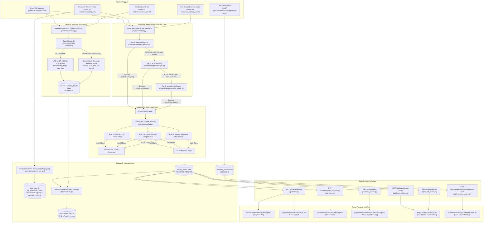

# Pipeline 01: Live Data Ingestion & Snapshot Telemetry

## 1. Purpose
Ingests real-time train running status across the corridor using a 3-tier adapter failover chain, filters telemetry through a 4-rule data quality validation gate, captures timestamped operational snapshots with provenance tags, and synchronizes hourly corridor micro-weather with mandatory UTC-to-IST conversion.

## 2. Triggers
- **Corridor Ingestion Cron / CLI**: `python -m collector.collect` via `collector.collect.run_cron()` (`collector/collect.py:118-128`).
- **Telemetry Snapshot Collector Cron**: `python -m collector.snapshot_cron` via `collector.snapshot_cron.run_snapshot_cron()` (`collector/snapshot_cron.py:140-150`).
- **Corridor Weather Backfill CLI**: `python -m collector.weather_backfill` via `collector.weather_backfill.backfill_all_weather()` (`collector/weather_backfill.py:185-264`).
- **Live Station-Change & Accuracy Daemon**: `python -m scripts.live_station_pipeline` via `scripts.live_station_pipeline.LiveStationPipeline.start_loop(interval_seconds=300)` (`scripts/live_station_pipeline.py:181-201`).
- **Nightly MLOps Pipeline Stage**: `python -m scripts.nightly_pipeline` (`scripts/nightly_pipeline.py:73-80`).
- **Timetable Master Seed Import Mutation**: HTTP `POST /api/timetable/versions/{version_id}/import-seed` (`api/timetable_routes.py:386-420`).

## 3. Mermaid Diagram

## 4. Stage-by-Stage Breakdown
| Stage | File | Key Function | Input -> Output |
|---|---|---|---|
| **1. Corridor Weather Ingestion & Backfill** | `collector/weather.py` `collector/weather_backfill.py` | `WeatherEngine.sync_corridor_weather()` `fetch_station()` | `target_date: date, lat/lon coordinates` -> Queries Open-Meteo API, applies UTC-to-IST conversion (`+05:30`), calculates radiative `fog_flag` (peak 05:00–09:00 IST), and writes hourly/daily records to `weather` and `weather_hourly`. |
| **2. Multi-Tier Live Status Adapter Ingestion** | `collector/collect.py` `collector/adapters/rapidapi.py` `collector/adapters/scrape.py` `collector/adapters/mock_replay.py` | `DataCollector.fetch_with_failover()` | `train_no: str, run_date: date` -> Attempts RapidAPI with round-robin key rotation; on HTTP 429/403 fails over to `ScrapeSource` (eRail / IndiaRailInfo, 2.0s polite delay); on parsing failure falls back to deterministic `MockReplaySource`. Returns `(List[StationEvent], source_name)`. |
| **3. Data Quality Gate Filtering** | `collector/quality.py` | `QualityGate.validate_events()` | `raw_events: List[StationEvent]` -> Applies sanity delay bounds (`[-120, 600]` min), identity completeness checks, and sequential timestamp monotonicity validation. Returns `QualityGateReport(passed_events, quarantined_events)`. |
| **4. Idempotent Station Events Upsert** | `collector/collect.py` | `DataCollector.run_collection_cycle()` | `passed_events: List[StationEvent]` -> Performs atomic batch `INSERT OR REPLACE INTO station_events`. Returns summary with upsert and quarantine counts. |
| **5. Continuous Snapshot Telemetry Archive** | `collector/snapshot_cron.py` | `SnapshotCollector.record_snapshot_cycle()` | `target_date: date, train_limit: int` -> Registers `train_runs` (`RUN-{train_no}-{date}`) and appends coordinate, timestamp, delay, and provenance (`rapidapi`, `synthetic`, `manual`) into `run_snapshots`. |
| **6. Snapshot Feature Materialization** | `ml/snapshots.py` | `SnapshotGenerator.build_dataset()` | `start_date, end_date, train_cutoff_date` -> Precomputes `DaySpatialIndex` trajectories, extracts 25-dimensional feature vectors, attaches 90-day exponential sample weights ($\lambda = 0.0077$), and writes `data/cache/*.parquet`. |

## 5. API Routes
| Method | Full Path | Handler Function | Required Role |
|---|---|---|---|
| `GET` | `/v1/network/state` | `get_network_state` (`api/routes.py:277`) | Public |
| `GET` | `/api/v1/network/state` | `get_network_state` (`api/routes.py:277`) | Public |
| `GET` | `/v1/trains/{train_no}/journey` | `get_train_journey` (`api/routes.py:86`) | Public |
| `GET` | `/api/v1/trains/{train_no}/journey` | `get_train_journey` (`api/routes.py:86`) | Public |
| `GET` | `/api/board/live` | `get_live_board` (`api/board_routes.py:37`) | Optional Auth (Public) |
| `GET` | `/api/board/stream` | `stream_live_board` (`api/board_routes.py:250`) | Public |
| `GET` | `/api/board/kiosk` | `get_kiosk_board` (`api/board_routes.py:202`) | Public |
| `POST` | `/api/timetable/versions/{version_id}/import-seed` | `import_seed_timetable` (`api/timetable_routes.py:386`) | `admin`, `station_master` |
| `GET` | `/v1/health` | `get_health` (`api/routes.py:838`) | Public |

## 6. Frontend Connections
| Frontend Page / Component | Route Called | Protocol (REST / SSE) | Polling / Interaction Behavior |
|---|---|---|---|
| `web/src/pages/dashboard/OverviewPage.tsx` | `/v1/network/state` | REST | Polled every 5s via TanStack Query (`queryKeys.networkState()`); displays active corridor trains, punctuality KPIs, and station status cards. |
| `web/src/pages/dashboard/TrainsPage.tsx` | `/v1/network/state` | REST | Polled every 5s; displays real-time corridor train directory with current station, speed, and delay status badges. |
| `web/src/pages/dashboard/TrainDetailPage.tsx` | `/v1/trains/{number}/journey` | REST | Fetched on page load and polled every 5s; renders chronological journey stops, scheduled vs actual arrival times, and delay deltas. |
| `web/src/pages/dashboard/board/LiveBoardPage.tsx` | `/api/board/live` | REST | Polled every 5s with HTTP 304 ETag memory caching; displays station platform arrival/departure schedule with live delay tags. |
| `web/src/pages/public/KioskPage.tsx` | `/api/board/kiosk` `/api/board/stream` | REST / SSE | Connects to SSE stream `/api/board/stream` (5s push interval) or polls `/api/board/kiosk`; renders public passenger station display board. |
| `web/src/pages/dashboard/ops/TimetablePage.tsx` | `/api/timetable/versions/{version_id}/import-seed` | REST | User action mutation on clicking "Import Master Seed"; populates draft timetable entries from master database trains and routes. |

## 7. DB Tables Touched
| Table Name | Operation (Read / Write / Upsert) | Description / Columns Touched |
|---|---|---|
| `trains` | Read | Queries active trains and priorities (`train_no`, `name`, `class`, `priority`). |
| `stations` | Read | Queries station metadata and geographic coordinates (`code`, `name`, `lat`, `lon`, `is_junction`, `platforms`). |
| `route_stations` | Read | Queries station sequence, scheduled arrival/departure, halt duration, and distance (`train_no`, `seq`, `station_code`, `sched_arr`, `sched_dep`, `distance_km`, `halt_min`). |
| `station_events` | Upsert (Write) | `INSERT OR REPLACE` with columns `(train_no, run_date, seq, station_code, sched_arr, actual_arr, sched_dep, actual_dep, delay_arr_min, delay_dep_min, collected_at)`. |
| `weather` | Upsert (Write) | Daily aggregated station weather: `(date, station_code, temp, precip_mm, humidity, fog_flag)`. |
| `weather_hourly` | Upsert (Write) | Hourly station weather with IST timestamp: `(station_code, ts_ist, date, hour, temperature_2m, precipitation, visibility, wind_speed_10m, relative_humidity_2m, fog_flag)`. |
| `train_runs` | Upsert (Write) | Train operational lifecycle tracking: `(run_id, train_no, run_date, origin, dest, source, created_at)` with `ON CONFLICT(run_id) DO NOTHING`. |
| `run_snapshots` | Write (Insert) | Telemetry coordinate snapshots: `(run_id, ts, station_code, sch_arr, sch_dep, exp_arr, exp_dep, delay_min, last_loc_station, lat, lng, raw_json, source)`. |
| `timetable_entries` | Write (Insert) | Populated upon master seed import: `(version_id, train_no, train_name, train_type, direction, station_code, stop_seq, sched_arr, sched_dep, halt_min)`. |

## 8. Failure & Fallback
- **RapidAPI Quota Exhaustion / Rate Limiting (HTTP 429/403/401)**: `RapidAPISource` rotates through configured comma-separated API keys via `_key_cycle`. If all keys fail or timeout, `DataCollector.fetch_with_failover()` silently catches exceptions and transfers execution to Tier 2 (`ScrapeSource`).
- **Web Scraper Changes / Public Portal Outage**: `ScrapeSource` handles HTML regex mismatches, connection timeouts, and empty responses from eRail and IndiaRailInfo, falling through to Tier 3 (`MockReplaySource`).
- **Mock Replay (Offline Safety Net)**: `MockReplaySource` generates deterministic, physically consistent arrival/departure events using timetable route structures and reproducible random seeds `hash(f"{train_no}_{date_str}")`. Guarantees 100% data availability even in completely air-gapped environments.
- **Open-Meteo Weather API Outage / Network Timeout**: `WeatherEngine` and `collector/weather_backfill.py` fall back to a deterministic seasonal physical climatology model (winter months Dec–Feb enforce temp=15.0°C, humidity=88.0%, fog_flag=1; non-winter enforce temp=30.0°C, humidity=60.0%, fog_flag=0).
- **Timezone Ingestion Gate**: Open-Meteo returns UTC timestamps; `collector/weather_backfill.py` applies explicit `+05:30` IST conversion at ingest time and stores `ts_ist`, preventing timezone misalignment and verifying that radiative fog peaks between 05:00 and 09:00 IST.
- **SQLite Concurrency & WAL Locking**: All database mutations execute inside `with db.transaction() as cur:` blocks configured with Write-Ahead Logging (`PRAGMA journal_mode=WAL`), preventing write starvation during concurrent inference reads.

## 9. Latency / SLA
- `REQUEST_TIMEOUT_SECONDS`: **10.0s** (`config.py:49`).
- `POLITE_SCRAPE_DELAY_SECONDS`: **2.0s** (`config.py:50`).
- `MAX_SANITY_DELAY_MINUTES`: **600 min** (`config.py:53`).
- `MIN_SANITY_DELAY_MINUTES`: **-120 min** (`config.py:54`).
- `STALE_EVENT_THRESHOLD_HOURS`: **24 hours** (`config.py:55`).
- `DEAD_TRAIN_CONSECUTIVE_DAYS`: **3 days** (`config.py:56`).
- `FOG_MAX_TEMP_CELSIUS`: **18.0 °C** (`config.py:59`).
- `FOG_MIN_HUMIDITY_PERCENT`: **85.0 %** (`config.py:60`).
- `HEAVY_RAIN_THRESHOLD_MM`: **25.0 mm** (`config.py:61`).
- Background Ingestion Refresh Loop Interval: **300 seconds (5 min)** (`scripts/live_station_pipeline.py:181`).
- Live Board Cache TTL: **4.0 seconds** (`api/board_routes.py:60`).
- Live Board SSE Stream Pulse Rate: **5.0 seconds** (`api/board_routes.py:266`).
- Weather Ingestion Historical Coverage SLA: **$\ge 95.0\%$** of calendar days (`collector/weather_backfill.py:243`).
- Radiation Fog Peak Window Verification: **04:00 to 10:00 IST** (`collector/weather_backfill.py:260`).
