# Pipeline 02: Nightly MLOps Training & Champion Promotion

## 1. Purpose
Automates the nightly retraining of quantile gradient boosted trees and sequential recurrent neural networks, calibrates Mondrian Conformalized Quantile Regression (CQR) uncertainty bounds, enforces paired statistical Wilcoxon champion promotion gates, generates held-out proof metrics, and monitors Population Stability Index (PSI) feature drift.

## 2. Triggers
- **Nightly MLOps Orchestrator**: `python -m scripts.nightly_pipeline --network=mixed` (`scripts/nightly_pipeline.py:46-126` or `make nightly`).
- **CI Fast Nightly Runner**: `python -m scripts.nightly_pipeline --network=mixed --skip-gru` (`make nightly-fast`).
- **LightGBM Retraining Standalone**: `python -m ml.train` (`ml/train.py:324-329` or `make train`).
- **PyTorch GRU Challenger Retraining**: `python -m ml.model_seq` (`ml/model_seq.py:244-392` or `make train-gru`).
- **Deep Ensemble Retraining**: `python -m ml.train_v2` (`ml/train_v2.py`).
- **Ensemble Stacking & Gate Evaluation**: `python -m ml.ensemble` (`ml/ensemble.py:446-451` or `make ensemble`).
- **9-Gate Statistical Champion Gate Runner**: `python -m scripts.champion_gate` (`scripts/champion_gate.py:77-366`).
- **Held-Out Test Week Evaluation**: `python -m ml.evaluate` (`ml/evaluate.py:495-499` or `make eval`).
- **PSI Feature Drift Monitor CLI**: `python -m ml.drift` (`ml/drift.py:327-345` or `make drift`).
- **In-Process Programmatic Loop**: `python -m scripts.nightly_loop` (`scripts/nightly_loop.py`).
- **Docker Compose Nightly Profile**: `docker-compose --profile nightly up nightly` (`docker-compose.yml:25-32`).

## 3. Mermaid Diagram

```mermaid
flowchart TD
    subgraph Triggers["Nightly Triggers"]
        T1["make nightly<br/>python -m scripts.nightly_pipeline"]
        T2["make nightly-fast<br/>(--skip-gru)"]
        T3["Docker Worker Profile<br/>docker-compose --profile nightly up"]
        T4["Manual / CI MLOps CLI<br/>ml.train / ml.model_seq / ml.ensemble"]
    end

    subgraph DataPrep["Stage 1 & 2: Seed, Baselines & Snapshot Generation"]
        T1 & T2 & T3 & T4 --> Seed["data.seed.seed_database()<br/>(data/seed.py)"]
        Seed --> MatBase["Database.materialize_historical_baselines()<br/>(data/db.py)"]
        MatBase --> DBHist[("hist_baselines Table<br/>O(1) Delay Statistics")]
        
        MatBase --> SnapGen["SnapshotGenerator.build_dataset()<br/>(ml/snapshots.py)"]
        SnapGen --> SpatialIdx["DaySpatialIndex Trajectory Raster<br/>(engine/spatial_context.py)"]
        SpatialIdx --> ParquetCache[("data/cache/*.parquet<br/>25-dim Vectors + Sample Weights")]
    end

    subgraph ModelTraining["Stage 3 & 4: Dual-Engine Model Retraining"]
        ParquetCache --> LGBMTrain["ModelTrainer.train_all()<br/>(ml/train.py)"]
        LGBMTrain --> DirBooster["3x Direct LGBM Boosters (q10, q50, q90)<br/>(hops <= 3, 3x Extreme Delay Oversample)"]
        LGBMTrain --> DelBooster["3x Delta LGBM Boosters (q10, q50, q90)<br/>(hops > 3, Huber L2 Regularizer)"]
        LGBMTrain --> LRBench["Baseline B3 Linear Regression<br/>(model_lr_benchmark.pkl)"]

        ParquetCache --> GRUTrain["GRUChallengerTrainer.train()<br/>(ml/model_seq.py / ml/train_v2.py)"]
        GRUTrain --> GRUModel["PyTorch NonCrossingGRUQuantileModel<br/>(FiLM Context + Masked Attention + Station Embedding)"]
    end

    subgraph CalibrationAndGate["Stage 5 & 6: Conformal Calibration & Promotion Gate"]
        DirBooster & DelBooster & GRUModel & LRBench --> Mondrian["MondrianCQR.calibrate()<br/>(ml/conformal.py)"]
        Mondrian --> CQRFactor["Partitioned q_hat Factors<br/>(short_1h, medium_3h, long_6h)"]

        CQRFactor --> Gate["EnsemblePromotionGate / champion_gate.py<br/>(scripts/champion_gate.py)"]
        Gate --> NNLS["5-Candidate NNLS Stacking Fit<br/>[GBM, GRU, LR, B1-Frozen, B3-Linear]"]
        NNLS --> Wilcoxon{"Paired Wilcoxon Signed-Rank<br/>& DM Test (p < 0.05)?"}
        
        Wilcoxon -- "Yes: Challenger Superior" --> Promote["Promote Challenger to Champion<br/>(registry.json updated)"]
        Wilcoxon -- "No: Champion Retained" --> Retain["Retain Pinned Champion<br/>(registry.json pinned)"]
        
        Promote & Retain --> Audit["Cryptographic SHA-256 Audit Log<br/>(audit_log Table)"]
        Promote & Retain --> ManifestOut[("artifacts/manifest.json<br/>artifacts/registry.json")]
    end

    subgraph EvaluationAndDrift["Stage 7 & 8: Backtest Proof & Drift Monitor"]
        ManifestOut --> Eval["Evaluator.evaluate_test_set()<br/>(ml/evaluate.py)"]
        Eval --> ProofTable["F14 Backtest Proof Table vs B1/B2/B3<br/>(MAE, HitRate10, 80% Coverage, CRPS)"]
        ProofTable --> MetricsOut[("artifacts/metrics.json<br/>Canonical Proof Summary")]

        ManifestOut --> DriftMon["PSIDriftMonitor.run()<br/>(ml/drift.py)"]
        DriftMon --> DriftCheck{"Overall PSI Status?"}
        DriftCheck -- "GREEN / AMBER (PSI <= 0.25)" --> DriftLog["Save artifacts/drift_report.json"]
        DriftCheck -- "RED (PSI > 0.25)" --> DriftAlert["Emit DRIFT_ALERT to notifications Table<br/>(severity=critical)"]
    end

    subgraph APIRoutes["FastAPI Serving Routes"]
        MetricsOut --> R_Summary["GET /v1/evaluation/summary<br/>(api/routes.py)"]
        ManifestOut & MetricsOut --> R_ModelsMeta["GET /v1/meta/models<br/>(api/routes.py)"]
        DriftAlert --> R_Health["GET /v1/health<br/>(api/routes.py)"]
    end

    subgraph FrontendConsumers["React Frontend (web/src)"]
        R_Summary --> UI_ModelPage["pages/dashboard/ModelPage.tsx<br/>(F14 Proof Table & Gate Benchmarks)"]
        R_ModelsMeta --> UI_Overview["pages/dashboard/OverviewPage.tsx<br/>(Model Version Badge & Accuracy Cards)"]
    end
```

## 4. Stage-by-Stage Breakdown
| Stage | File | Key Function | Input -> Output |
|---|---|---|---|
| **1. Database Baseline Refresh** | `data/db.py` `data/seed.py` | `Database.materialize_historical_baselines()` | `station_events, route_stations, trains` -> Pre-aggregates train-station average delay and p90 delay metrics, materializing `hist_baselines` for $O(1)$ lookup time during feature extraction. |
| **2. Leakage-Free Snapshot Construction** | `ml/snapshots.py` `engine/spatial_context.py` | `SnapshotGenerator.build_dataset()` | `start_date, end_date, train_cutoff_date` -> Rasterizes 1-minute corridor train trajectories via `DaySpatialIndex`, computes 25 point-in-time features with training-window historical baselines, applies 90-day exponential sample decay ($\lambda = 0.0077$), and writes `data/cache/*.parquet`. |
| **3. LightGBM Quantile Tree Retraining** | `ml/train.py` | `ModelTrainer.train_all()` | `data/cache/*.parquet` (train core) -> Trains 3 Direct boosters ($q \in \{0.1, 0.5, 0.9\}$) with 3x oversampling on extreme delays (>120m), 3 Delta incremental boosters ($q \in \{0.1, 0.5, 0.9\}$) with Huber L2 regularization, and fits Baseline B3 Linear Regression (`model_lr_benchmark.pkl`). |
| **4. PyTorch Sequential Challenger Retraining** | `ml/model_seq.py` `ml/train_v2.py` | `GRUChallengerTrainer.train()` | 8-step sequence tensors, 25-feature context, 1200-station embeddings -> Trains 2-layer `NonCrossingGRUQuantileModel` with FiLM context modulation, masked self-attention (-1e9 padding mask), softplus non-crossing projection heads, and multi-quantile pinball loss. Outputs `model_gru_challenger.pt`. |
| **5. Mondrian Conformal Uncertainty Calibration** | `ml/conformal.py` | `MondrianCQR.calibrate()` | Predicted quantiles, validation targets, hop counts, km distances -> Computes partitioned non-conformity adjustments $\hat{q}$ across horizon buckets (`short_1h`, `medium_3h`, `long_6h`), enforcing theoretical 80% coverage guarantees. |
| **6. Statistical Champion Promotion Gate** | `ml/ensemble.py` `scripts/champion_gate.py` | `EnsemblePredictor.evaluate_gate_and_update_registry()` `run_champion_promotion_gate()` | Out-of-sample test predictions on identical benchmark rows -> Solves 5-candidate Non-Negative Least Squares (NNLS) stacking, runs paired Wilcoxon signed-rank and Diebold-Mariano hypothesis tests ($p < 0.05$), evaluates 9 promotion gates (G1–G9), updates `registry.json` and `manifest.json`, and signs SHA-256 HMAC entry in `audit_log`. |
| **7. Held-Out Backtest Proof Generation** | `ml/evaluate.py` | `Evaluator.evaluate_test_set()` | Held-out test week dataset (`metrics.json`) -> Computes MAE, HitRate10, 80% coverage, Winkler score, and CRPS across 1h/3h/6h horizons against Baselines B1 (Frozen delay), B2 (Official Scheduled Recovery), and B3 (Linear Regression); runs 6-fold rolling-origin CV; exports `metrics.json`. |
| **8. Population Stability & Drift Monitoring** | `ml/drift.py` | `PSIDriftMonitor.run()` | Training reference window vs live scoring window (last 3 days) -> Calculates Population Stability Index (PSI) across 25 features, evaluates CUSUM and ADWIN change-point detectors, categorizes feature drift status (`GREEN` / `AMBER` / `RED`), saves `drift_report.json`, and emits `DRIFT_ALERT` into `notifications` on RED status. |

## 5. API Routes
| Method | Full Path | Handler Function | Required Role |
|---|---|---|---|
| `GET` | `/v1/evaluation/summary` | `get_evaluation_summary` (`api/routes.py:43`) | Public |
| `GET` | `/api/v1/evaluation/summary` | `get_evaluation_summary` (`api/routes.py:43`) | Public |
| `GET` | `/v1/meta/models` | `get_models_meta` (`api/routes.py:558`) | Public |
| `GET` | `/api/v1/meta/models` | `get_models_meta` (`api/routes.py:558`) | Public |
| `GET` | `/v1/health` | `get_health` (`api/routes.py:838`) | Public |

## 6. Frontend Connections
| Frontend Page / Component | Route Called | Protocol (REST / SSE) | Polling / Interaction Behavior |
|---|---|---|---|
| `web/src/pages/dashboard/ModelPage.tsx` | `/v1/evaluation/summary` | REST | Fetched on mount via TanStack Query (`queryKeys.modelProof()`); renders the F14 Proof Table comparing RailTwin-X against Baselines B1/B2/B3 across 1h, 3h, 6h horizons, along with 24-feature spectrum, MoE expert visualizer, and 7 verification gates. |
| `web/src/pages/dashboard/OverviewPage.tsx` | `/v1/meta/models` | REST | Polled every 5s; displays the active production model version badge (`v3.0 MoE`), champion status, and real-time corridor ETA accuracy. |

## 7. DB Tables Touched
| Table Name | Operation (Read / Write / Upsert) | Description / Columns Touched |
|---|---|---|
| `station_events` | Read | Reads historical actuals for feature engineering: `(train_no, run_date, seq, station_code, sched_arr, actual_arr, delay_arr_min, delay_dep_min, collected_at)`. |
| `trains` | Read | Reads train master catalog, priorities, and classes (`train_no`, `name`, `class`, `priority`). |
| `stations` | Read | Reads station master metadata, coordinates, and platform counts (`code`, `name`, `lat`, `lon`, `is_junction`, `platforms`). |
| `route_stations` | Read | Reads stop sequence, scheduled times, distances, and halt durations (`train_no`, `seq`, `station_code`, `sched_arr`, `sched_dep`, `distance_km`, `halt_min`). |
| `weather` / `weather_hourly` | Read | Reads historical temperature, rainfall, humidity, and fog flags (`station_code`, `date`, `fog_flag`, `precip_mm`, `temp`, `humidity`). |
| `rake_links` | Read | Reads incoming/outgoing rake links and turnaround buffers (`incoming_train`, `outgoing_train`, `station_code`, `turnaround_min`). |
| `speed_restrictions` | Read | Reads active TSR slowdown percentages and locations (`from_code`, `to_code`, `speed_limit_kmph`, `is_active`). |
| `hist_baselines` | Upsert (Write) / Read | Written by `materialize_historical_baselines()` with columns `(train_no, station_code, avg_delay, p90_delay, sample_count)`; read by `SnapshotGenerator`. |
| `conformal_pid_state` | Upsert (Write) / Read | Persists streaming PID calibration states: `(group_key, target_alpha, current_alpha, integral, prev_error, steps, updated_at)`. |
| `shadow_log` | Read / Write | Stores champion vs challenger shadow prediction samples `(champ_p50, chall_p50, delta, latency)`. |
| `audit_log` | Write (Insert) | Persists cryptographic SHA-256 HMAC audit records upon champion promotion decisions (`actor_id`, `actor_role`, `action`, `table_name`, `record_id`, `row_hash`). |
| `notifications` | Write (Insert) | Records automated system alerts when feature drift reaches RED status: `(event_type="DRIFT_ALERT", severity="critical", title, message, payload_json, state="queued")`. |

## 8. Failure & Fallback
- **PyTorch GPU / CUDA Acceleration Unavailable**: PyTorch GRU trainer and predictor detect device capability and automatically fallback to CPU (`torch.device("cpu")` with `torch.set_num_threads(1)` to eliminate multi-threaded thrashing).
- **Challenger Promotion Gate Failure**: If candidate model (GRU or deep ensemble) has higher MAE or fails the paired Wilcoxon test ($p \ge 0.05$), the previous champion remains pinned in `registry.json`.
- **Missing or Corrupted PyTorch GRU Binary (`model_gru_challenger.pt`)**: `EnsemblePredictor` falls back to 5-candidate stacking using LightGBM quantile trees and Linear Regression benchmark without raising runtime exceptions.
- **Full Model Artifact Corruption (Zero-Fail Serving Fallback)**: `api/predictor.py` implements a 3-tier degradation cascade: Tier 2 (Neural GRU / LightGBM CQR Ensemble) $\to$ Tier 1 (`hist_baselines` SQL lookup) $\to$ Tier 0 (Timetable scheduled arrival + current delay).
- **Parquet Cache Invalidation**: If cached parquet files in `data/cache/` fail validation or are missing, `SnapshotGenerator.build_dataset()` automatically rebuilds the dataset from raw database events.
- **PSI Feature Drift Alarm**: When PSI exceeds 0.25 on critical features (e.g. `current_delay` or `fog_flag_target`), `PSIDriftMonitor` creates an automated high-severity alert in `notifications` to trigger scheduled retraining.

## 9. Latency / SLA
- `ML_TRAIN_DAYS`: **21 days** (`config.py:64`).
- `ML_TEST_DAYS`: **7 days** (`config.py:65`).
- `DIRECT_MODEL_MAX_HOPS`: **3 hops** (`config.py:66`).
- `QUANTILE_ALPHAS`: `[0.1, 0.5, 0.9]` (`config.py:67`).
- `CONFORMAL_MISCOVERAGE_ALPHA`: **0.20** (Target Coverage: **80%**) (`config.py:68`).
- `LGBM_NUM_LEAVES`: **63** (`config.py:69`).
- `LGBM_LEARNING_RATE`: **0.05** (`config.py:70`).
- `LGBM_N_ESTIMATORS`: **600** (`config.py:71`).
- `LGBM_MIN_CHILD_SAMPLES`: **40** (`config.py:72`).
- Exponential Sample Decay Half-Life: **90 days** ($\lambda = 0.0077$) (`ml/snapshots.py:851`, `ml/train.py:222`).
- Single-Model GRU Inference Latency SLA: $p_{50} = \mathbf{0.77\text{ ms}}$, $p_{95} \le \mathbf{1.56\text{ ms}}$ (CPU thread=1, Budget: $\le \mathbf{8.0\text{ ms}}$ in `scripts/champion_gate.py:166`, $\le \mathbf{3.0\text{ ms}}$ in `tests/test_serving_optimization.py:38`).
- Model Ensemble Memory Footprint Budget: $\le \mathbf{150\text{ MB}}$ (`scripts/champion_gate.py:317`).
- PSI Feature Drift Thresholds: `GREEN < 0.10`, `AMBER 0.10–0.25`, `RED > 0.25` (`ml/drift.py:7-9`).
- 6-Fold Rolling-Origin CV Embargo Gap: **2 days** (`ml/evaluate.py:399`).
- Full End-to-End Nightly Retraining Wall-Clock Duration: $\approx \mathbf{40\text{--}120\text{ s}}$ (`scripts/nightly_pipeline.py:108`).
