# Pipeline 03: Real-Time Inference & Dynamic ETA Prediction

## 1. Purpose
Serves ultra-low-latency, calibrated arrival ETAs with non-crossing quantile confidence intervals ($p_{10}, p_{50}, p_{90}$) for all corridor trains. Resolves soft probabilistic spatial train positions via Bayesian inference and filters predictions through 100% deterministic kinematic safety interlocks. Provides feature attribution delay drivers and real-time live board streaming for operational control and passenger display.

## 2. Triggers
- **HTTP REST Endpoint**: `GET /v1/trains/{train_no}/eta?station={CODE}` (or `/api/v1/trains/{train_no}/eta`) invoked for single-station calibrated arrival predictions (`api/routes.py:67-80`).
- **HTTP REST Endpoint**: `GET /v1/trains/{train_no}/journey` (or `/api/v1/trains/{train_no}/journey`) invoked for multi-stop journey progression timelines (`api/routes.py:86-189`).
- **HTTP REST Endpoint**: `GET /v1/network/state` (or `/api/v1/network/state`) invoked for corridor-wide active fleet monitoring (`api/routes.py:277-380`).
- **HTTP REST / SSE Live Board**: `GET /api/board/live`, `GET /api/board/kiosk`, and `GET /api/board/stream` (SSE event stream pulsing every 5 seconds) (`api/board_routes.py:38-269`).
- **Internal Orchestrator Call**: Invoked internally by `BrainOrchestrator.advise()` (`api/brain.py:119`) and `LiveStationPipeline.run_cycle()` (`scripts/live_station_pipeline.py:87-179`).
- **Frontend Reactive Polling**: TanStack React Query polling every 5000ms (5 seconds) from `TrainDetailPage.tsx`, `OverviewPage.tsx`, `LiveBoardPage.tsx`, and `KioskPage.tsx`.

## 3. Mermaid Diagram

```mermaid
flowchart TD
    subgraph Triggers["Pipeline 03 Triggers & Entrypoints"]
        T1["HTTP GET /v1/trains/{no}/eta<br/>(api/routes.py:67)"]
        T2["HTTP GET /v1/trains/{no}/journey<br/>(api/routes.py:86)"]
        T3["HTTP GET /api/board/live | /kiosk | /stream<br/>(api/board_routes.py:38)"]
        T4["Internal: BrainOrchestrator.advise()<br/>(api/brain.py:119)"]
        T5["Frontend Polling (5s refetchInterval)<br/>(web/src/main.tsx:14)"]
    end

    Triggers --> PredictorEntry["PredictorService.predict_train_eta()<br/>(api/predictor.py:289)"]

    subgraph PositionResolution["Stage 1: Soft Bayesian Position Resolution"]
        PredictorEntry --> PR["PositionResolver.resolve_train_position()<br/>(engine/position_resolver.py:64)"]
        PR --> ReadAD[("ad_events table<br/>(Point-in-time station master actuals)")]
        PR --> ReadSE[("station_events table<br/>(Telemetry actuals <= now_iso)")]
        PR --> ReadRS[("route_stations table<br/>(Ordered stop sequence)")]
        ReadAD & ReadSE & ReadRS --> PostDist["Compute Posterior P(seq=k | evidence)<br/>P(k) ~ exp(-Δt/τ) · SchedPrior(k|now)"]
        PostDist --> TopK["Select Top-3 Candidate Stops [(seq_k, p_k)]<br/>(engine/position_resolver.py:40)"]
    end

    subgraph FeatureHydration["Stage 2: Snapshot Feature Vector Generation"]
        TopK --> GenVec["SnapshotGenerator.extract_features_at_snapshot()<br/>(ml/snapshots.py:31)"]
        GenVec --> ReadWeather[("weather & weather_hourly tables<br/>(fog_flag, rain_mm)")]
        GenVec --> ReadTSR[("speed_restrictions table<br/>(Active caution orders)")]
        GenVec --> ReadHist[("hist_baselines table<br/>(avg_delay, p90_delay)")]
        ReadWeather & ReadTSR & ReadHist --> FeatVec["25-dim Feature Vector (v1) / 34-dim (v2)<br/>(ml/features.py)"]
    end

    subgraph MultiTierInference["Stage 3: Multi-Tier Quantile Inference"]
        FeatVec --> CheckTier{"Champion Check<br/>(registry.json)"}
        
        CheckTier -- "PyTorch GRU Champion & hops <= 3" --> GRUInference["Tier 2: NonCrossingGRUQuantileModel<br/>(ml/model_seq.py:28)<br/>x=[1, 8, 8], context=[1, 25]"]
        CheckTier -- "LightGBM Champion | hops > 3" --> LGBMInference["Tier 2: LightGBM CQR Booster<br/>(api/predictor.py:271)<br/>Direct (hops<=3) | Delta (hops>3)"]
        CheckTier -- "Model Failure / Exception" --> HistInference["Tier 1 Fallback: hist_baselines SQL Lookup<br/>(api/predictor.py:284)"]
        HistInference -- "DB Missing" --> SchedInference["Tier 0 Fallback: Scheduled Timetable + Delay<br/>(api/predictor.py:240)"]

        GRUInference --> ApplyCQR_GRU["Apply Conformal Offset -q_hat_gru / +q_hat_gru<br/>(ml/conformal.py)"]
        LGBMInference --> ApplyCQR_LGBM["Apply Conformal Offset -q_hat / +q_hat<br/>(ml/conformal.py)"]
        ApplyCQR_GRU & ApplyCQR_LGBM & HistInference & SchedInference --> RawQuantiles["Raw Quantiles [q10, q50, q90]"]
    end

    subgraph MarginalizationAndInvariant["Stage 4: Position Marginalization & Quantile Invariant"]
        RawQuantiles --> Marginalize["Marginalize over Top-3 Positions<br/>q_bar = sum(p_k * q_k)"]
        Marginalize --> MathInvariant["enforce_quantile_order(p10, p50, p90, cap=720)<br/>(api/predictor.py:32)<br/>0 <= p10 <= p50 <= p90 <= 720.0"]
    end

    subgraph DeterministicInterlock["Stage 5: 100% Deterministic Safety Interlock"]
        MathInvariant --> Interlock["validate_prediction_through_interlock()<br/>(safety/interlock.py:308)"]
        
        Interlock --> Rule1["Rule 1: Input Sanity (Bounds & Non-null)<br/>(safety/interlock.py:82)"]
        Interlock --> Rule2["Rule 2: Quantile Monotonicity (q10<=q50<=q90, width<=180m)<br/>(safety/interlock.py:177)"]
        Interlock --> Rule3["Rule 3: Kinematic Recovery Feasibility ((dist/km_per_min)+slack)<br/>(safety/interlock.py:134)"]
        Interlock --> Rule4["Rule 4: Absolute Delay Bounds [0, 720] min<br/>(safety/interlock.py:257)"]
        Interlock --> Rule5["Rule 5: Monotonic 6h Horizon Drift <= 720 min<br/>(safety/interlock.py:283)"]

        Rule1 & Rule2 & Rule3 & Rule4 & Rule5 --> InterlockResult{"Any Rule Violated?"}
        InterlockResult -- "Yes" --> ClampAction["Apply Clamps + Downgrade to LOW Tier<br/>Set verify_with_controller=True<br/>(safety/interlock.py:327)"]
        InterlockResult -- "No" --> RetainHigh["Retain HIGH Confidence Tier<br/>all_passed=True"]
        ClampAction & RetainHigh --> InterlockReport["SafetyInterlockReport Object<br/>(safety/interlock.py:43)"]
    end

    subgraph AttributionAndAudit["Stage 6: Feature Attribution & Shadow Audit"]
        InterlockReport --> ExtractDrivers["PredictorService._extract_top_drivers()<br/>(Fog, Congestion, Incurred Delay, Junction)<br/>(api/predictor.py:442)"]
        ExtractDrivers --> ShadowLog[("shadow_log table<br/>(INSERT INTO shadow_log)<br/>(api/predictor.py:88)")]
        ExtractDrivers --> FormatResp["PredictorService._format_prediction_result()<br/>(api/predictor.py:512)"]
    end

    subgraph APIOutputs["Stage 7: Formatted API Payloads"]
        FormatResp --> OutETA["TrainEtaResponse JSON<br/>(api/schemas.py:19)"]
        FormatResp --> OutJourney["TrainJourneyResponse JSON<br/>(api/schemas.py:20)"]
        FormatResp --> OutBoard["LiveBoard JSON / SSE Event Stream<br/>(api/board_routes.py:250)"]
    end

    subgraph FrontendConsumers["Stage 8: Web Frontend React Dashboards"]
        OutETA & OutJourney --> PageTrainDetail["TrainDetailPage.tsx<br/>(web/src/pages/dashboard/TrainDetailPage.tsx:28)"]
        OutJourney --> PageOverview["OverviewPage.tsx<br/>(web/src/pages/dashboard/OverviewPage.tsx)"]
        OutJourney --> PageLiveBoard["LiveBoardPage.tsx<br/>(web/src/pages/dashboard/LiveBoardPage.tsx)"]
        OutBoard --> PageKiosk["KioskPage.tsx<br/>(web/src/pages/public/KioskPage.tsx)"]
    end
```

## 4. Stage-by-Stage Table
| Stage | File | Key Function | Input -> Output |
|---|---|---|---|
| **1. Soft Bayesian Position Resolution** | `engine/position_resolver.py` | `PositionResolver.resolve_train_position(train_no, route_stops, as_of_time)` | `train_no: str, route_stops: List[dict], as_of_time: datetime` -> `PositionRecord` with posterior probabilities $P(seq=k)$, mode location, uncertainty age, and top-3 candidates. |
| **2. Snapshot Feature Hydration** | `ml/snapshots.py` | `SnapshotGenerator.extract_features_at_snapshot(...)` | `train_no, seq_k, target_seq, run_date, current_delay, query_time` -> Hydrated 25/34-feature vector `TrainFeatureVector` (downstream headway, fog, rain, TSRs, rake links). |
| **3. Multi-Tier Model Inference** | `api/predictor.py` | `PredictorService._predict_single_position(...)` | Feature DataFrame `df_feat`, `seq_k`, `target_seq` -> Raw quantile outputs $(q_{10}, q_{50}, q_{90})$ and `tier_used` (`Tier2_PyTorch_GRU_Champion`, `Tier2_LightGBM_CQR`, `Tier1_HistLookup`, `Fallback_Schedule`). |
| **4. Conformal Calibration (CQR)** | `ml/conformal.py` | `ConformalCalibrator.calibrate()` / `PredictorService` | Raw model quantiles -> Calibrated confidence intervals adjusted by empirical non-conformity factor $\hat{q}$ ($q_{10} - \hat{q}, q_{50}, q_{90} + \hat{q}$) to guarantee $\ge 80\%$ empirical coverage. |
| **5. Position Marginalization** | `api/predictor.py` | `PredictorService.predict_train_eta(...)` | Top-3 candidate predictions $\{(p_k, q_{10,k}, q_{50,k}, q_{90,k})\}$ -> Weighted marginalized quantiles $\bar{q} = \sum_k p_k q_k$. |
| **6. Mathematical Quantile Invariant** | `api/predictor.py` | `enforce_quantile_order(p10, p50, p90, cap=720.0)` | Marginalized quantiles -> Sanitized quantiles guaranteeing $0.0 \le p_{10} \le p_{50} \le p_{90} \le 720.0\text{ min}$ with NaN/Inf elimination. |
| **7. 100% Deterministic Safety Interlock** | `safety/interlock.py` | `validate_prediction_through_interlock(...)` | Sanitized quantiles + feature dictionary -> `SafetyInterlockReport` evaluating 5 physical checks (input sanity, non-crossing, kinematic recovery limit, $[0, 720\text{m}]$ bounds, 6h horizon drift). |
| **8. Feature Attribution Driver Extraction** | `api/predictor.py` | `PredictorService._extract_top_drivers(df_feat, predicted_delay)` | Feature DataFrame & predicted delay -> Top-3 ranked causal delay drivers with minute contributions (e.g. `severe_fog_visibility`, `downstream_section_congestion`). |
| **9. Response Formatting & Shadow Logging** | `api/predictor.py` | `PredictorService._format_prediction_result(...)` | Clamped quantiles, scheduled times, interlock report, position record -> Formatted JSON payload with audit provenance; asynchronous record to `shadow_log`. |

## 5. API Routes Table
| Method | Full Path | Handler Function | Required Role |
|---|---|---|---|
| `GET` | `/v1/trains/{train_no}/eta` | `get_train_eta` (`api/routes.py:67`) | Public |
| `GET` | `/v1/trains/{train_no}/journey` | `get_train_journey` (`api/routes.py:86`) | Public |
| `GET` | `/v1/network/state` | `get_network_state` (`api/routes.py:277`) | Public |
| `GET` | `/api/board/live` | `get_live_board` (`api/board_routes.py:38`) | Optional Auth (Public) |
| `GET` | `/api/board/kiosk` | `get_kiosk_board` (`api/board_routes.py:203`) | Public |
| `GET` | `/api/board/stream` | `stream_live_board` (`api/board_routes.py:251`) | Public |
| `GET` | `/v1/meta/models` | `get_models_meta` (`api/routes.py:558`) | Public |

*(Note: In `api/main.py:97`, all `/v1` routes are additionally mounted under prefix `/api`, enabling both `/v1/...` and `/api/v1/...` endpoint URLs.)*

## 6. Frontend Connections
| Frontend Page / Component | Route Called | Protocol (REST / SSE) | Polling / Interaction Behavior |
|---|---|---|---|
| `web/src/pages/dashboard/TrainDetailPage.tsx` | `GET /v1/trains/{id}/journey` `GET /v1/trains/{id}/autopsy` | REST (`api.getTrain`, `api.getTrainAutopsy`) | Initial fetch on page load; automatic 5s background poll via TanStack React Query (`queryKeys.train(id)`). Displays tri-band confidence cards ($p_{10}, p_{50}, p_{90}$), journey stop timeline, and live causal autopsy ledger. |
| `web/src/pages/dashboard/OverviewPage.tsx` | `GET /v1/network/state` | REST (`api.getTrains`, `api.getStation`) | Continuous 5s background poll (`refetchInterval: 5000`). Drives corridor fleet map, active train count KPI, and real-time delay telemetry. |
| `web/src/pages/dashboard/LiveBoardPage.tsx` | `GET /v1/trains/{number}/journey` `GET /api/board/live` | REST (`api.getTrain`, `fetchBackend`) | 5s background poll. Renders live arrival/departure board with ETag 304 optimization and delay status badges (`green` $\le 15$m, `amber` $\le 60$m, `red` $>60$m). |
| `web/src/pages/public/KioskPage.tsx` | `GET /api/board/kiosk` `GET /api/board/stream` | REST / SSE | Connects to `/api/board/stream` for zero-poll push updates, or falls back to `/api/board/kiosk` 5s REST poll. Displays passenger-safe whitelisted PIDS board. |
| `web/src/pages/dashboard/TrainsPage.tsx` | `GET /v1/network/state` | REST (`api.getTrains`) | 5s background poll refreshing corridor active fleet list with live position, speed, and delay status badges. |

## 7. DB Tables Touched
| Table Name | Operation (Read / Write / Upsert) | Description / Columns Touched |
|---|---|---|
| `trains` | Read | Reads train metadata, class, and priority: `SELECT name, class, priority FROM trains WHERE train_no = ?`. |
| `route_stations` | Read | Reads stop sequence and schedule: `SELECT seq, station_code, sched_arr, sched_dep, halt_min, distance_km FROM route_stations WHERE train_no = ? ORDER BY seq`. |
| `station_events` | Read | Reads point-in-time telemetry: `SELECT seq, station_code, event_time, delay_arr_min, delay_dep_min FROM station_events WHERE train_no = ? AND event_time <= ? ORDER BY event_time DESC, seq DESC LIMIT 1`. |
| `ad_events` | Read | Reads station master actuals: `SELECT station_code, event_kind, actual_ts FROM ad_events WHERE train_no = ? AND actual_ts <= ? ORDER BY actual_ts DESC LIMIT 1`. |
| `hist_baselines` | Read | Reads $O(1)$ pre-materialized station aggregates: `SELECT avg_delay, p90_delay FROM hist_baselines WHERE train_no = ? AND station_code = ?`. |
| `weather` | Read | Reads micro-weather at target station: `SELECT temp, humidity, precip_mm, fog_flag FROM weather WHERE station_code = ? AND date = ?`. |
| `speed_restrictions` | Read | Reads active TSRs in section: `SELECT speed_limit_kmph, start_km, end_km FROM speed_restrictions WHERE status = 'ACTIVE'`. |
| `shadow_log` | Write (Insert) | Records shadow evaluation comparison: `INSERT INTO shadow_log (train_no, target_station, champion_model, challenger_model, champion_p50, challenger_p50, abs_delta, latency_ms, created_at)`. |

## 8. Failure & Fallback
1. **Tier 2 Champion Neural Model Failure**: If `model_gru_challenger.pt` is missing, corrupted, or encounters CUDA memory pressure, `PredictorService._try_load_models()` falls back to PyTorch CPU (`torch.device("cpu")`). If tensor inference fails, execution seamlessly yields to the LightGBM Quantile Booster ensemble (`_direct_models` / `_delta_models`).
2. **Tier 2 LightGBM Booster Failure**: If LightGBM model text files (`model_direct_q*.txt`) fail to load or feature extraction raises an exception, the pipeline catches the error and degrades to **Tier 1 Historical Baseline Lookup** (`hist_baselines` table materialized during startup).
3. **Tier 1 Historical Lookup Missing**: If the train or station has no historical records in `hist_baselines`, the engine executes **Tier 0 Nominal Fallback** (scheduled timetable arrival + current frozen delay with default confidence band $[d-5, d, d+15]$).
4. **Intermittent / Missing GPS Telemetry**: If no live station event has arrived within 15 minutes ($>900\text{s}$), `PositionResolver` applies dead-reckoning recency decay ($\tau = 1800\text{s}$ / 30 min) and blends a Gaussian transit prior around expected timetable arrival. If position confidence drops below $0.80$, `PredictorService` automatically widens the prediction interval by $(1.0 - \text{confidence}) \times 15.0\text{ min}$.
5. **Deterministic Safety Interlock Violations (`safety/interlock.py`)**:
   - *Input Sanity Failure (NaN/Inf / delay $< -30$m / distance $< 0$km)*: Clamps values to $[-5.0, 720.0]$, forces confidence tier to `LOW`, and flags `verify_with_controller: True`.
   - *Quantile Crossing ($p_{10} > p_{50}$ or $p_{50} > p_{90}$)*: Enforces monotonic ordering ($p_{10} \le p_{50} \le p_{90}$) and clamps spread to $180.0\text{ min}$ max width.
   - *Unfeasible Kinematic Speed Recovery*: Enforces physical track recovery limit $\Delta_{\text{recovery}} \le (\text{dist} / \text{km\_per\_min}) + \text{slack}$. If predicted recovery violates physics, $p_{50}$ is clamped to maximum feasible recovery, confidence is downgraded to `LOW`, and `verify_with_controller: True` is set.
   - *Monotonic Horizon Drift*: Bounds 6-hour horizon drift to $\le 720.0\text{ min}$.

## 9. Latency / SLA
- **Single-Item GRU Model Inference**: **$p_{50} = 0.77\text{ ms}$, $p_{95} \le 1.56\text{ ms}$** (Single-threaded CPU execution in `scripts/champion_gate.py:166`; strict budget $\le 8.0\text{ ms}$).
- **RailTwinGRUv2 Deep Ensemble Benchmark**: **$p_{95} \le 3.0\text{ ms}$** (Verified in `tests/test_serving_optimization.py:38-66` and `scripts/champion_gate.py:9`).
- **End-to-End Single Train ETA Serving**: **$< 10.0\text{ ms}$** nominal, **$p_{95} \le 20.0\text{ ms}$** (`api/predictor.py`).
- **Journey Timeline API Latency (`/v1/trains/{no}/journey`)**: **$p_{50} \le 25\text{ ms}$, $p_{95} \le 155.0\text{ ms}$** (`scripts/perf_bench.py:124`).
- **Live Board API Latency (`/api/board/live`)**: **$p_{50} = 24.9\text{ ms}$, $p_{95} = 155.0\text{ ms}$** (`scripts/perf_bench.py:124`).
- **Live Board In-Memory Snapshot Cache TTL**: **4.0 seconds** (`api/board_routes.py:60`).
- **Live Board SSE Stream Pulse Interval**: **5 seconds** (`api/board_routes.py:266`).
- **Conformal Prediction Empirical Coverage SLA**: **$\ge 80.0\%$** empirical coverage guarantee across all test week horizons (`ml/conformal.py`, `ml/artifacts/manifest.json`).
- **Token-Bucket API Rate Limiter**: **60 requests/min per IP with 10-token burst** (`api/middleware.py`, `api/main.py:93`).
