# Pipeline 04: Advisory Generation & Multi-Channel Notifications

## 1. Purpose
Scans the railway network for deterministic spatial track conflicts (headway separation and single-line opposing meets) and crew fatigue duty breaches. Formulates human-in-the-loop operational advisories validated through deterministic safety interlocks and records immutable audit trails. Dispatches multi-channel alerts via WhatsApp and SMS failover with an automated 5-minute supervisor escalation ladder and bidirectional webhook acknowledgment.

## 2. Triggers
- **HTTP REST Endpoint**: `POST /v1/advise` (or `/api/v1/advise`) invoked by controllers or background workers to generate train decision advisories (`api/routes.py:604-614`).
- **HTTP REST Endpoint**: `GET /v1/conflicts/{train_no}` (or `/api/v1/conflicts/{train_no}`) for real-time corridor conflict status (`api/routes.py:617-628`).
- **HTTP REST Endpoint**: `POST /v1/advise/{adv_id}/ack` invoked on controller accept/reject action in the dashboard (`api/routes.py:702-734`).
- **HTTP REST Webhook**: `POST /v1/hooks/whatsapp` invoked by OpenWA gateway on inbound SMS/WhatsApp replies (`api/routes.py:740-832`).
- **HTTP REST Endpoint**: `GET /v1/crew/alerts` invoked for hours-of-service fatigue duty alerts (`api/routes.py:537-550`).
- **HTTP REST Event Bus**: `POST /api/notifications/emit`, `POST /api/notifications/{id}/ack`, and `POST /api/notifications/escalate` (`api/notification_routes.py:58-190`).
- **Continuous Background Monitor**: `LiveStationPipeline.start_loop(interval_seconds=300)` running every 5 minutes in `scripts/live_station_pipeline.py:181-201`.
- **Periodic Supervisor Escalation**: `notifications.dispatcher.escalate_unacked_notifications(max_age_minutes=5)` polling for unacknowledged critical alerts.

## 3. Mermaid Diagram

```mermaid
flowchart TD
    subgraph Triggers["Pipeline 04 Triggers & Entrypoints"]
        T1["HTTP POST /v1/advise<br/>(api/routes.py:604)"]
        T2["HTTP GET /v1/conflicts/{train_no}<br/>(api/routes.py:617)"]
        T3["LiveStationPipeline 5-min Loop<br/>(scripts/live_station_pipeline.py:181)"]
        T4["HTTP POST /api/notifications/emit<br/>(api/notification_routes.py:145)"]
        T5["Inbound OpenWA Webhook<br/>(POST /v1/hooks/whatsapp)<br/>(api/routes.py:740)"]
        T6["Periodic Escalation Runner<br/>(notifications/dispatcher.py:345)"]
    end

    Triggers --> BrainEntry["BrainOrchestrator.advise()<br/>(api/brain.py:41)"]

    subgraph PerceptionAndInference["Stage 1: State Perception & Feature Vector Construction"]
        BrainEntry --> ReadState[("station_events & route_stations<br/>(Query latest delay & sequence)")]
        ReadState --> GenFeat["SnapshotGenerator.extract_features_at_snapshot()<br/>(ml/snapshots.py:31)"]
        GenFeat --> EnsPred["EnsemblePredictor.predict(feat_df)<br/>(ml/ensemble.py)"]
        EnsPred --> InterlockCheck["Safety Interlock Validation<br/>(safety/interlock.py:308)"]
    end

    subgraph ConflictAndCrewScanning["Stage 2: Deterministic Conflict & Crew Fatigue Scanning"]
        InterlockCheck --> ConfScan["ConflictScanner.scan_train_conflicts()<br/>(engine/conflicts.py:108)"]
        InterlockCheck --> CrewScan["CrewDutyEngine.evaluate_crew_alerts()<br/>(engine/ops.py:347)"]
        
        ConfScan --> ReadSections[("sections & trains tables<br/>(Topology & Class Speeds)")]
        ConfScan --> RuleHW["Headway Separation Check<br/>Coal 14m | Freight 8m | Passenger 5m<br/>(engine/conflicts.py:61)"]
        ConfScan --> RuleSL["Single-Line Opposing Meet Check<br/>Clearance < 10m limit<br/>(engine/conflicts.py:84)"]
        CrewScan --> RuleCrew["10h Hours-of-Service Regulatory Cap<br/>(CREW_DUTY_HOURS_CAP = 10.0h)<br/>(engine/ops.py:315)"]
    end

    subgraph AdvisoryFormulation["Stage 3: Structured Advisory Action Formulation"]
        RuleHW & RuleSL & RuleCrew --> ActionFormulator["Brain Action Formulator<br/>(api/brain.py:135)"]
        ActionFormulator --> Act1["HOLD_AT_LOOP_ADVISORY<br/>(Opposing meet on single-line siding)"]
        ActionFormulator --> Act2["STOP_TRAIN_ADVISORY<br/>(Headway separation hazard)"]
        ActionFormulator --> Act3["CREW_DUTY_BREACH_ALERT<br/>(Relief crew dispatch recommendation)"]
        ActionFormulator --> Act4["PROCEED_NOMINAL<br/>(Corridor context clear)"]
        Act1 & Act2 & Act3 & Act4 --> AuditLog[("brain_advisory_audit table<br/>(INSERT INTO brain_advisory_audit)<br/>(api/brain.py:198)")]
    end

    subgraph RecipientResolution["Stage 4: Recipient Resolution & Rate Limiting"]
        AuditLog --> CheckCritical{"Is Safety-Critical or High Conflict?"}
        CheckCritical -- "Yes" --> DispInit["NotificationDispatcher.dispatch(AlertEvent)<br/>(notifications/dispatcher.py:138)"]
        DispInit --> QueryStaff[("staff table<br/>(Query on-duty controllers & pointsmen)<br/>(notifications/dispatcher.py:53)")]
        QueryStaff --> RateLimitCheck{"_is_rate_limited() Check<br/>(2.0 min window, bypass for HIGH/CRITICAL)<br/>(notifications/dispatcher.py:130)"}
        RateLimitCheck -- "Rate Limited" --> SkipLog["Log skipped_rate_limit to notification_log"]
        RateLimitCheck -- "Allowed / Bypassed" --> OpenWADispatch["Primary Channel: OpenWA WhatsApp<br/>(notifications/channels/openwa.py:64)"]
    end

    subgraph MultiChannelFailover["Stage 5: Multi-Channel Gateway Dispatch & Fallback"]
        OpenWADispatch --> OpenWAGateway["OpenWA REST API Gateway<br/>(http://localhost:2785/api/sessions/{sid}/messages/send-text)"]
        OpenWAGateway -- "200 OK" --> WASuccess["Record status='wa_sent'<br/>Update HealthTracker='connected'"]
        OpenWAGateway -- "HTTP Error / Timeout (10s)" --> WAFail["Record HealthTracker='down'<br/>Trigger SMS Failover for HIGH/CRITICAL<br/>(notifications/dispatcher.py:182)"]
        
        WAFail --> SMSDispatch["Secondary Channel: SMSChannel<br/>(notifications/channels/sms.py:39)"]
        SMSDispatch --> SMSGateway["SMS Provider API<br/>(MSG91 Flow API / Fast2SMS Bulk V2 / Mock)"]
        SMSGateway -- "Success" --> SMSSuccess["Record status='wa_failed_sms_sent'"]
        SMSGateway -- "Fail / Mock" --> MockSuccess["Record status='wa_and_sms_failed' / 'mock'"]
        
        WASuccess & SMSSuccess & MockSuccess --> WriteNotifLog[("notification_log & notifications tables<br/>(INSERT INTO notification_log / notifications)<br/>(notifications/channels/inapp.py:30)")]
    end

    subgraph InboundLoopClosure["Stage 6: Bidirectional Human ACK Loop & Escalation"]
        T5 --> WebhookEntry["FastAPI POST /v1/hooks/whatsapp<br/>(api/routes.py:740)"]
        WebhookEntry --> HMACVerify["verify_hmac(body, secret)<br/>(notifications/webhook_verify.py:14)"]
        HMACVerify -- "Valid Signature" --> ParseMsg["Parse Inbound Text<br/>('ACK <id>' / 'ACCEPT <id>' vs 'ESC <id>' / 'REJ <id>')"]
        HMACVerify -- "Invalid Signature" --> Reject401["HTTP 401 UNAUTHORIZED_WEBHOOK"]
        
        ParseMsg --> RecordACK["record_advisory_ack()<br/>(api/routes.py:640)"]
        
        WebUI["Web UI Dispatcher Action<br/>(POST /v1/advise/{adv_id}/ack)"] --> RecordACK
        
        RecordACK --> WriteACK[("advisory_ack_log table<br/>(INSERT INTO advisory_ack_log)<br/>UPDATE notification_log SET status='acked_accepted'")]
        
        T6 --> EscalateRunner["escalate_unacked_notifications(max_age_minutes=5)<br/>(notifications/dispatcher.py:345)"]
        EscalateRunner --> FindUnacked[("notifications table<br/>(SELECT WHERE state='sent' AND age >= 5 min)")]
        FindUnacked --> UpdateEsc["UPDATE notifications SET state='escalated'<br/>Rebroadcast AlertEvent to Station Master & Admin<br/>(notifications/dispatcher.py:390)"]
    end

    subgraph FrontendConsumers["Stage 7: Web Frontend React Dashboards"]
        WriteACK & WriteNotifLog --> PageAdvisories["AdvisoriesPage.tsx<br/>(Triage Queue, Hotkeys A/D, Modal Sign-Off)<br/>(web/src/pages/dashboard/AdvisoriesPage.tsx)"]
        WriteNotifLog --> PageOverview["OverviewPage.tsx<br/>(Advisory & Conflict Banner Cards)<br/>(web/src/pages/dashboard/OverviewPage.tsx)"]
        WriteNotifLog --> PageCrew["CrewPage.tsx<br/>(Crew Duty & Fatigue Roster)<br/>(web/src/pages/dashboard/CrewPage.tsx)"]
    end
```

## 4. Stage-by-Stage Table
| Stage | File | Key Function | Input -> Output |
|---|---|---|---|
| **1. State Perception & Feature Construction** | `api/brain.py` | `BrainOrchestrator.advise(train_no, target_station_code)` | `train_no: str, target_station_code: Optional[str]` -> Retrieves latest train telemetry and builds `TrainFeatureVector` via `SnapshotGenerator`. |
| **2. Deterministic Track Conflict Scanning** | `engine/conflicts.py` | `ConflictScanner.scan_train_conflicts(train_no, target_date_str)` | `train_no, target_date` -> Evaluates freight headway buffers (Coal $14.0$m, Freight $8.0$m, Passenger $5.0$m) and single-line opposing clearances ($<10.0$m). Returns `List[ConflictRecord]`. |
| **3. Crew Duty Fatigue Projection** | `engine/ops.py` | `CrewDutyEngine.evaluate_crew_alerts()` | Active trains with delay $\ge 90$m -> Computes projected duty against $10.0$-hour cap (`CREW_DUTY_HOURS_CAP`) and generates `List[CrewAlert]` with relief hub recommendations. |
| **4. Safety Interlock Validation** | `safety/interlock.py` | `validate_prediction_through_interlock(...)` | Raw ML ensemble predictions -> Validates 5 physical checks (input sanity, non-crossing, kinematic recovery ceiling, $[0, 720\text{m}]$ bounds, horizon drift). |
| **5. Advisory Action Formulation & Audit Ingestion** | `api/brain.py` | `BrainOrchestrator.advise(...)` | Conflicts & interlock outcome -> Generates structured operational action (`HOLD_AT_LOOP_ADVISORY`, `STOP_TRAIN_ADVISORY`, `PROCEED_NOMINAL`) with `human_ack_required = True`. Appends audit entry to `brain_advisory_audit`. |
| **6. Targeted Recipient Resolution** | `notifications/dispatcher.py` | `NotificationDispatcher.resolve_recipients(station_code, roles)` | `station_code, roles` -> Queries on-duty staff directory in `staff` table, mapping roles to verified contact phones with test whitelist protection. |
| **7. Multi-Channel Dispatch & Rate Limiting** | `notifications/dispatcher.py` | `NotificationDispatcher.dispatch(event, bypass_rate_limit)` | `AlertEvent` -> Evaluates 2.0-minute rate limit window; formats message and attempts WhatsApp delivery via `OpenWAChannel.send()`. |
| **8. Multi-Channel Failover** | `notifications/dispatcher.py` | `NotificationDispatcher.dispatch(...)` / `SMSChannel.send()` | On WhatsApp failure/timeout ($>10\text{s}$), automatically routes `HIGH`/`CRITICAL` alerts to `SMSChannel` (MSG91 / Fast2SMS). Logs outcome to `notification_log`. |
| **9. Inbound Webhook Signature Verification** | `notifications/webhook_verify.py` | `verify_hmac(body, headers, secret)` | Request raw body bytes and HMAC headers -> Verifies cryptographic authenticity using HMAC-SHA256 (`X-OpenWA-Signature`). |
| **10. Bi-Directional ACK Loop Closure** | `api/routes.py` | `record_advisory_ack(...)` / `post_advisory_ack(...)` | `adv_id, decision, dispatcher_id, comment, channel` -> Records human decision in `advisory_ack_log` and updates corresponding `notification_log` status to `acked_accepted` or `acked_rejected`. |
| **11. 5-Minute Supervisor Escalation Ladder** | `notifications/dispatcher.py` | `escalate_unacked_notifications(max_age_minutes=5)` | Queries unacknowledged critical/warning notifications older than 5 min -> Updates state to `'escalated'` and broadcasts urgent `AlertEvent` to Station Masters and Admins. |

## 5. API Routes Table
| Method | Full Path | Handler Function | Required Role |
|---|---|---|---|
| `POST` | `/v1/advise` | `post_brain_advise` (`api/routes.py:604`) | Public / Controller |
| `GET` | `/v1/conflicts/{train_no}` | `get_train_conflicts` (`api/routes.py:617`) | Public / Controller |
| `POST` | `/v1/advise/{adv_id}/ack` | `post_advisory_ack` (`api/routes.py:702`) | Public / Controller |
| `POST` | `/v1/hooks/whatsapp` | `whatsapp_inbound_webhook` (`api/routes.py:740`) | OpenWA Gateway (HMAC Verified) |
| `GET` | `/v1/crew/alerts` | `get_crew_alerts` (`api/routes.py:537`) | Public |
| `GET` | `/api/notifications/active` | `get_active_notifications` (`api/notification_routes.py:58`) | Authenticated User |
| `POST` | `/api/notifications/{notification_id}/ack` | `ack_notification_endpoint` (`api/notification_routes.py:110`) | Authenticated User |
| `POST` | `/api/notifications/emit` | `emit_notification_endpoint` (`api/notification_routes.py:145`) | `admin`, `station_master`, `dy_sm`, `crew_controller`, `section_controller`, `engineer` |
| `POST` | `/api/notifications/escalate` | `trigger_escalation_ladder` (`api/notification_routes.py:178`) | `admin`, `station_master` |
| `GET` | `/v1/health` | `get_health` (`api/routes.py:838`) | Public |

## 6. Frontend Connections
| Frontend Page / Component | Route Called | Protocol (REST / SSE) | Polling / Interaction Behavior |
|---|---|---|---|
| `web/src/pages/dashboard/AdvisoriesPage.tsx` | `GET /v1/crew/alerts` `POST /v1/advise/{id}/ack` | REST (`api.getAdvisories`, `api.acceptAdvisory`, `api.dismissAdvisory`) | 5s background poll (`queryKeys.advisories()`). Renders triage queue with single-key hotkey navigation (<kbd>A</kbd> = Accept, <kbd>D</kbd> = Dismiss), operational rationale dialog, and optimistic UI updates. |
| `web/src/pages/dashboard/OverviewPage.tsx` | `GET /v1/crew/alerts` `POST /v1/advise/{id}/ack` | REST (`api.getAdvisories`) | 5s background poll. Renders active critical advisory banner and quick one-click acknowledge button in the control room overview. |
| `web/src/pages/dashboard/CrewPage.tsx` | `GET /api/workforce/crew/roster` `POST /api/workforce/crew/signon` | REST (`api.getCrew`, `api.requestCrewRelief`) | 5s background poll. Displays real-time hours-of-service duty meters, projected fatigue breach alerts, and 1-click relief ordering. |

## 7. DB Tables Touched
| Table Name | Operation (Read / Write / Upsert) | Description / Columns Touched |
|---|---|---|
| `trains` | Read | Reads train class, priority, and identifiers: `SELECT name, class, priority FROM trains WHERE train_no = ?`. |
| `stations` | Read | Reads station master dictionary and junction flags: `SELECT code, name, is_junction, platforms FROM stations`. |
| `route_stations` | Read | Reads stop schedule and distances: `SELECT seq, station_code, sched_arr, sched_dep, distance_km FROM route_stations WHERE train_no = ?`. |
| `sections` | Read | Reads track block topology and single-line status: `SELECT from_station, to_station, single_line, max_speed_kmph FROM sections`. |
| `station_events` | Read | Reads latest train positions and delays: `SELECT train_no, seq, station_code, delay_arr_min, delay_dep_min, run_date FROM station_events`. |
| `staff` | Read | Queries on-duty personnel directory: `SELECT staff_id, name, role, phone, station_code, on_duty FROM staff WHERE station_code = ? AND role IN (...) AND on_duty = 1`. |
| `brain_advisory_audit` | Write (Insert) | Append-only log of all formulated perception-action advisories: `INSERT INTO brain_advisory_audit (train_no, query_timestamp, input_delay_min, predicted_delay_min, confidence_tier, checks_passed, conflicts_count, suggested_action, model_version, raw_payload)`. |
| `notifications` | Read / Write / Upsert | In-app notification center repository: `INSERT INTO notifications (event_type, target_role, severity, title, message, payload_json, state, created_at)` and `UPDATE notifications SET state = 'acked', acked_at = ?, acked_by = ? WHERE id = ?`. |
| `notification_log` | Read / Write / Upsert | Channel dispatch audit record: `INSERT INTO notification_log (staff_id, event_type, severity, channel, status, payload, created_at)` and `UPDATE notification_log SET ack_at = ?, status = ? WHERE id IN (...)`. |
| `notification_ack` | Write (Insert) | Specific acknowledgement audit record: `INSERT INTO notification_ack (notif_id, user_id, channel, ack_ts, notes)`. |
| `advisory_ack_log` | Read / Write (Insert) | Human dispatcher sign-off record: `INSERT INTO advisory_ack_log (adv_id, decision, dispatcher_id, comment, recorded_at)`. |
| `audit_log` | Write (Insert) | Cryptographic HMAC audit chain log: `INSERT INTO audit_log (actor_id, actor_role, action, table_name, record_id, before_state, after_state, timestamp, signature)`. |

## 8. Failure & Fallback
1. **OpenWA WhatsApp Gateway Failure / Outage**:
   - When the OpenWA gateway (`http://localhost:2785`) is unreachable, times out ($>10.0\text{s}$), or returns HTTP 404/500, `OpenWAChannel.send()` catches the exception and notifies `HealthTracker.set_whatsapp_status("down")` (`notifications/channels/openwa.py:90`).
   - For `HIGH` and `CRITICAL` severity events, `NotificationDispatcher` instantly triggers **Automatic SMS Failover** (`SMSChannel.send()`) via MSG91 Flow API or Fast2SMS Bulk V2 (`notifications/dispatcher.py:182`).
   - If SMS gateway credentials are absent or fail, the alert is logged with status `mock_delivered` / `wa_and_sms_failed` and persists in the SQLite `notifications` table for in-app display.
2. **Inbound Webhook Tampering / Invalid HMAC**:
   - `POST /v1/hooks/whatsapp` validates the `X-OpenWA-Signature` header against `OPENWA_WEBHOOK_SECRET` using `hmac.compare_digest()` (`notifications/webhook_verify.py:14-47`).
   - If the signature is invalid or missing, the endpoint immediately returns HTTP 401 `UNAUTHORIZED_WEBHOOK` and refuses to modify any advisory state.
3. **Dispatcher Alert Fatigue & Rate Limiting**:
   - Non-critical alerts are throttled by `NOTIFICATION_RATE_LIMIT_MINUTES = 2.0` per staff member.
   - Any alert with severity `HIGH` or `CRITICAL` (e.g. single-line opposing meet, severe headway violation, supervisor escalation) **automatically bypasses rate-limiting** to guarantee field safety (`notifications/dispatcher.py:131`).
4. **Unacknowledged Alert Escalation Ladder**:
   - If an operational alert remains in state `'sent'` without human acknowledgement for 5 minutes (`max_age_minutes=5`), `escalate_unacked_notifications()` automatically promotes its state to `'escalated'`, updates `escalated_at = now_iso`, and rebroadcasts an urgent `AlertEvent` with `roles=["station_master", "admin"]` (`notifications/dispatcher.py:345-402`).
5. **Brain ML Failure & Operational Fallback**:
   - If ML feature extraction or ensemble prediction fails, `BrainOrchestrator` falls back to `PROCEED_NOMINAL` or `CONTROLLER_VERIFY_ADVISORY`, retaining deterministic conflict scanner outputs and enforcing `human_ack_required = True`.

## 9. Latency / SLA
- **Brain Orchestrator Advisory Latency SLA**: **$< 2000\text{ ms}$** maximum budget (`tests/test_brain_e2e_adversarial.py:173`; typical runtime: **$15\text{--}45\text{ ms}$**).
- **In-Memory Advisory Cache TTL**: **5.0 seconds** for `/v1/advise` endpoints (`api/middleware.py`, `api/main.py:89`).
- **OpenWA HTTP Client Request Timeout**: **10.0 seconds** (`config.py:49`, `notifications/channels/openwa.py:77`).
- **OpenWA Session Discovery Timeout**: **3.0 seconds** (`notifications/channels/openwa.py:52`).
- **Outbound Alert Rate-Limiting Window**: **2.0 minutes** for non-critical alerts (`config.py:117`, `notifications/dispatcher.py:134`).
- **Unacknowledged Notification Escalation Age Threshold**: **5 minutes** (`notifications/dispatcher.py:345`, `api/notification_routes.py:179`).
- **Live Station Pipeline Background Polling Cycle**: **300 seconds (5 minutes)** (`scripts/live_station_pipeline.py:181`).
- **Crew Duty Hours Regulatory Threshold**: **10.0 hours max duty cap** (`CREW_DUTY_HOURS_CAP = 10.0`) with **60-minute advance breach warning buffer** (`engine/ops.py:315-316`).
- **Deterministic Railway Headway Buffers**: Coal Rakes: **14.0 min**, Container/Freight: **8.0 min**, Passenger Express: **5.0 min**, Single-Line Opposing Clearance: **10.0 min** (`engine/conflicts.py:61-84`).
