# Pipeline 05: Station Platform Gantt & Self-Healing 1-Click Re-Optimizer

## 1. Purpose
Provides real-time 24-hour visual berthing occupancy timelines and interval collision detection across station platforms. Executes a sub-50ms greedy local-search re-allocation heuristic (with chance-constrained CVaR risk optimization) to resolve platform overlap conflicts. Enforces safety interlocks against blocked maintenance tracks, supports manual lockouts against AI swapping, and streams live train boards via SSE and ETag caching.

---

## 2. Triggers
- **Gantt Page Load & 5s Heartbeat Polling**: Section controllers or station masters opening `web/src/pages/dashboard/GanttPage.tsx` trigger `GET /api/platform/states` (and `GET /v1/stations/{code}/gantt`) on a 5-second polling interval (`queryKeys.platforms`).
- **1-Click Re-Optimize Plan Button**: Dispatcher clicking the "1-Click Re-Optimize Plan" button on `GanttPage.tsx` invokes `POST /api/platform/reoptimize` (`api/platform_routes.py:279-291`) or `POST /v1/stations/{code}/reoptimize` (`api/routes.py:459-481`), running the optimization engine (`engine/ops.py:210-306`).
- **Platform Maintenance Block / Release**: Station Master or Senior Section Engineer blocking a platform for maintenance or restoring it to service invokes `POST /api/platform/block` (`api/platform_routes.py:88-144`), setting state to `BLOCKED_MAINT`, `OUT_OF_SERVICE`, or `FREE`.
- **Manual Platform Train Allocation**: Dispatcher assigning or reallocating a train to a platform invokes `POST /api/platform/assign` (`api/platform_routes.py:146-237`), which validates against maintenance blocks and 10-minute headway overlaps.
- **Assignment Lock Toggle**: Station Master toggling the AI protection pin on an assignment invokes `POST /api/platform/assignments/{assign_id}/lock` (`api/platform_routes.py:239-273`).
- **Gantt Day Planner Changeset Simulation & Commit**: Planner editing schedule mutations invokes `POST /api/planner/simulate` (`api/planner_routes.py:41-97`) and commits approved batch changesets via `POST /api/planner/apply` (`api/planner_routes.py:99-172`).
- **Live Board SSE Stream Connection**: Passenger Information Display System (PIDS) kiosks or station dashboard monitors connecting to `GET /api/board/stream` (`api/board_routes.py:250-268`) or querying `GET /api/board/live` (`api/board_routes.py:37-200`).
- **CLI & Diagnostic Execution**: Direct invocation via `python -m engine.ops` (`engine/ops.py:422-441`).

---

## 3. Mermaid Diagram

```mermaid
flowchart TD
    subgraph Triggers["Triggers & User Actions"]
        T1["Gantt Page Load / 5s Poll<br/>(web/src/pages/dashboard/GanttPage.tsx)"]
        T2["1-Click Re-Optimize Button<br/>(web/src/pages/dashboard/GanttPage.tsx)"]
        T3["Platform Maintenance Block<br/>(POST /api/platform/block)"]
        T4["Manual Platform Assignment<br/>(POST /api/platform/assign)"]
        T5["Toggle Assignment Lock<br/>(POST /api/platform/assignments/{id}/lock)"]
        T6["Planner Changeset Commit<br/>(POST /api/planner/apply)"]
        T7["Live Board / SSE Stream<br/>(GET /api/board/live & /api/board/stream)"]
    end

    subgraph API_Routers["API Router Layer (FastAPI)"]
        R1["api/platform_routes.py<br/>(get_platform_states)"]
        R2["api/platform_routes.py<br/>(reoptimize_station_platforms)<br/>api/routes.py:459"]
        R3["api/platform_routes.py<br/>(set_platform_block)"]
        R4["api/platform_routes.py<br/>(assign_platform)"]
        R5["api/platform_routes.py<br/>(toggle_assignment_lock)"]
        R6["api/planner_routes.py<br/>(apply_day_changeset)"]
        R7["api/board_routes.py<br/>(get_live_board / stream_live_board)"]
    end

    T1 --> R1
    T2 --> R2
    T3 --> R3
    T4 --> R4
    T5 --> R5
    T6 --> R6
    T7 --> R7

    subgraph Gantt_Engine["Platform Gantt & Conflict Engine (engine/ops.py)"]
        R1 & R2 --> G1["PlatformManager.get_station_gantt(station_code)<br/>(engine/ops.py:115)"]
        G1 --> G2["Build PlatformBlock Intervals<br/>(dwell = max(15m, halt_min))"]
        G2 --> G3["PlatformManager._detect_conflicts()<br/>(engine/ops.py:184)"]
        G3 --> G4{"Interval Overlap?<br/>max(start_1, start_2) < min(end_1, end_2)"}
        G4 -- "Yes" --> G5["Generate List[PlatformConflict]<br/>Mark block.is_conflicted = True"]
        G4 -- "No" --> G6["Nominal Gantt Schedule"]
    end

    subgraph Optimization_Engine["Self-Healing Re-Optimizer (engine/ops.py & engine/ops_risk.py)"]
        R2 --> O1["Save Rollback Snapshot<br/>(_history_snapshots[stn] = deepcopy)"]
        O1 --> O2["PlatformManager.reoptimize_platforms()<br/>(engine/ops.py:210)"]
        O2 --> O3["Greedy Pass (Max 30 Passes)<br/>Pick Unmoved Conflicted Train"]
        O3 --> O4["Evaluate Candidate Platforms 1..N<br/>Skip Locked Assignments (is_locked=1)"]
        O4 --> O5["Calculate Overlap Count + 0.5 Swap Penalty"]
        O5 --> O6["Assign to Minimum Penalty Platform<br/>Record Swap in swaps_performed"]
        O6 --> O7{"Conflicts == 0 or<br/>Max Passes Reached?"}
        O7 -- "No" --> O3
        O7 -- "Yes" --> O8["Build ReoptDiff<br/>(conflicts_before, conflicts_after, swaps, exec_time)"]
        
        O2 -. "Optional Risk Pass" .-> OR1["RiskAwareReOptimizer.optimize()<br/>(engine/ops_risk.py:184)"]
        OR1 -.-> OR2["CVaR_0.95 Tail Loss Minimization<br/>(S_select=256, S_cert=600)"]
        OR2 -.-> OR3["Incumbent Cost Guarantee<br/>(final_cost <= incumbent_cost)"]
    end

    subgraph Safety_Interlocks["Safety Interlocks & Allocation Validation"]
        R4 --> S1["Check Maintenance State<br/>(platform_states)"]
        S1 -- "BLOCKED_MAINT / OUT_OF_SERVICE" --> S1_Fail["HTTP 400 Bad Request<br/>(Platform Blocked)"]
        S1 -- "FREE / OK" --> S2["Check Pairwise 10-min Headway Buffer<br/>(platform_assignments)"]
        S2 -- "Overlap <= 10 min" --> S2_Fail["HTTP 409 Conflict<br/>(Assignment Overlap)"]
        S2 -- "Buffer Clear" --> S3["Commit Assignment (SCHEDULED)"]

        R3 --> S4["Upsert platform_states<br/>(ON CONFLICT DO UPDATE)"]
        R5 --> S5["Update is_locked = 1/0<br/>(platform_assignments)"]
    end

    subgraph DB_Persistence["Database Tables (railtwin.db)"]
        DB_STN[("stations<br/>(platforms, name)")]
        DB_RS[("route_stations<br/>(sched_arr, sched_dep, halt_min)")]
        DB_SE[("station_events<br/>(actual_arr, delay_arr_min)")]
        DB_PS[("platform_states<br/>(state, since, reason)")]
        DB_PA[("platform_assignments<br/>(train_no, platform, is_locked)")]
        DB_PC[("planner_changesets<br/>(changeset_json, sim_result)")]
        DB_AUDIT[("audit_log<br/>(HMAC-SHA256 Chained Log)")]
        DB_NOTIF[("notifications<br/>(Signal Cabin Broadcast)")]
        DB_HB[("hist_baselines<br/>(avg_delay, p90_delay)")]
        DB_AD[("ad_events<br/>(setin, setout, platform)")]
    end

    G1 -.-> DB_STN & DB_RS & DB_SE
    S1 -.-> DB_PS
    S2 -.-> DB_PA
    S3 --> DB_PA & DB_AUDIT
    S4 --> DB_PS & DB_AUDIT & DB_NOTIF
    S5 --> DB_PA & DB_AUDIT
    R6 --> DB_PC & DB_PA & DB_AUDIT & DB_NOTIF

    subgraph Live_Board_Engine["Live Board & Streaming (api/board_routes.py)"]
        R7 --> B1["Single Vectorized SQL Query<br/>(route_stations + trains + hist_baselines + ad_events + station_events)"]
        B1 -.-> DB_RS & DB_HB & DB_AD & DB_SE
        B1 --> B2["In-Memory ETag Cache Check<br/>(_BOARD_CACHE, TTL = 4.0s)"]
        B2 -- "If-None-Match == ETag" --> B3["HTTP 304 Not Modified"]
        B2 -- "Cache Miss / Expired" --> B4["Compute Vectorized Delays<br/>p10, p50, p90 CQR Bands"]
        B4 --> B5["Generate MD5 ETag & Update Cache"]
        B5 --> B6["HTTP 200 JSON Response / SSE Event Stream (5s)"]
    end

    subgraph Frontend_Consumers["Frontend React UI Consumers (web/src/)"]
        FE_GANTT["GanttPage.tsx<br/>(Visual Timeline, Re-Opt Mutation)"]
        FE_KIOSK["KioskPage.tsx<br/>(Passenger PIDS Display)"]
        FE_YARD["YardDiagramPage.tsx<br/>(Relay Interlocking Schematic)"]
        FE_OVERVIEW["OverviewPage.tsx<br/>(Platform KPI Cards)"]
        FE_PLANNER["TimetablePage.tsx<br/>(Schedule & Changeset Planner)"]
    end

    G5 & G6 & O8 --> FE_GANTT
    B6 --> FE_KIOSK & FE_GANTT
    S4 & S5 --> FE_YARD
    R1 --> FE_OVERVIEW
    R6 --> FE_PLANNER
```

---

## 4. Stage-by-Stage Table

| Stage | Component / File | Key Function | Input → Output |
|---|---|---|---|
| **1. Gantt Schedule Assembly** | `engine/ops.py` | `PlatformManager.get_station_gantt()` | `(station_code: str, target_date: Optional[str])` → Queries `stations`, `route_stations`, and `station_events`; materializes platform occupancy intervals `[start_dt, end_dt]` with dwell buffer `dwell = max(15, halt_min)`. Returns `(List[PlatformBlock], List[PlatformConflict])`. |
| **2. Pairwise Conflict Detection** | `engine/ops.py` | `PlatformManager._detect_conflicts()` | `(station_code: str, blocks: List[PlatformBlock])` → Evaluates all block pairs `(b1, b2)` on identical platforms for temporal intersection `max(start_1, start_2) < min(end_1, end_2)`. Returns `List[PlatformConflict]`. |
| **3. Snapshot Rollback Capture** | `engine/ops.py` | `PlatformManager._history_snapshots` | `(station_code: str, blocks: List[PlatformBlock])` → Creates in-memory deepcopy snapshot in `self._history_snapshots[station_code]` prior to re-optimization, enabling deterministic one-click plan restoration via `rollback_plan()`. |
| **4. Greedy & Local-Search Solver** | `engine/ops.py` | `PlatformManager.reoptimize_platforms()` | `(station_code: str, blocks: List[PlatformBlock])` → Executes up to 30 heuristic passes (`MAX_REOPT_PASSES`), evaluating candidate platforms $1..N$ for minimum overlap penalty ($overlaps + 0.5 \times swap\_penalty$). Returns `(working_blocks, ReoptDiff)`. |
| **5. Chance-Constrained Risk Solver** | `engine/ops_risk.py` | `RiskAwareReOptimizer.optimize()` | `(station_code: str, blocks: List[RiskPlatformBlock], available_platforms: List[int])` → Executes Min-Conflicts search under $[q_{10}, q_{50}, q_{95}]$ uncertainty, evaluating $\text{CVaR}_{0.95}$ tail overlap loss across $S_{\text{select}}=256$ and $S_{\text{cert}}=600$ scenarios. Returns `(final_blocks, RiskReoptDiff)`. |
| **6. Platform Assignment Validation** | `api/platform_routes.py` | `assign_platform()` | `req: PlatformAssignRequest` → Validates platform state $\ne \text{BLOCKED\_MAINT} / \text{OUT\_OF\_SERVICE}$ (HTTP 400) and checks 10-minute headway interval separation against existing assignments (HTTP 409). Inserts into `platform_assignments` and `audit_log`. |
| **7. Platform Maintenance State Machine** | `api/platform_routes.py` | `set_platform_block()` | `req: PlatformBlockRequest` → Upserts `platform_states` (`BLOCKED_MAINT`, `OUT_OF_SERVICE`, `FREE`), records HMAC audit trail in `audit_log`, and dispatches cabin notification via `notify()`. |
| **8. Assignment Lock Management** | `api/platform_routes.py` | `toggle_assignment_lock()` | `(assign_id: int, req: PlatformLockRequest)` → Updates `is_locked` and `locked_by` in `platform_assignments` to pin assignments against AI re-allocation. |
| **9. Vectorized Live Board Assembly** | `api/board_routes.py` | `get_live_board()` | `(station_code: str, target_date: str, hours: int, kind: str)` → Single vectorized SQL query joining `route_stations`, `trains`, `hist_baselines`, `ad_events`, and `station_events`. Applies 4.0s in-memory ETag caching and returns `LiveBoardResponse` or HTTP 304. |
| **10. Live Board SSE Streaming** | `api/board_routes.py` | `stream_live_board()` | `station_code: str` → Async generator pulsing live train board state over Server-Sent Events (`text/event-stream`) every 5 seconds (`asyncio.sleep(5)`). |

---

## 5. API Routes Table

| Method | Full Route Path | Handler Function | Required Role | Description |
|---|---|---|---|---|
| `GET` | `/api/platform/states` | `get_platform_states` (`api/platform_routes.py:44`) | Authenticated User (`get_current_user`) | Returns real-time occupancy status (`FREE`, `OCCUPIED`, `BLOCKED_MAINT`, `OUT_OF_SERVICE`) for all station platforms. |
| `POST` | `/api/platform/block` | `set_platform_block` (`api/platform_routes.py:88`) | `station_master`, `dy_sm`, `engineer`, `admin` | Sets platform maintenance block or releases platform back to service with audit logging and cabin notification. |
| `POST` | `/api/platform/assign` | `assign_platform` (`api/platform_routes.py:146`) | `station_master`, `dy_sm`, `section_controller`, `admin` | Manually assigns train to platform with overlap interlock and maintenance checks. |
| `POST` | `/api/platform/assignments/{assign_id}/lock` | `toggle_assignment_lock` (`api/platform_routes.py:239`) | `station_master`, `admin` | Locks or unlocks platform assignment to protect against AI re-optimization swapping. |
| `POST` | `/api/platform/reoptimize` | `reoptimize_station_platforms` (`api/platform_routes.py:280`) | Authenticated User (`get_current_user`) | Executes AI platform conflict resolution & Gantt re-optimization. |
| `GET` | `/v1/stations/{code}/gantt` | `get_station_gantt` (`api/routes.py:429`) | Public / Controller | Returns platform occupancy Gantt blocks and detected pairwise conflicts for station. |
| `POST` | `/v1/stations/{code}/reoptimize` | `reoptimize_station_platforms` (`api/routes.py:460`) | Public / Controller | Executes full Greedy + Local-Search platform re-optimizer, returning resolved conflict count, swaps, and execution time. |
| `GET` | `/api/board/live` | `get_live_board` (`api/board_routes.py:38`) | Optional Auth (`get_current_user`) | Returns live train arrival/departure board with vectorized SQL, baseline join, and 4.0s ETag caching. |
| `GET` | `/api/board/kiosk` | `get_kiosk_board` (`api/board_routes.py:203`) | Public | Passenger-facing PIDS kiosk board with payload whitelisting and public 5s cache headers. |
| `GET` | `/api/board/stream` | `stream_live_board` (`api/board_routes.py:251`) | Public | Real-time Server-Sent Events (SSE) stream pushing live board updates every 5 seconds. |
| `POST` | `/api/planner/apply` | `apply_day_changeset` (`api/planner_routes.py:100`) | `station_master`, `section_controller`, `admin` | Validates batch mutations against safety interlocks and commits versioned changeset and platform assignments. |

---

## 6. Frontend Connections

| Frontend Page / Component Path (`web/src/`) | Route Called | Protocol (REST / SSE) | Polling / Interaction Behavior | UI Feature Representation |
|---|---|---|---|---|
| `pages/dashboard/GanttPage.tsx` | `GET /api/platform/states` | REST | 5s automatic poll via React Query (`queryKeys.platforms(stationCode)`). | 24-hour visual platform berthing timeline (16:00–22:00 IST), conflict highlight bars, and live virtual time indicator. |
| `pages/dashboard/GanttPage.tsx` | `POST /api/platform/reoptimize` | REST | User Action Mutation (`1-Click Re-Optimize Plan` button click). | Resolves platform conflicts, displays success banner with swaps performed, and invalidates query cache. |
| `pages/public/KioskPage.tsx` | `GET /api/board/kiosk` (or `GET /api/board/stream`) | REST / SSE | 5s poll via `queryKeys.board('CNB')` or persistent SSE stream; 12s auto-rotation between departures board and PA announcement. | High-contrast 3-meter readable PIDS kiosk board, platform badges, and bilingual Hindi/English announcements. |
| `pages/dashboard/network/YardDiagramPage.tsx` | Station track state lookup | Client State / REST | Interactive station switcher (`CNB`, `NDLS`, `GZB`). | Station yard relay interlocking schematic, platform line occupancies, siding loops, and live signal aspects (Green/Caution/Stop). |
| `pages/dashboard/OverviewPage.tsx` | `GET /v1/network/state` | REST | 5s automatic poll. | Station Control Room overview cards displaying platform conflict counts and active train statuses. |
| `pages/dashboard/ops/TimetablePage.tsx` | `GET /api/timetable/versions` `GET /api/timetable/versions/{id}/entries` | REST | On version select. | Working Timetable (WTT) manager showing default platform assignments and stop timings. |

---

## 7. DB Tables Touched

| Table Name | Operation (Read / Write / Upsert) | Description / Columns Touched |
|---|---|---|
| `stations` | Read | Queries total platform capacity (`platforms`), station name (`name`), and junction flag (`is_junction`) in `engine/ops.py:124` and `api/platform_routes.py:54`. |
| `trains` | Read | Fetches train metadata (`train_no`, `name`, `class`, `priority`) in `engine/ops.py:135` and `api/board_routes.py:79`. |
| `route_stations` | Read | Retrieves scheduled arrival (`sched_arr`), departure (`sched_dep`), dwell/halt (`halt_min`), stop sequence (`seq`), and distance (`distance_km`) in `engine/ops.py:134` and `api/board_routes.py:77`. |
| `station_events` | Read | Queries actual arrival (`actual_arr`), actual departure (`actual_dep`), live arrival delay (`delay_arr_min`), and departure delay (`delay_dep_min`) in `engine/ops.py:136` and `api/board_routes.py:100`. |
| `hist_baselines` | Read | Joins historical average delay (`avg_delay`) and 90th percentile delay (`p90_delay`) for fast vectorized board estimation in `api/board_routes.py:92`. |
| `ad_events` | Read | Queries ground truth set-in / set-out events (`event_kind`, `platform`, `actual_ts`) in `api/board_routes.py:95`. |
| `platform_states` | Read / Upsert | Stores real-time platform operational availability (`station_code`, `platform`, `state`, `occupied_by_train`, `since`, `reason`, `updated_by`). Written by `api/platform_routes.py:101`. |
| `platform_assignments` | Read / Insert / Update | Manages dynamic scheduled train-to-platform allocations (`station_code`, `train_no`, `run_date`, `platform`, `assigned_arr`, `assigned_dep`, `is_locked`, `locked_by`, `status`, `created_at`). Inserted by `api/platform_routes.py:200` and updated by `api/platform_routes.py:255`. |
| `planner_changesets` | Read / Insert | Persists versioned batch day planner mutations (`station_code`, `plan_date`, `changeset_json`, `sim_result_json`, `interlock_passed`, `applied_by`, `created_at`). Inserted by `api/planner_routes.py:133`. |
| `audit_log` | Insert | Appends cryptographic HMAC-SHA256 chained audit records for `PLATFORM_STATE_CHANGED`, `PLATFORM_ASSIGNED`, `PLATFORM_ASSIGNMENT_LOCK_TOGGLED`, and `PLANNER_CHANGESET_APPLIED` (`data/audit.py`). |
| `notifications` | Insert | Emits operational alerts (`PLATFORM_BLOCKED`, `PLAN_CHANGESET_COMMITTED`) to station master and section controller roles (`notifications/dispatcher.py`). |

---

## 8. Failure & Fallback Resilience

1. **Solver Saturation / Severe Over-Capacity**:
   - If platform traffic density exceeds available platform capacity such that not all overlaps can be resolved within 30 passes, `PlatformManager.reoptimize_platforms()` gracefully terminates. Residual conflicts remain explicitly marked with `is_conflicted = True` and reported in `ReoptDiff.conflicts_after > 0`, triggering controller review in the UI.
2. **Strict Incumbent Non-Inferiority Cost Guarantee**:
   - In `RiskAwareReOptimizer.optimize()` (`engine/ops_risk.py:252`), the final schedule is assigned `final_platforms = best_platforms if best_cost <= incumbent_cost else orig_platforms_arr`. The optimizer mathematically guarantees never returning a schedule worse than the incumbent baseline schedule (`guarantee_satisfied = True`).
3. **Deterministic One-Click Rollback State**:
   - `PlatformManager._history_snapshots[station_code]` captures a complete deepcopy of all platform blocks immediately before executing swaps (`engine/ops.py:217`). If a dispatcher rejects the re-optimized routing, `PlatformManager.rollback_plan(station_code)` restores the previous plan instantaneously.
4. **Maintenance Block Safety Interlock**:
   - When a platform is marked `BLOCKED_MAINT` or `OUT_OF_SERVICE`, `POST /api/platform/assign` detects the condition and rejects any train allocation with HTTP 400 Bad Request (`api/platform_routes.py:163-166`).
5. **Pairwise 10-Minute Headway Buffer Interlock**:
   - `POST /api/platform/assign` evaluates all active assignments on the target platform and rejects overlapping allocations within a mandatory 10-minute safety buffer with HTTP 409 Conflict (`api/platform_routes.py:192-195`).
6. **Assignment Lockout Protection**:
   - Platform assignments with `is_locked = 1` are protected against automated modification. The re-optimizer evaluates candidate platform swaps only for unlocked trains.
7. **Live Board In-Memory Snapshot Cache & ETag Fallback**:
   - `_BOARD_CACHE` caches computed station boards for 4.0 seconds. Under heavy concurrent polling or database contention, cached responses are served immediately. Clients supplying matching `If-None-Match` headers receive an instantaneous HTTP 304 Not Modified without database queries.

---

## 9. Latency / SLA Constants (Code-Verified)

- **Platform Re-Optimizer Solver Execution**: **< 0.05 seconds (< 50 ms)** (`engine/ops.py:213`, `api/routes.py:461`).
- **Platform Re-Optimizer SLA Ceiling**: **< 2.0 seconds (< 2000 ms)** (`engine/ops.py:5`, `api/routes.py:461`).
- **Risk-Aware Re-Optimizer Benchmark (20-train station graph)**: **<= 40.0 ms** (`tests/test_ops_risk.py:57, 77`).
- **Live Train Board Latency**: **$p_{50} = 24.9\text{ ms}$, $p_{95} = 155.0\text{ ms}$** (`scripts/perf_bench.py:124`).
- **Live Board In-Memory Snapshot Cache TTL**: **4.0 seconds** (`api/board_routes.py:60`).
- **Live Board Public Kiosk Cache TTL**: **5.0 seconds** (`api/board_routes.py:239`).
- **Server-Sent Events (SSE) Stream Pulse Interval**: **5 seconds** (`api/board_routes.py:266`).
- **Maximum Re-Optimizer Greedy Passes**: **30 passes** in `engine/ops.py:239` (configured ceiling: `MAX_REOPT_PASSES = 50` in `config.py:75`).
- **Default Platform Dwell Buffer**: **15 minutes** (`DEFAULT_PLATFORM_DWELL_BUFFER_MINUTES = 15` in `config.py:79`, `engine/ops.py:155`).
- **Platform Swap Penalty Weight**: **1.5** (`PLATFORM_SWAP_PENALTY_WEIGHT = 1.5` in `config.py:76`, `engine/ops.py:265`).
- **Risk Optimization Monte Carlo Scenario Sample Sizes**: **$S_{\text{select}} = 256$, $S_{\text{cert}} = 600$** (`engine/ops_risk.py:22-23`).
