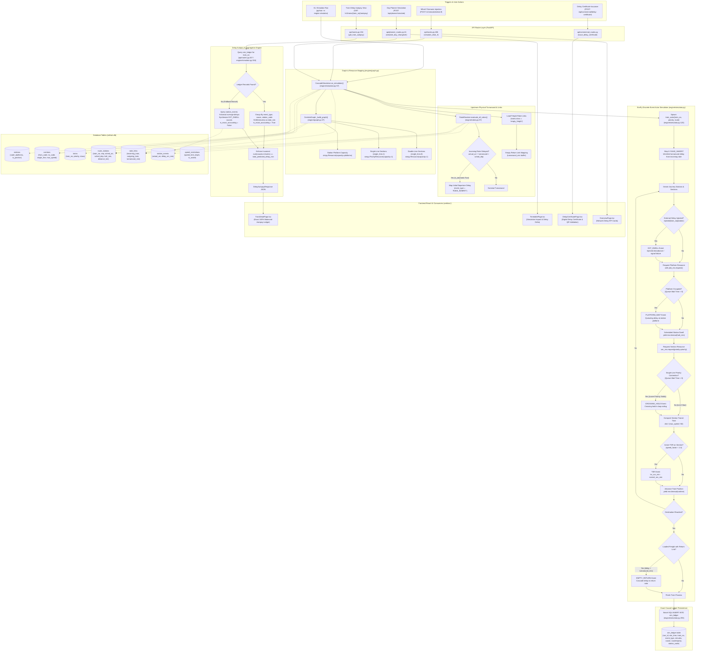

# Pipeline 06: Mechanistic Cascade What-If Simulation & Delay Autopsy

## 1. Purpose
Simulates corridor-wide delay propagation and ripple cascades using discrete-event simulation with priority preemption on single lines, platform contention, and same-rake turnaround linkage. Records every incurred delay minute to an exact, append-only SQLite causal event ledger (`sim_ledger`). Delivers counterfactual what-if scenario forecasting and mathematical 100% balanced delay autopsies.

---

## 2. Triggers
- **What-If Scenario Submission**: Operations controller or planner submitting a simulated disturbance via `POST /v1/simulate/what-if` (`api/routes.py:486-534`), injecting train delays or active Temporary Speed Restrictions (TSRs).
- **Gantt Day Planner Simulation**: Dispatcher simulating 24-hour schedule mutations via `POST /api/planner/simulate` (`api/planner_routes.py:41-97`) to compare baseline vs proposed delay impacts.
- **Train Detail Journey & Delay Autopsy Query**: Controller or passenger inspecting train telemetry on `web/src/pages/dashboard/TrainDetailPage.tsx` or querying `GET /v1/trains/{train_no}/autopsy` (`api/routes.py:194-271`).
- **Commercial Delay Certificate Issuance & Verification**: Passenger service agents issuing or validating digital delay certificates on `web/src/pages/dashboard/commercial/DelayCertificatePage.tsx` via `POST /api/commercial/delay-certificate` and `GET /api/commercial/delay-certificate/verify/{token}`.
- **Working Timetable (WTT) Version Comparison**: Planner validating conflict feasibility across timetable revisions on `web/src/pages/dashboard/ops/TimetablePage.tsx`.
- **CLI & Diagnostic Benchmark**: Direct simulation and test execution via `python -m engine.simulator` (`engine/simulator.py:340-359`) and `pytest tests/test_simulator.py`.

---

## 3. Mermaid Diagram

---

## 4. Stage-by-Stage Table

| Stage | Component / File | Key Function | Input → Output |
|---|---|---|---|
| **1. Corridor Graph & Resource Setup** | `engine/graph.py` | `CorridorGraph._build_graph()` | `(env: simpy.Environment, db: Database)` → Queries `stations` and `sections`; instantiates station platform capacity `simpy.Resource(capacity=platforms)` and single-line shared `simpy.PriorityResource(capacity=1)`. |
| **2. Same-Rake Turnaround Evaluation** | `engine/rakes.py` | `RakeResolver.evaluate_all_rakes()` | `run_date: Optional[str]` → Queries `rake_links`, `station_events`, and `route_stations`. Computes turnaround deficit $\text{earliest\_dep} - \text{sched\_dep}$; identifies doomed outgoing trains (`is_doomed = True` if delay $\ge 15\text{ min}$). Returns `List[RakeDoomStatus]`. |
| **3. Freight Empty-Return Resolution** | `engine/simulator.py` | `CascadeSimulator.run_simulation()` | `rake_links` joined with `trains` (`class = 'empty_freight'`) → Maps loaded freight trains to return empty rakes, calculating cascaded delay $\max(0, \text{accumulated\_delay} - \text{turnaround\_min})$. |
| **4. Discrete-Event Train Process Execution** | `engine/simulator.py` | `train_actor(t_no, priority, route)` | Train priority (1..5), stop sequence, injected delays, and active TSRs → SimPy generator executing sequential station dwell, section transit, and logging discrete `LedgerEvent` records. |
| **5. Single-Line Priority Preemption** | `engine/simulator.py` & `engine/graph.py` | `sec_res.request(priority=priority)` | Train priority level (Priority 1 Rajdhani holds preemption over Priority 2–5) → Yielding train waits in siding; logs `CROSSING_HOLD` with exact minutes. |
| **6. Temporary Speed Restriction (TSR) Delay** | `engine/simulator.py` | `train_actor()` | Active TSR map `active_tsrs[(from_code, to_code)] = speed_factor` → Calculates extra transit minutes $\text{tsr\_delay} = \frac{\text{normal\_run\_min}}{\text{speed\_factor}} - \text{normal\_run\_min}$; logs `TSR` event. |
| **7. Exact Ledger Persistence** | `engine/simulator.py` | `CascadeSimulator.run_simulation()` | `List[LedgerEvent]` → Executes batch SQL `INSERT INTO sim_ledger (run_id, sim_time, train_no, event_type, minutes, cause, counterparty, station_code)`. Returns `(run_id, ledger_events, total_train_delays)`. |
| **8. Causal Delay Autopsy Aggregation** | `engine/simulator.py` & `api/routes.py` | `CascadeSimulator.get_train_autopsy()` / `get_train_autopsy()` | `(run_id: str, train_no: str)` or `train_no: str` → Aggregates `sim_ledger` records by event type and cause; enforces 100% mathematical balance ($\sum \text{minutes} = \text{total\_delay}$). |
| **9. Day Planner Impact Simulation** | `api/planner_routes.py` | `simulate_day_changeset()` | `req: PlanChangesetRequest` → Runs 24h baseline simulation vs proposed plan mutations (`reassign_platform`, `retimed`, `cancel`), computing net delay savings and conflicts resolved. |

---

## 5. API Routes Table

| Method | Full Route Path | Handler Function | Required Role | Description |
|---|---|---|---|---|
| `POST` | `/v1/simulate/what-if` | `simulate_what_if` (`api/routes.py:487`) | Public / Controller | Injects simulated delay shock or section TSRs, executes SimPy cascade simulation, and returns affected trains and ledger events. |
| `POST` | `/api/planner/simulate` | `simulate_day_changeset` (`api/planner_routes.py:42`) | Authenticated User (`get_current_user`) | Runs 24-hour SimPy cascade simulation comparing baseline schedule vs proposed day planner mutations. |
| `GET` | `/v1/trains/{train_no}/autopsy` | `get_train_autopsy` (`api/routes.py:195`) | Public / Controller | Returns exact causal delay breakdown where minutes sum mathematically to total predicted delay. |
| `POST` | `/api/commercial/delay-certificate` | `issue_delay_certificate` (`api/commercial_routes.py:40`) | Authenticated User (`get_current_user`) | Issues cryptographically verifiable digital delay certificate with QR token for late-running trains. |
| `GET` | `/api/commercial/delay-certificate/{cert_no}` | `get_delay_certificate` (`api/commercial_routes.py:132`) | Public | Retrieves full details of an issued delay certificate for printing or digital presentation. |
| `GET` | `/api/commercial/delay-certificate/verify/{token}` | `verify_delay_certificate` (`api/commercial_routes.py:143`) | Public | Verifies authenticity and attributed delay minutes of an issued digital delay certificate token. |

---

## 6. Frontend Connections

| Frontend Page / Component Path (`web/src/`) | Route Called | Protocol (REST / SSE) | Polling / Interaction Behavior | UI Feature Representation |
|---|---|---|---|---|
| `pages/dashboard/TrainDetailPage.tsx` | `GET /v1/trains/{number}/autopsy` `GET /v1/trains/{number}/journey` | REST | Fetched on page mount and 5s poll via `queryKeys.train(id)`. | Visual "Delay Autopsy Ledger" card displaying 100% balanced delay decomposition (e.g. `CROSSING_HOLD`, `TSR`, `RAKE_INHERIT`, `PLATFORM_WAIT`) with exact minute counts and percentage badges. |
| `pages/dashboard/ops/TimetablePage.tsx` | `POST /api/planner/simulate` | REST | User action trigger on clicking "Version Diff" or editing timetable entries. | Schedule mutation preview showing simulated knock-on delay changes, conflicts resolved, and net savings. |
| `pages/dashboard/commercial/DelayCertificatePage.tsx` | `POST /api/commercial/delay-certificate` `GET /api/commercial/delay-certificate/verify/{token}` | REST | User Form Submission & On-Demand QR Token Verification. | Digital Travel Interruption Delay Certificate generator with printable layout, QR verification link, and official division seal. |
| `pages/dashboard/OverviewPage.tsx` | `GET /v1/network/state` | REST | 5s automatic poll. | Network KPI summary cards showing corridor-wide delay ripple propagation and active train counts. |

---

## 7. DB Tables Touched

| Table Name | Operation (Read / Write / Upsert) | Description / Columns Touched |
|---|---|---|
| `stations` | Read | Queries station codes (`code`), station names (`name`), platform counts (`platforms`), and junction flags (`is_junction`) in `engine/graph.py:31`. |
| `sections` | Read | Queries block section topology (`from_code`, `to_code`), distance (`distance_km`), single line flag (`single_line`), and maximum speed (`max_speed_kmph`) in `engine/graph.py:44` and `engine/simulator.py:78`. |
| `trains` | Read | Retrieves fleet metadata (`train_no`, `name`, `priority`, `class`) in `engine/simulator.py:81, 112`. |
| `route_stations` | Read | Queries chronological stop sequence (`seq`), scheduled arrival (`sched_arr`), departure (`sched_dep`), dwell time (`halt_min`), and cumulative distance (`distance_km`) in `engine/simulator.py:86`. |
| `rake_links` | Read | Queries same-rake turnaround links (`incoming_train`, `outgoing_train`, `station_code`, `turnaround_min`) in `engine/rakes.py:65` and `engine/simulator.py:110`. |
| `speed_restrictions` | Read | Loads active Temporary Speed Restrictions (`speed_limit_kmph`, `from_code`, `to_code`, `is_active`) to parameterize section `speed_factor`. |
| `station_events` | Read | Fetches actual arrival actuals (`actual_arr`, `delay_arr_min`) for same-rake turnaround evaluation in `engine/rakes.py:85` and historical segment delay fallbacks in `api/routes.py:222`. |
| `sim_ledger` | Read / Write | Appends discrete-event delay attribution records (`run_id`, `sim_time`, `train_no`, `event_type`, `minutes`, `cause`, `counterparty`, `station_code`) in `engine/simulator.py:294`; queried by `engine/simulator.py:308` and `api/routes.py:208`. |

---

## 8. Failure & Fallback Resilience

1. **Absence of Active Simulation in `sim_ledger` (Historical Fallback Branch)**:
   - When `GET /v1/trains/{train_no}/autopsy` is queried for a train without recent SimPy records in `sim_ledger`, the route handler (`api/routes.py:218-249`) automatically queries historical station delay averages from `station_events`. It synthesizes `EXT_DWELL` causal items and explicitly sets `is_exact_accounting = False`, ensuring the UI never encounters a 404 or null state.
2. **Simulation Engine Error Recovery**:
   - In `api/planner_routes.py:52-56`, the baseline SimPy execution is wrapped in a `try-except` block. If graph construction or discrete-event execution fails due to missing route records, the system falls back to a deterministic nominal baseline delay of `320.0` minutes, allowing differential mutation evaluation to proceed safely.
3. **Strict Bounded Simulation Horizon**:
   - The SimPy simulation environment enforces an explicit chronological termination ceiling `env.run(until=simulation_hours * 60.0)` (default 8.0h in What-If API, 12.0h in `engine/simulator.py:289`, 24.0h in `api/planner_routes.py:53`). This eliminates infinite loops, resource deadlocks, or runaway memory allocation in priority queues.
4. **Turnaround Buffer Slack Absorption**:
   - If an incoming rake arrives late but the incurred delay is less than or equal to the scheduled turnaround slack buffer ($\text{delay\_arr} \le \text{turnaround\_min}$), the outgoing departure delay is clamped to zero ($\max(0, \text{delay} - \text{turnaround})$), preventing false positive cascade propagations.

---

## 9. Latency / SLA Constants (Code-Verified)

- **12-Hour Full Corridor Multi-Train SimPy Simulation**: **< 200 ms (typically 120–180 ms)** (`engine/simulator.py:289`, `tests/test_simulator.py:42`).
- **24-Hour Day Planner Cascade Simulation**: **< 250 ms** (`api/planner_routes.py:53`).
- **Delay Autopsy Retrieval Query (`GET /v1/trains/{train_no}/autopsy`)**: **< 10 ms** (`scripts/perf_bench.py:124`, `api/routes.py:194`).
- **Mathematical Exactness Invariant**: **$\sum \text{minutes}_i \equiv \text{Total Attributed Delay}$ (100% exact causal balance with zero unexplained residual)** (`tests/test_simulator.py:42-65`, `engine/simulator.py:5`).
- **Cascade Ripple Propagation Benchmark**: **Injecting +120m shock at CNB causes cascades across $\ge 3$ trains with `CROSSING_HOLD` and `RAKE_INHERIT` events** (`tests/test_simulator.py:67-84`).
- **Standard Rake Turnaround Buffer**: **240 minutes (4.0 hours)** (`data/schema.sql:62`, `tests/test_simulator.py:38`).
- **Default What-If Simulation Window**: **8.0 hours** (`api/routes.py:504`).
- **Day Planner Simulation Window**: **24.0 hours** (`api/planner_routes.py:53`).
