# Pipeline 07: Live Position Tracking, Context & Real Delay Attribution

## 1. Purpose
Provides continuous, high-precision spatial positioning and causal delay attribution for all active trains along the 785 KM New Delhi (NDLS) to Pt. Deen Dayal Upadhyaya (DDU) trunk corridor. Combines multi-tier station-board polling and rate-budgeted RapidAPI refresh with polyline kinematic dead-reckoning, exponential confidence decay ($\tau = 1800\text{s}$), 5-layer operational context enrichment, and exact mathematical delay attribution ($\sum \text{minutes} = \Delta\text{delay}$) logged to an immutable ledger.

## 2. Triggers
- **Master Live Tracker Loop**: `engine/live_tracker.py` `LivePositionTracker.tick()` executing every `LIVE_TRACKER_INTERVAL_SECONDS = 30s` in FastAPI `lifespan()`.
- **Station-Board Batch Polling**: Corridor station boards polled every `LIVE_STATION_POLL_SECONDS = 60s` staggered across trunk stations.
- **Per-Train RapidAPI Refresh**: Dynamic round-robin refresh for active delayed rakes capped at `LIVE_POLL_TPM_BUDGET = 30` calls/min.
- **Delay Jump Attribution Trigger**: Evaluated whenever $\Delta\text{delay} \ge \text{ATTRIBUTION\_DELTA\_MIN} = 3\text{m}$.
- **Client SSE Stream**: Real-time push every `LIVE_SSE_PULSE_SECONDS = 5s` via `GET /v1/live/stream`.

## 3. Mermaid Diagram

```mermaid
flowchart TD
    subgraph Triggers["Pipeline 07 Triggers"]
        T1["Master Tracker Loop (30s)<br/>engine/live_tracker.py"]
        T2["Station-Board Polling (60s)<br/>collector/adapters/"]
        T3["RapidAPI TPM Rate Limiter (30/min)<br/>TokenBucket"]
        T4["SSE Pulse Stream (5s)<br/>GET /v1/live/stream"]
    end

    subgraph AnchorSubsystem["Anchor Ingestion & Re-Anchoring"]
        T2 & T3 --> DC["DataCollector.fetch_with_failover()"]
        DC --> QG["QualityGate.validate_events()"]
        QG --> DBStationEvents[("station_events Table<br/>(SQLite WAL)")]
        DBStationEvents --> AnchorDetect["Detect New Station Anchor<br/>(seq, station_code, actual_ts, delay_arr_min)"]
    end

    subgraph KinematicDeadReckon["Polyline Dead-Reckoning Subsystem"]
        T1 & AnchorDetect --> DR["Kinematic Dead-Reckoning Engine"]
        DR --> SectionRuntime["section_runtime = section_km / (max_speed / 60)<br/>adjusted by active TSR speed factor"]
        DR --> Interpolate["Polyline Coords Interpolation (lat/lng, km marker, progress %)"]
        DR --> ConfDecay["Confidence Decay: exp(-Δt / 1800s)<br/>Clamped at DEAD_RECKON_MIN_CONFIDENCE = 0.20"]
        Interpolate & ConfDecay --> DBLivePositions[("live_positions Table<br/>INSERT OR REPLACE (train_no, run_date)")]
    end

    subgraph ContextSubsystem["5-Layer Operational Context Engine"]
        DR --> CE["ContextEngine.enrich(train_no)<br/>(engine/context.py)"]
        CE --> L1["Layer 1: Station Micro-Weather<br/>(Open-Meteo cached 15min)"]
        CE --> L2["Layer 2: Active TSR Caution Orders<br/>(speed_restrictions on next 3 sections)"]
        CE --> L3["Layer 3: Incoming Rake Turnaround<br/>(RakeResolver Turnaround Deficit)"]
        CE --> L4["Layer 4: Platform Berthing & Conflicts<br/>(PlatformManager dwell / holds)"]
        CE --> L5["Layer 5: Spatial Congestion<br/>(Trains ahead within headway)"]
    end

    subgraph AttributionSubsystem["Live Delay Attribution Engine"]
        AnchorDetect -- "Delay Jump >= 3m" --> AE["LiveAttributionEngine.evaluate_delay_jump()<br/>(engine/attribution.py)"]
        AE --> R1["1. RAKE_INHERIT (turnaround deficit)"]
        AE --> R2["2. TSR_ACTIVE (speed restriction delay)"]
        AE --> R3["3. WEATHER_FOG / RAIN (fog/precipitation)"]
        AE --> R4["4. PLATFORM_WAIT (dwell extension)"]
        AE --> R5["5. CONGESTION (headway buffer wait)"]
        AE --> R6["6. UNEXPLAINED (residual > 2m)"]
        R1 & R2 & R3 & R4 & R5 & R6 --> InvariantCheck["Exact Accounting Invariant<br/>sum(minutes) == measured_delta_min"]
        InvariantCheck --> DBLedger[("live_delay_ledger Table<br/>Append-Only Immutable Ledger")]
    end

    subgraph APIRoutes["Serving & Streaming Layer"]
        DBLivePositions & CE & DBLedger --> RLive["GET /v1/trains/{no}/live"]
        DBLedger --> RWhyLate["GET /v1/trains/{no}/why-late"]
        DBLivePositions --> RPositions["GET /v1/live/positions"]
        T4 & DBLivePositions --> RSSE["GET /v1/live/stream (SSE)"]
        ConfigConst["config.py Constants"] --> RMeta["GET /v1/meta/config"]
    end

    subgraph Frontend["Frontend Dashboard Layer"]
        RLive & RWhyLate & RPositions & RSSE & RMeta --> LiveMap["LiveMapPage.tsx<br/>Gliding markers, confidence halos, Why-Late side drawer"]
    end
```

## 4. Pipeline Stages

| Stage | Component | Input | Output | Invariants / SLA |
|---|---|---|---|---|
| **1. Anchor Polling** | `LivePositionTracker._poll_station_boards()` | Corridor station codes | New `station_events` rows | Rate limited by `LIVE_STATION_POLL_SECONDS` (60s), staggered |
| **2. Dead-Reckoning** | `LivePositionTracker._track_single_train_with_event()` | Latest anchor + timetable geometry | `LiveTrainPosition` (lat, lng, speed, progress, confidence) | $25.0 \le \text{lat} \le 29.0$, $77.0 \le \text{lng} \le 83.5$, confidence $\in [0.2, 1.0]$ |
| **3. Context Enrichment** | `ContextEngine.enrich()` | `train_no`, `run_date`, `km` | `TrainContext` (Weather, TSRs, Rake, Platform, Congestion) | Cached `CONTEXT_CACHE_TTL_SECONDS` (5s), pure reads |
| **4. Delay Jump Evaluation** | `LiveAttributionEngine.evaluate_delay_jump()` | Previous & current delay, context | `AttributionResult` (causes, minutes, proof) | Triggered when $\Delta\text{delay} \ge 3\text{m}$; exact sum invariant strictly enforced |
| **5. Ledger Persistence** | `Database.append_live_delay_ledger()` | `AttributionResult` | `live_delay_ledger` row | Append-only, never overwrites historical audit rows |
| **6. Position Persistence** | `Database.upsert_live_positions_bulk()` | `List[LiveTrainPosition]` | `live_positions` table rows | Idempotent upsert on `(train_no, run_date)` |
| **7. Real-Time Streaming** | `api/live_routes.py` `stream_live_positions()` | Broadcast event queue | SSE `text/event-stream` chunks | Emits every `LIVE_SSE_PULSE_SECONDS` (5s) with initial state burst |

## 5. API Routes

| Endpoint | Method | Response Schema | Description |
|---|---|---|---|
| `/v1/trains/{train_no}/live` | `GET` | `TrainLiveDetail` | Live kinematic position, enriched context, and why-late attribution summary |
| `/v1/trains/{train_no}/why-late` | `GET` | `WhyLateSummary` | Ranked delay causes with exact accounting proof and historical timeline |
| `/v1/live/positions` | `GET` | `List[LivePosition]` | All active corridor train positions for initial map load |
| `/v1/live/stream` | `GET` | `text/event-stream` | Real-time Server-Sent Events stream with 5s pulse and delay chips |
| `/v1/meta/config` | `GET` | `MetaConfig` | Frontend runtime configuration (intervals, thresholds, color tokens) |

## 6. Frontend Connections

| Page / Component | Route | Endpoints Consumed | Visual Behavior |
|---|---|---|---|
| `LiveMapPage.tsx` | `/dashboard/live-map` | `GET /v1/live/positions`, `GET /v1/live/stream` | Corridor SVG map with gliding train markers, confidence halos, and Why-Late side drawer |
| `TrainDetailPage.tsx` | `/dashboard/trains/:no` | `GET /v1/trains/{no}/live`, `GET /v1/trains/{no}/why-late` | Live telemetry banner, micro-weather badge, and why-late breakdown chips |
| `TopBar.tsx` | Global shell | `GET /v1/meta/config` | Real-time connection status indicator and DEMO/REPLAY badge |

## 7. Database Tables

### `live_positions` (Upsert Key: `train_no + run_date`)
| Column | Type | Description |
|---|---|---|
| `train_no` | `TEXT` | Primary key component |
| `run_date` | `TEXT` | Primary key component (`YYYY-MM-DD`) |
| `lat` / `est_lat` | `REAL` | Current estimated latitude |
| `lng` / `est_lng` | `REAL` | Current estimated longitude |
| `current_station_code` | `TEXT` | Nearest / anchored station code |
| `next_station_code` | `TEXT` | Next scheduled station code |
| `section_id` | `TEXT` | Current block section identifier |
| `speed_kmh` / `est_speed_kmph` | `REAL` | Estimated kinematic speed in km/h |
| `delay_minutes` | `REAL` | Current arrival/departure delay in minutes |
| `confidence` | `REAL` | Exponential confidence metric $\in [0.2, 1.0]$ |
| `progress_pct` | `REAL` | Cumulative corridor progress percentage |
| `is_dead_reckoned` | `INTEGER` | `1` if interpolated between anchors, `0` if hard anchor |
| `source` | `TEXT` | `station_events_telemetry`, `rapidapi`, or `mock_replay` |
| `updated_at` | `TEXT` | ISO-8601 timestamp |

### `live_delay_ledger` (Append-Only)
| Column | Type | Description |
|---|---|---|
| `id` | `INTEGER PK` | Auto-increment primary key |
| `train_no` | `TEXT` | Train number |
| `run_date` | `TEXT` | Train run date |
| `timestamp` | `TEXT` | Attribution evaluation timestamp |
| `delay_change_min` | `REAL` | Measured positive delay delta ($\Delta \ge 3\text{m}$) |
| `previous_delay_min` | `REAL` | Delay at prior anchor |
| `current_delay_min` | `REAL` | Delay at current anchor |
| `primary_cause` | `TEXT` | Top attributed causal factor |
| `secondary_cause` | `TEXT` | Second attributed causal factor (if any) |
| `confidence` | `REAL` | Attribution confidence score |
| `evidence_json` | `TEXT` | Structured JSON containing cause minutes and context snapshot |
| `is_exact_accounting` | `INTEGER` | `1` indicating exact mathematical accounting |
| `created_at` | `TEXT` | ISO-8601 insertion timestamp |

## 8. Failure & Fallback Handling

1. **Total Adapter Failure**: If all live adapters (RapidAPI, scrape) fail, the system falls back to `MockReplaySource` or continues dead-reckoning from the last known anchors with decaying confidence. The system never raises unhandled 500 errors.
2. **Missing Station Telemetry**: When telemetry is absent for a train, position resolves to scheduled origin station with `confidence = 0.20` and `status = "NOT_STARTED"`.
3. **SSE Connection Drop**: The frontend `LiveMapPage` catches SSE disconnects, displays a subtle "STALE TELEMETRY" badge, keeps the last known markers rendered, and auto-reconnects with exponential backoff.
4. **Weather Provider Downtime**: When Open-Meteo is unreachable, `WeatherEngine` provides deterministic seasonal fallback values (e.g. Winter morning: $15^\circ\text{C}$, 88% RH, `fog_flag = 1`).

## 9. Staleness Budget & SLA

| Layer | Max Staleness | Configuration Knob | Default Value |
|---|---|---|---|
| **Station-Board Anchor Poll** | 60s | `LIVE_STATION_POLL_SECONDS` | `60s` |
| **Position Recompute Loop** | 30s | `LIVE_TRACKER_INTERVAL_SECONDS` | `30s` |
| **Position API Cache** | 5s | `POSITION_CACHE_TTL_SECONDS` | `5s` |
| **SSE Push Stream** | 5s | `LIVE_SSE_PULSE_SECONDS` | `5s` |
| **Client Marker Glide** | 1s | `LIVE_CONFIG.GLIDE_DURATION_MS` | `1000ms` |
| **Operational Context Cache** | 5s | `CONTEXT_CACHE_TTL_SECONDS` | `5s` |
| **Station Weather Refresh** | 15min | `WEATHER_CACHE_MINUTES` | `15min` |
| **Confidence Decay Half-Life** | 1800s | `CONFIDENCE_TAU_SECONDS` | `1800s` |
