# RailTwin-X Runtime Pipelines: Master Architectural Index & System Specification

## 1. Executive System Overview

**RailTwin-X** is an enterprise-grade railway delay intelligence and station operating system engineered for real-time dispatch decision-support, predictive traffic management, and passenger information delivery. The system is designed around **six tightly integrated, deterministic runtime pipelines** that span continuous telemetry ingestion, automated MLOps retraining, ultra-low-latency calibrated inference, track conflict advisory generation with multi-channel alerting, station platform berthing re-optimization, and discrete-event mechanistic cascade simulation.

```
┌───────────────────────────────────────────────────────────────────────────────────────────────────┐
│                                   RAILTWIN-X RUNTIME ARCHITECTURE                                 │
├───────────────────────────────────────────────────────────────────────────────────────────────────┤
│                                                                                                   │
│   [01 Ingestion] ────(Events & Weather)───► [02 Nightly MLOps] ────(Champion Models)───┐          │
│          │                                                                             ▼          │
│          ├────────────────────────────────────────────────────────────────► [03 Real-Time ETA]    │
│          │                                                                             │          │
│          │                                ┌────────────────────────────────────────────┴─────┐    │
│          │                                ▼                                                  ▼    │
│          ├──────────────────────► [04 Advisory & Alerts]                          [05 Platform Gantt]│
│          │                                │ (WhatsApp / SMS)                                 │    │
│          ▼                                ▼                                                  ▼    │
│   [06 SimPy Cascade] ◄──────────── Field Dispatchers                              SSE Live Boards │
│          │                                                                                        │
│          └────────────────────────► 100% Balanced Delay Autopsies & What-If Forecasts             │
│                                                                                                   │
│   ═════════════════════════════════════════════════════════════════════════════════════════════   │
│   Unified Web Dashboard (web/src React + TanStack Query 5s Polling & SSE Real-Time Streaming)    │
└───────────────────────────────────────────────────────────────────────────────────────────────────┘
```

### Core Architectural Tenets
1. **Multi-Tier Degradation & Zero-Fail Resilience**: Every pipeline incorporates automatic fallback cascades (e.g., RapidAPI $\to$ Web Scraper $\to$ Deterministic Mock Replay in Pipeline 01; PyTorch GRU Champion $\to$ LightGBM CQR $\to$ Historical Baseline SQL $\to$ Timetable Dead-Reckoning in Pipeline 03; WhatsApp Gateway $\to$ SMS Gateway $\to$ In-App Inbox in Pipeline 04).
2. **100% Deterministic Safety Interlocks**: Machine learning predictions and AI re-allocations are strictly bounded by mathematical kinematic checks (`safety/interlock.py`), single-line block clearances, and platform maintenance state locks before execution or display.
3. **Calibrated Statistical Uncertainty**: Dynamic ETA predictions provide non-crossing quantiles ($p_{10}, p_{50}, p_{90}$) calibrated via Mondrian Conformalized Quantile Regression (CQR), providing a mathematically verified $\ge 80.0\%$ empirical coverage guarantee across all horizons.
4. **Human-in-the-Loop Operational Authority**: High-consequence dispatch advisories require explicit human sign-off with single-key dashboard hotkeys, backed by an automated 5-minute supervisor escalation ladder and cryptographic HMAC-SHA256 audit chaining.
5. **Exact Causal Attribution & Reversibility**: Discrete-event simulations attribute 100% of accumulated delay minutes to discrete physical causes in an append-only ledger (`sim_ledger`), while platform schedule optimizations support instantaneous 1-click snapshot rollbacks.

---

## 2. Master Index Table

| Pipeline # | Name | Trigger | Primary Stages & Files | Core Database Tables Touched | Final Output | Latency Budget / SLA | Document Link |
|---|---|---|---|---|---|---|---|
| **01** | **Live Data Ingestion & Snapshot Telemetry** | Cron / CLI (`collector.collect`, `collector.snapshot_cron`), 300s Live Daemon, Seed API | 1. Weather sync (UTC-to-IST)<br/>2. 3-tier adapter failover<br/>3. 4-rule QualityGate<br/>4. Station events upsert<br/>5. Snapshot coordinate archive<br/>*(`collector/collect.py`, `collector/weather.py`, `collector/quality.py`, `collector/snapshot_cron.py`, `ml/snapshots.py`)* | `station_events` (W)<br/>`weather` (W)<br/>`weather_hourly` (W)<br/>`train_runs` (W)<br/>`run_snapshots` (W)<br/>`timetable_entries` (W)<br/>`trains` (R)<br/>`stations` (R)<br/>`route_stations` (R) | Verified point-in-time station events, hourly corridor micro-weather, telemetry snapshots, and 25-dim cache parquets | Request timeout $\le 10.0\text{s}$; scrape delay $2.0\text{s}$; 300s background cycle; SSE pulse $5.0\text{s}$; historical weather coverage $\ge 95\%$ | [Pipeline 01 Specification](01_live_data_ingestion.md) |
| **02** | **Nightly MLOps Training & Champion Promotion** | `make nightly` (`scripts/nightly_pipeline`), `make train`, `make eval`, `make drift`, Docker profile | 1. Baseline pre-aggregation<br/>2. Trajectory snapshot builder<br/>3. LightGBM quantile training<br/>4. PyTorch GRU challenger training<br/>5. Mondrian CQR calibration<br/>6. Paired Wilcoxon champion gate<br/>7. Held-out backtest proof<br/>8. PSI feature drift monitor<br/>*(`scripts/nightly_pipeline.py`, `data/db.py`, `ml/snapshots.py`, `ml/train.py`, `ml/model_seq.py`, `ml/conformal.py`, `scripts/champion_gate.py`, `ml/evaluate.py`, `ml/drift.py`)* | `hist_baselines` (W)<br/>`conformal_pid_state` (W)<br/>`shadow_log` (W)<br/>`audit_log` (W)<br/>`notifications` (W)<br/>`station_events` (R)<br/>`trains` (R)<br/>`stations` (R)<br/>`route_stations` (R)<br/>`weather` (R)<br/>`speed_restrictions` (R)<br/>`rake_links` (R) | Retrained champion models, `manifest.json`, `registry.json`, `metrics.json` F14 proof table, `drift_report.json` | Pipeline wall-clock $40\text{--}120\text{s}$; GRU inference budget $\le 8.0\text{ms}$ ($p_{50}=0.77\text{ms}$); ensemble memory $\le 150\text{MB}$; PSI alert $>0.25$ | [Pipeline 02 Specification](02_nightly_ml_training.md) |
| **03** | **Real-Time Inference & Dynamic ETA Prediction** | REST (`/v1/trains/{no}/eta`, `/v1/trains/{no}/journey`, `/v1/network/state`), SSE (`/api/board/stream`), 5s UI poll | 1. Soft Bayesian position resolution<br/>2. Snapshot feature hydration<br/>3. Multi-tier quantile inference<br/>4. Mondrian CQR offset adjustment<br/>5. Top-3 position marginalization<br/>6. Mathematical quantile invariant<br/>7. 5-rule safety interlock<br/>8. Delay driver extraction<br/>*(`api/predictor.py`, `engine/position_resolver.py`, `ml/snapshots.py`, `ml/conformal.py`, `safety/interlock.py`, `api/board_routes.py`)* | `shadow_log` (W)<br/>`station_events` (R)<br/>`ad_events` (R)<br/>`route_stations` (R)<br/>`trains` (R)<br/>`stations` (R)<br/>`weather` (R)<br/>`speed_restrictions` (R)<br/>`hist_baselines` (R) | Calibrated non-crossing quantiles ($p_{10}, p_{50}, p_{90}$), delay attribution drivers, safety interlock tier, SSE live board stream | Single-item GRU $p_{95} \le 1.56\text{ms}$; Deep ensemble $p_{95} \le 3.0\text{ms}$; ETA endpoint $p_{95} \le 20\text{ms}$; Journey $p_{95} \le 155\text{ms}$; Cache TTL $4.0\text{s}$; Coverage $\ge 80\%$ | [Pipeline 03 Specification](03_realtime_inference_eta.md) |
| **04** | **Advisory Generation & Multi-Channel Notifications** | REST (`POST /v1/advise`, `GET /v1/conflicts/{no}`), 5-min daemon, Webhook (`POST /v1/hooks/whatsapp`), 5-min escalation | 1. State perception & features<br/>2. Track conflict scanning<br/>3. Crew fatigue evaluation<br/>4. Safety interlock validation<br/>5. Advisory formulation & audit<br/>6. Recipient directory lookup<br/>7. WhatsApp dispatch & 2-min rate limit<br/>8. Automatic SMS failover<br/>9. HMAC webhook ACK ingestion<br/>10. 5-min supervisor escalation<br/>*(`api/brain.py`, `engine/conflicts.py`, `engine/ops.py`, `safety/interlock.py`, `notifications/dispatcher.py`, `notifications/channels/openwa.py`, `notifications/channels/sms.py`, `notifications/webhook_verify.py`)* | `brain_advisory_audit` (W)<br/>`notifications` (W)<br/>`notification_log` (W)<br/>`notification_ack` (W)<br/>`advisory_ack_log` (W)<br/>`audit_log` (W)<br/>`station_events` (R)<br/>`route_stations` (R)<br/>`sections` (R)<br/>`trains` (R)<br/>`stations` (R)<br/>`staff` (R) | Structured operational advisories, WhatsApp/SMS alert messages, cryptographic ACK logs, and supervisor escalation events | Brain advisory SLA $< 2000\text{ms}$ (typical $15\text{--}45\text{ms}$); cache TTL $5.0\text{s}$; gateway timeout $10.0\text{s}$; non-critical rate limit $2.0\text{min}$; unacked escalation $5\text{min}$ | [Pipeline 04 Specification](04_advisory_notifications.md) |
| **05** | **Station Platform Gantt & Self-Healing Re-Optimizer** | Gantt 5s poll, "1-Click Re-Optimize" button, Maintenance block, Manual assign, Changeset commit, SSE PIDS | 1. Gantt occupancy timeline build<br/>2. Pairwise platform overlap detection<br/>3. In-memory rollback capture<br/>4. Sub-50ms greedy local search solver<br/>5. Chance-constrained CVaR risk pass<br/>6. Safety interlock validation<br/>7. Maintenance state machine<br/>8. Assignment locking<br/>9. Vectorized live board & 4s ETag<br/>10. 5s SSE streaming<br/>*(`engine/ops.py`, `engine/ops_risk.py`, `api/platform_routes.py`, `api/board_routes.py`, `api/planner_routes.py`)* | `platform_states` (W)<br/>`platform_assignments` (W)<br/>`planner_changesets` (W)<br/>`audit_log` (W)<br/>`notifications` (W)<br/>`stations` (R)<br/>`trains` (R)<br/>`route_stations` (R)<br/>`station_events` (R)<br/>`hist_baselines` (R)<br/>`ad_events` (R) | Conflict-free platform berthing schedule, diff summary with swaps, locked assignments, 24h Gantt visual timeline, SSE live board | Solver execution $< 50\text{ms}$ (risk-aware $\le 40\text{ms}$, SLA ceiling $< 2000\text{ms}$); live board $p_{50}=24.9\text{ms}$, $p_{95}=155\text{ms}$; cache TTL $4.0\text{s}$; SSE pulse $5\text{s}$; max 30 greedy passes | [Pipeline 05 Specification](05_platform_gantt_reoptimizer.md) |
| **06** | **Mechanistic Cascade What-If Simulation & Delay Autopsy** | REST (`POST /v1/simulate/what-if`, `POST /api/planner/simulate`, `GET /v1/trains/{no}/autopsy`), Delay Cert API, CLI | 1. Corridor SimPy graph setup<br/>2. Same-rake turnaround doom check<br/>3. Freight empty-return resolution<br/>4. Discrete-event train process<br/>5. Single-line priority preemption<br/>6. Active TSR delay calculation<br/>7. Batch `sim_ledger` insert<br/>8. Causal delay autopsy aggregation<br/>9. Day planner impact simulation<br/>*(`engine/simulator.py`, `engine/graph.py`, `engine/rakes.py`, `api/routes.py`, `api/planner_routes.py`, `api/commercial_routes.py`)* | `sim_ledger` (W)<br/>`stations` (R)<br/>`sections` (R)<br/>`trains` (R)<br/>`route_stations` (R)<br/>`rake_links` (R)<br/>`station_events` (R)<br/>`speed_restrictions` (R) | Append-only causal ledger records (`sim_ledger`), 100% mathematically balanced delay autopsies, what-if ripple forecasts, and digital delay certificates | 12-hour simulation $< 200\text{ms}$ (typical $120\text{--}180\text{ms}$); 24-hour planner sim $< 250\text{ms}$; autopsy query $< 10\text{ms}$; exact balance invariant $\sum \text{causes} \equiv \text{total delay}$ | [Pipeline 06 Specification](06_cascade_whatif_simulation.md) |
| **07** | **Live Position Tracking, Context & Real Delay Attribution** | Master loop (30s), Station poll (60s), Delay Jump $\ge 3\text{m}$, SSE (5s), REST `/v1/trains/{no}/live` | 1. Multi-tier anchor ingestion<br/>2. Polyline dead-reckoning<br/>3. Exponential confidence decay ($\tau=1800\text{s}$)<br/>4. 5-layer operational context<br/>5. 6-rule delay attribution<br/>6. Exact accounting ledger<br/>7. 5s SSE position broadcast<br/>*(`engine/live_tracker.py`, `engine/context.py`, `engine/attribution.py`, `api/live_routes.py`)* | `live_positions` (W)<br/>`live_delay_ledger` (W)<br/>`station_events` (R)<br/>`route_stations` (R)<br/>`trains` (R)<br/>`stations` (R)<br/>`weather` (R)<br/>`speed_restrictions` (R)<br/>`rake_links` (R)<br/>`platform_states` (R) | Real-time train positions (`live_positions`), exact delay attribution records (`live_delay_ledger`), 5-layer context, SSE real-time stream | Tracker recompute 30s; anchor poll 60s; API cache 5s; SSE pulse 5s; client glide 1s; attribution exact accounting invariant $\sum\text{causes} \equiv \Delta\text{delay}$ | [Pipeline 07 Specification](07_live_position_attribution.md) |

---

## 3. MASTER System Mermaid Flowchart

The following comprehensive flowchart represents the entire RailTwin-X architecture, mapping all 6 pipelines, external data providers, database persistence layers, model registries, cross-pipeline dependencies, and React frontend dashboard consumers.

```mermaid
flowchart TD
    %% ─────────────────────────────────────────────────────────────
    %% EXTERNAL PROVIDERS & SENSORS
    %% ─────────────────────────────────────────────────────────────
    subgraph ExternalSources["External Ingestion Sources & Field Telemetry"]
        Ext_RapidAPI["RapidAPI Live Running Status API<br/>(Primary Live Telemetry)"]
        Ext_Scrape["eRail / IndiaRailInfo Web Scrapers<br/>(Secondary Live Telemetry)"]
        Ext_Meteo["Open-Meteo Weather API<br/>(Hourly Forecast & Archive)"]
        Ext_OpenWA["OpenWA WhatsApp Webhook<br/>(POST /v1/hooks/whatsapp)"]
        Ext_SMS["SMS Gateway Providers<br/>(MSG91 Flow / Fast2SMS API)"]
        Ext_WTT["Official Timetable Master Seed<br/>(CSV / Working Timetable WTT)"]
    end

    %% ─────────────────────────────────────────────────────────────
    %% PIPELINE 01: INGESTION
    %% ─────────────────────────────────────────────────────────────
    subgraph P01["Pipeline 01: Live Ingestion & Snapshot Telemetry"]
        P01_Collect["DataCollector.fetch_with_failover()<br/>(collector/collect.py)"]
        P01_Weather["WeatherEngine.sync_corridor_weather()<br/>(collector/weather.py)"]
        P01_Quality["QualityGate.validate_events()<br/>(collector/quality.py)"]
        P01_Snapshots["SnapshotCollector.record_snapshot_cycle()<br/>(collector/snapshot_cron.py)"]
    end

    Ext_RapidAPI & Ext_Scrape --> P01_Collect
    Ext_Meteo --> P01_Weather
    Ext_WTT --> P01_Snapshots
    P01_Collect --> P01_Quality

    %% ─────────────────────────────────────────────────────────────
    %% CORE DATABASE STORAGE
    %% ─────────────────────────────────────────────────────────────
    subgraph Database["SQLite Central Relational Storage (railtwin.db)"]
        DB_Events[("station_events Table<br/>(Live & Historical Actuals)")]
        DB_Weather[("weather & weather_hourly Tables<br/>(IST Micro-Weather & Fog Flags)")]
        DB_Snapshots[("train_runs & run_snapshots Tables<br/>(High-Frequency Telemetry)")]
        DB_Baselines[("hist_baselines Table<br/>(Pre-Aggregated avg_delay & p90)")]
        DB_Topol[("trains, stations, route_stations, sections<br/>(Master Network Topology & Constraints)")]
        DB_Platform[("platform_states & platform_assignments<br/>(Real-Time Berthing & Maintenance Locks)")]
        DB_Ledger[("sim_ledger Table<br/>(Discrete-Event Causal Attribution)")]
        DB_Notif[("notifications, notification_log, advisory_ack_log<br/>(Alerts, Dispatches & Human Sign-Offs)")]
        DB_Audit[("audit_log Table<br/>(HMAC-SHA256 Cryptographic Audit Chain)")]
    end

    P01_Quality --> DB_Events
    P01_Weather --> DB_Weather
    P01_Snapshots --> DB_Snapshots

    %% ─────────────────────────────────────────────────────────────
    %% PIPELINE 02: NIGHTLY MLOPS
    %% ─────────────────────────────────────────────────────────────
    subgraph P02["Pipeline 02: Nightly MLOps Retraining & Champion Gate"]
        P02_Seed["Baseline Pre-Aggregation<br/>(data/db.py: materialize_historical_baselines)"]
        P02_Parquet["SnapshotGenerator.build_dataset()<br/>(ml/snapshots.py -> data/cache/*.parquet)"]
        P02_LGBM["ModelTrainer.train_all()<br/>(ml/train.py -> Direct & Delta Trees)"]
        P02_GRU["GRUChallengerTrainer.train()<br/>(ml/model_seq.py -> PyTorch GRU)"]
        P02_CQR["MondrianCQR.calibrate()<br/>(ml/conformal.py -> q_hat Horizons)"]
        P02_Gate["champion_gate.py & EnsemblePromotionGate<br/>(Paired Wilcoxon & DM Test p < 0.05)"]
        P02_Eval["Evaluator.evaluate_test_set()<br/>(ml/evaluate.py -> F14 Backtest Proof)"]
        P02_Drift["PSIDriftMonitor.run()<br/>(ml/drift.py -> PSI Feature Drift Check)"]
    end

    DB_Events & DB_Weather & DB_Topol --> P02_Seed
    P02_Seed --> DB_Baselines
    DB_Events & DB_Weather & DB_Baselines --> P02_Parquet
    P02_Parquet --> P02_LGBM & P02_GRU
    P02_LGBM & P02_GRU --> P02_CQR --> P02_Gate
    P02_Gate --> P02_Eval & P02_Drift
    P02_Gate --> DB_Audit
    P02_Drift -- "RED Alert (PSI > 0.25)" --> DB_Notif

    %% Model Artifact Storage
    subgraph ModelRegistry["Filesystem Model & Artifact Registry (artifacts/)"]
        Art_Models["model_gru_challenger.pt<br/>model_direct_q*.txt, model_delta_q*.txt"]
        Art_Manifest["registry.json & manifest.json<br/>(Champion Pinned State & CQR Offsets)"]
        Art_Metrics["metrics.json & drift_report.json<br/>(F14 Proof Benchmarks vs B1/B2/B3)"]
    end

    P02_Gate --> Art_Models & Art_Manifest
    P02_Eval & P02_Drift --> Art_Metrics

    %% ─────────────────────────────────────────────────────────────
    %% PIPELINE 03: REAL-TIME INFERENCE & ETA SERVING
    %% ─────────────────────────────────────────────────────────────
    subgraph P03["Pipeline 03: Real-Time Inference & Dynamic ETA Prediction"]
        P03_Pos["PositionResolver.resolve_train_position()<br/>(engine/position_resolver.py -> Bayesian Posterior)"]
        P03_Feat["Feature Hydration Vector<br/>(ml/snapshots.py -> 25-dim Features)"]
        P03_Predict["PredictorService.predict_train_eta()<br/>(api/predictor.py -> Multi-Tier Cascade)"]
        P03_Interlock["validate_prediction_through_interlock()<br/>(safety/interlock.py -> 5 Deterministic Rules)"]
        P03_Drivers["PredictorService._extract_top_drivers()<br/>(Delay Attribution Explanation)"]
    end

    DB_Events & DB_Topol --> P03_Pos
    P03_Pos & DB_Weather & DB_Baselines --> P03_Feat
    P03_Feat --> P03_Predict
    Art_Manifest & Art_Models --> P03_Predict
    P03_Predict --> P03_Interlock --> P03_Drivers

    %% ─────────────────────────────────────────────────────────────
    %% PIPELINE 04: ADVISORY & MULTI-CHANNEL NOTIFICATIONS
    %% ─────────────────────────────────────────────────────────────
    subgraph P04["Pipeline 04: Advisory Generation & Multi-Channel Notifications"]
        P04_Brain["BrainOrchestrator.advise()<br/>(api/brain.py: Multi-Stage Perception-Action)"]
        P04_Conflicts["ConflictScanner.scan_train_conflicts()<br/>(engine/conflicts.py: Headway & Opposing)"]
        P04_Crew["CrewDutyEngine.evaluate_crew_alerts()<br/>(engine/ops.py: 10h Cap Breach Projection)"]
        P04_Dispatch["NotificationDispatcher.dispatch()<br/>(notifications/dispatcher.py: 2-min Rate Limit)"]
        P04_OpenWAChannel["OpenWA WhatsApp Channel<br/>(Primary Dispatch)"]
        P04_SMSChannel["SMS Fallback Channel<br/>(Secondary HIGH/CRITICAL Failover)"]
        P04_ACK["record_advisory_ack()<br/>(Bidirectional Human Decision Ingestion)"]
        P04_Escalate["escalate_unacked_notifications()<br/>(5-Minute Unacked Supervisor Escalation)"]
    end

    P03_Interlock -- "Dynamic Quantiles (p10, p50, p90)" --> P04_Brain
    DB_Topol & DB_Events --> P04_Conflicts
    DB_Events --> P04_Crew
    P04_Brain & P04_Conflicts & P04_Crew --> P04_Dispatch
    P04_Dispatch --> P04_OpenWAChannel
    P04_OpenWAChannel -- "HTTP 200 OK" --> DB_Notif
    P04_OpenWAChannel -- "Gateway Error / Timeout (10s)" --> P04_SMSChannel
    P04_SMSChannel --> Ext_SMS & DB_Notif
    P04_OpenWAChannel --> Ext_OpenWA

    Ext_OpenWA -- "Inbound Webhook ACK / REJ" --> P04_ACK
    P04_ACK --> DB_Notif & DB_Audit
    DB_Notif --> P04_Escalate
    P04_Escalate -- "Escalate to Station Master / Admin" --> P04_Dispatch

    %% ─────────────────────────────────────────────────────────────
    %% PIPELINE 05: PLATFORM GANTT RE-OPTIMIZER
    %% ─────────────────────────────────────────────────────────────
    subgraph P05["Pipeline 05: Station Platform Gantt & Re-Optimizer"]
        P05_Gantt["PlatformManager.get_station_gantt()<br/>(engine/ops.py: 24h Berthing Intervals)"]
        P05_Detect["PlatformManager._detect_conflicts()<br/>(Pairwise Platform Intersection Check)"]
        P05_Reopt["PlatformManager.reoptimize_platforms()<br/>(Sub-50ms Greedy Solver & Local Search)"]
        P05_Risk["RiskAwareReOptimizer.optimize()<br/>(engine/ops_risk.py: CVaR 0.95 Chance-Constrained)"]
        P05_Lock["Assignment Lock & Maintenance State<br/>(api/platform_routes.py: Safety Interlocks)"]
        P05_Board["Vectorized Live Board & SSE Stream<br/>(api/board_routes.py: 4s ETag / 5s SSE)"]
    end

    P03_Interlock -- "Calibrated Arrival Times" --> P05_Gantt
    DB_Topol & DB_Events & DB_Platform --> P05_Gantt
    P05_Gantt --> P05_Detect --> P05_Reopt
    P05_Reopt -. "Optional Risk Search" .-> P05_Risk
    P05_Reopt --> DB_Platform & DB_Audit
    P05_Lock --> DB_Platform & DB_Audit
    DB_Platform & DB_Baselines & DB_Events --> P05_Board

    %% ─────────────────────────────────────────────────────────────
    %% PIPELINE 06: CASCADE SIMULATION & DELAY AUTOPSY
    %% ─────────────────────────────────────────────────────────────
    subgraph P06["Pipeline 06: Cascade What-If Simulation & Delay Autopsy"]
        P06_Graph["CorridorGraph._build_graph()<br/>(engine/graph.py: SimPy Priority Resources)"]
        P06_Rakes["RakeResolver.evaluate_all_rakes()<br/>(engine/rakes.py: Turnaround Link Deficit)"]
        P06_Sim["CascadeSimulator.run_simulation()<br/>(engine/simulator.py: Discrete-Event Actors)"]
        P06_Ledger["Batch Causal Persistence<br/>(engine/simulator.py -> sim_ledger)"]
        P06_Autopsy["CascadeSimulator.get_train_autopsy()<br/>(100% Balanced Delay Decomposition)"]
        P06_Planner["simulate_day_changeset()<br/>(api/planner_routes.py: 24h Scenario Comparison)"]
        P06_Cert["Commercial Delay Certificate Engine<br/>(api/commercial_routes.py: QR Token Issuance)"]
    end

    DB_Topol & DB_Events --> P06_Graph & P06_Rakes
    P06_Graph & P06_Rakes --> P06_Sim
    P06_Sim --> P06_Ledger --> DB_Ledger
    DB_Ledger --> P06_Autopsy
    P06_Sim --> P06_Planner
    P06_Autopsy --> P06_Cert

    %% ─────────────────────────────────────────────────────────────
    %% UNIFIED FRONTEND DASHBOARDS (web/src React)
    %% ─────────────────────────────────────────────────────────────
    subgraph Frontend["React Web Dashboard Consumers (web/src)"]
        UI_Overview["OverviewPage.tsx<br/>(Corridor Fleet State, Delay KPIs & Live Alerts)"]
        UI_TrainDetail["TrainDetailPage.tsx<br/>(Trip Journey Stops & 100% Balanced Delay Autopsy)"]
        UI_Advisories["AdvisoriesPage.tsx<br/>(Triage Queue, Rationale & Hotkeys A/D)"]
        UI_Gantt["GanttPage.tsx<br/>(24h Visual Timeline & 1-Click Re-Optimize Button)"]
        UI_LiveBoard["LiveBoardPage.tsx & KioskPage.tsx<br/>(Station Arrivals Board & 5s SSE Stream)"]
        UI_Model["ModelPage.tsx<br/>(F14 Backtest Proof, MoE Experts & 7 Gates)"]
        UI_Crew["CrewPage.tsx<br/>(10h Duty Fatigue Meters & 1-Click Relief Dispatch)"]
        UI_Timetable["TimetablePage.tsx<br/>(WTT Revision Diff & Day Changeset Planner)"]
        UI_Cert["DelayCertificatePage.tsx<br/>(Digital Delay Certificate & QR Validation)"]
    end

    %% Pipeline-to-Frontend Connections
    P01_Snapshots & P03_Predict --> UI_Overview
    P03_Predict & P06_Autopsy --> UI_TrainDetail
    P04_Brain & P04_ACK --> UI_Advisories
    P05_Gantt & P05_Reopt --> UI_Gantt
    P05_Board --> UI_LiveBoard
    Art_Metrics & P02_Eval --> UI_Model
    P04_Crew --> UI_Crew
    P05_Lock & P06_Planner --> UI_Timetable
    P06_Cert --> UI_Cert
```



---

## 4. Cross-Pipeline Data Flow & Shared State Matrix

The 6 pipelines operate concurrently over a shared SQLite database (configured with Write-Ahead Logging `PRAGMA journal_mode=WAL`) and shared filesystem artifact trees. The table below documents the exact **Read (`R`)**, **Write (`W`)**, and **Upsert (`U`)** operations across pipelines.

| Database Table / Artifact | Pipeline 01 (Ingestion) | Pipeline 02 (Nightly ML) | Pipeline 03 (Inference) | Pipeline 04 (Advisory) | Pipeline 05 (Platform) | Pipeline 06 (Simulation) | Primary Function / Scope |
|---|:---:|:---:|:---:|:---:|:---:|:---:|---|
| `station_events` | **U** | **R** | **R** | **R** | **R** | **R** | Live and historical train arrival/departure actuals and observed delay minutes. |
| `train_runs` & `run_snapshots` | **U / W** | — | — | — | — | — | High-frequency telemetry snapshots with provenance tags (`rapidapi`, `synthetic`, `manual`). |
| `weather` & `weather_hourly` | **U** | **R** | **R** | — | — | — | Hourly micro-weather, temperature, humidity, rainfall, and IST radiative fog flags. |
| `trains` & `stations` | **R** | **R** | **R** | **R** | **R** | **R** | Master railway catalog, train priorities, station coordinates, and platform capacities. |
| `route_stations` | **R** | **R** | **R** | **R** | **R** | **R** | Ordered stop sequences, scheduled timings, scheduled halt durations, and inter-station distances. |
| `sections` | — | — | — | **R** | — | **R** | Network block section topology, single-line track indicators, and maximum permissible line speeds. |
| `speed_restrictions` (TSR) | — | **R** | **R** | — | — | **R** | Active Temporary Speed Restrictions and caution orders parameterizing speed slowdown factors. |
| `rake_links` | — | **R** | — | — | — | **R** | Incoming-to-outgoing train rake turnaround linkages and buffer durations. |
| `hist_baselines` | — | **U** | **R** | — | **R** | — | $O(1)$ pre-materialized historical average delay and 90th percentile delay per train-station pair. |
| `platform_states` | — | — | — | — | **U / R** | — | Real-time platform availability (`FREE`, `OCCUPIED`, `BLOCKED_MAINT`, `OUT_OF_SERVICE`). |
| `platform_assignments` | — | — | — | — | **W / R** | — | Scheduled train platform assignments, arrival/departure intervals, and `is_locked` AI protection pins. |
| `planner_changesets` | — | — | — | — | **W / R** | **R** | Versioned 24-hour day schedule mutations and differential simulation results. |
| `ad_events` | — | — | **R** | — | **R** | — | Station master ground truth actuals (arrival, departure, set-in, set-out, berthing). |
| `sim_ledger` | — | — | — | — | — | **W / R** | Append-only discrete-event causal delay records for exact autopsy decomposition. |
| `brain_advisory_audit` | — | — | — | **W** | — | — | Immutable audit log of all formulated perception-action dispatch advisories. |
| `advisory_ack_log` | — | — | — | **W / R** | — | — | Records controller sign-off decisions (`ACCEPTED`, `DISMISSED`, `ESCALATED`) and response latency. |
| `notifications` & `notification_log` | — | **W** | — | **W / U** | **W** | — | Central in-app notification repository and multi-channel gateway delivery audit trails. |
| `audit_log` | — | **W** | — | **W** | **W** | — | Cryptographic HMAC-SHA256 chained audit ledger for security compliance and state changes. |
| `shadow_log` | — | **R** | **W** | — | — | — | Live shadow scoring log comparing champion vs challenger prediction discrepancies. |
| `conformal_pid_state` | — | **U** | **R** | — | — | — | Streaming PID controller state tracking empirical coverage errors per horizon group. |
| `data/cache/*.parquet` | **W** | **W / R** | — | — | — | — | 25-dimensional feature vectors with 90-day exponential sample decay weights ($\lambda = 0.0077$). |
| `artifacts/registry.json` | — | **W** | **R** | **R** | — | — | Pinned champion model identifier, active model type, and promotion timestamp. |
| `artifacts/manifest.json` | — | **W** | **R** | — | — | — | Model lineage, parameter metadata, training cutoff dates, and conformal $\hat{q}$ adjustments. |
| `artifacts/metrics.json` | — | **W** | — | — | — | — | Held-out test week evaluation metrics (MAE, HitRate10, 80% Coverage, CRPS) vs B1/B2/B3. |
| `artifacts/drift_report.json` | — | **W** | — | — | — | — | Population Stability Index (PSI) feature drift reports across all 25 features. |

---

## 5. One-Off Bootstrap & Maintenance Commands

The RailTwin-X repository provides structured CLI and Make targets to initialize databases, materialize baselines, train models, backfill historical weather, and run benchmarks.

### 5.1 Environment Setup & Installation
```bash
# Install core Python dependencies and verify package environment
make install
# Equivalent CLI:
python -m pip install --upgrade pip
python -m pip install -r requirements.txt
```

### 5.2 Database Initialization & Seed Materialization
```bash
# Seed standard passenger railway network (NDLS-CNB-PRYJ-MGS corridor)
make seed
# Equivalent CLI:
python -m data.seed --network=passenger

# Seed mixed traffic network (Passenger express + Dedicated Freight Corridor DFC trains)
make seed-mixed
# Equivalent CLI:
python -m data.seed --network=mixed

# Materialize historical station delay baselines for O(1) feature extraction
python -c "from data.db import get_db; db = get_db(); db.init_schema(); db.materialize_historical_baselines(); print('[OK] Baselines materialized.')"
```

### 5.3 Weather Synchronization & Historical Backfill
```bash
# Backfill complete corridor micro-weather with UTC-to-IST conversion and fog flags
python -m collector.weather_backfill

# Verify weather table density and IST radiation fog peak window (04:00 - 10:00 IST)
pytest tests/test_data_density_and_weather.py -v
```

### 5.4 MLOps Model Retraining & Champion Promotion
```bash
# Run standalone LightGBM quantile booster retraining + Conformal calibration
make train
# Equivalent CLI:
python -m ml.train

# Retrain PyTorch Sequential GRU Quantile Challenger
make train-gru
# Equivalent CLI:
python -m ml.model_seq

# Fit 5-candidate stacking ensemble & evaluate promotion gate
make ensemble
# Equivalent CLI:
python -m ml.ensemble

# Execute full Nightly MLOps Pipeline (Seed -> Baselines -> Train -> Gate -> Eval -> Drift)
make nightly
# Equivalent CLI:
python -m scripts.nightly_pipeline --network=mixed

# Fast Nightly Pipeline for CI/CD runners (skips GRU deep neural training)
make nightly-fast
# Equivalent CLI:
python -m scripts.nightly_pipeline --network=mixed --skip-gru

# Run held-out test week evaluation and export F14 proof table (metrics.json)
make eval
# Equivalent CLI:
python -m ml.evaluate

# Run Population Stability Index (PSI) feature drift monitor
make drift
# Equivalent CLI:
python -m ml.drift
```

### 5.5 Server Launch & Container Deployment
```bash
# Start FastAPI development server with hot reload on port 8000
make api
# Equivalent CLI:
python -m uvicorn api.main:app --host 0.0.0.0 --port 8000 --reload

# Start production API server with multi-worker concurrency
make api-prod
# Equivalent CLI:
python -m uvicorn api.main:app --host 0.0.0.0 --port 8000 --workers 2

# Build Docker image for RailTwin-X
make docker-build
# Equivalent CLI:
docker build -t railtwin-x:v4 .

# Start full production container stack (API, Background Workers, Cron)
make docker-up
# Equivalent CLI:
docker-compose up -d

# Stop production container stack
make docker-down
# Equivalent CLI:
docker-compose down
```

### 5.6 Housekeeping & Artifact Cleanup
```bash
# Clean cached parquet datasets, intermediate model binaries, and drift reports
make clean
# Equivalent CLI:
rm -f artifacts/model_*.txt artifacts/model_*.pkl artifacts/metrics.json artifacts/drift_report.json data/cache/*.parquet

# Reset and purge local SQLite database (Requires 'make seed' to re-create)
make clean-db
# Equivalent CLI:
rm -f data/railtwin.db
```

---

## 6. Acceptance & Verification Matrix

The complete RailTwin-X runtime pipeline architecture is validated through an extensive automated test suite covering unit tests, property-based invariants, kinematic safety interlocks, and end-to-end integration benchmarks.

| Target Subsystem / Pipeline | Primary Test Suite | Key Test Cases & Verification Functions | Success Criteria / Invariants Enforced |
|---|---|---|---|
| **01 Ingestion & Weather** | `tests/test_collector.py`<br/>`tests/test_snapshot_cron.py`<br/>`tests/test_data_density_and_weather.py` | `test_rapidapi_fallback_to_scrape()`<br/>`test_quality_gate_delay_bounds()`<br/>`test_weather_ist_offset()`<br/>`test_radiation_fog_peak_window()` | - 3-tier adapter failover gracefully handles HTTP 429/500 without crashing.<br/>- Events outside $[-120, 600]\text{ min}$ are quarantined.<br/>- Weather timestamps converted to IST ($+05:30$) with $\ge 95\%$ calendar coverage.<br/>- Radiation fog flag correctly peaks during morning hours (05:00–09:00 IST). |
| **02 Nightly MLOps & Promotion** | `tests/test_ml.py`<br/>`tests/test_model_accuracy.py`<br/>`tests/test_gru_architecture.py`<br/>`tests/test_conformal_math.py`<br/>`tests/test_stacking_non_inferiority.py` | `test_champion_promotion_wilcoxon()`<br/>`test_gru_non_crossing_quantiles()`<br/>`test_conformal_coverage_guarantee()`<br/>`test_psi_drift_alert_generation()` | - Paired Wilcoxon test rejects challenger if $p \ge 0.05$ or MAE increases.<br/>- PyTorch Softplus heads guarantee non-crossing quantiles ($p_{10} \le p_{50} \le p_{90}$).<br/>- Mondrian CQR calibration delivers $\ge 80.0\%$ empirical test coverage.<br/>- Feature PSI $> 0.25$ triggers automated critical notification alert. |
| **03 Real-Time Inference & Safety** | `tests/test_serving_optimization.py`<br/>`tests/test_safety_interlock.py`<br/>`tests/test_position_resolver.py`<br/>`tests/test_quantile_property.py` | `test_serving_latency_p95()`<br/>`test_safety_interlock_kinematic_ceiling()`<br/>`test_bayesian_position_resolver()`<br/>`test_zero_fail_fallback_cascade()` | - Single GRU inference latency $p_{95} \le 1.56\text{ ms}$; Deep ensemble $p_{95} \le 3.0\text{ ms}$.<br/>- Deterministic interlock clamps unfeasible speed recoveries to physical limits.<br/>- Dead-reckoning position resolver decays confidence after 15m silence and widens bounds.<br/>- Tier 2 $\to$ Tier 1 $\to$ Tier 0 fallback guarantees 100% API availability. |
| **04 Advisory & Notifications** | `tests/test_brain_e2e_adversarial.py`<br/>`tests/test_conflicts.py`<br/>`tests/test_notifications.py`<br/>`tests/test_notification_center.py` | `test_brain_advisory_latency_sla()`<br/>`test_headway_and_opposing_conflicts()`<br/>`test_openwa_failover_to_sms()`<br/>`test_unacked_5min_escalation()` | - Brain advisory response time $< 2000\text{ ms}$ under heavy adversarial load.<br/>- Deterministic detection of Coal ($14\text{m}$), Freight ($8\text{m}$), and Single-Line ($10\text{m}$) conflicts.<br/>- Automatic SMS failover for `HIGH`/`CRITICAL` alerts on OpenWA gateway timeout.<br/>- Unacknowledged alerts $\ge 5\text{ min}$ automatically escalate to Station Master/Admin. |
| **05 Platform Gantt & Re-Optimizer** | `tests/test_ops.py`<br/>`tests/test_ops_risk.py`<br/>`tests/test_platform_console.py`<br/>`tests/test_live_board.py` | `test_reoptimize_solver_latency()`<br/>`test_risk_aware_cvar_guarantee()`<br/>`test_platform_maintenance_block_interlock()`<br/>`test_board_etag_cache_ttl()` | - Greedy re-optimizer resolves platform conflicts in $< 50\text{ ms}$ (max 30 passes).<br/>- Risk-aware solver guarantees incumbent non-inferiority ($\text{final\_cost} \le \text{incumbent\_cost}$).<br/>- Assignment safety interlock rejects allocations on `BLOCKED_MAINT` tracks (HTTP 400).<br/>- Live board serves cached 304 responses within 4.0s ETag window. |
| **06 Cascade Simulation & Autopsy** | `tests/test_simulator.py`<br/>`tests/test_planner.py`<br/>`tests/test_passenger_commercial.py` | `test_discrete_event_cascade_ripple()`<br/>`test_autopsy_exact_accounting_invariant()`<br/>`test_single_line_priority_preemption()`<br/>`test_turnaround_rake_inherit_delay()` | - 12-hour corridor SimPy simulation executes in $< 200\text{ ms}$.<br/>- 100% exact mathematical balance invariant: $\sum \text{causes} \equiv \text{total delay}$ with zero residual.<br/>- Priority 1 Rajdhani preempts Priority 2–5 trains on single-line sections with `CROSSING_HOLD`.<br/>- Late incoming rakes propagate `RAKE_INHERIT` delay to linked outgoing departures. |
| **End-to-End System Suite** | `tests/test_api.py`<br/>`tests/test_e2e_demo.py`<br/>`scripts/perf_bench.py` | `test_full_corridor_lifecycle()`<br/>`test_rbac_and_audit_log_hmac()`<br/>`test_concurrency_wal_integrity()` | - Full pytest suite (53 test modules, $>78$ critical path tests) passes with 0 failures.<br/>- FastAPI routes adhere strictly to RBAC roles and append tamper-evident HMAC signatures.<br/>- Concurrent inference reads and telemetry writes execute cleanly under SQLite WAL. |

---

## 7. Document Index & Reference Navigation

For detailed step-by-step code walkthroughs, function signatures, database column definitions, API routes, and failure handling policies, consult the dedicated pipeline specifications:

- **[Pipeline 01: Live Data Ingestion & Snapshot Telemetry](01_live_data_ingestion.md)**
- **[Pipeline 02: Nightly MLOps Training & Champion Promotion](02_nightly_ml_training.md)**
- **[Pipeline 03: Real-Time Inference & Dynamic ETA Prediction](03_realtime_inference_eta.md)**
- **[Pipeline 04: Advisory Generation & Multi-Channel Notifications](04_advisory_notifications.md)**
- **[Pipeline 05: Station Platform Gantt & Self-Healing Re-Optimizer](05_platform_gantt_reoptimizer.md)**
- **[Pipeline 06: Mechanistic Cascade What-If Simulation & Delay Autopsy](06_cascade_whatif_simulation.md)**
