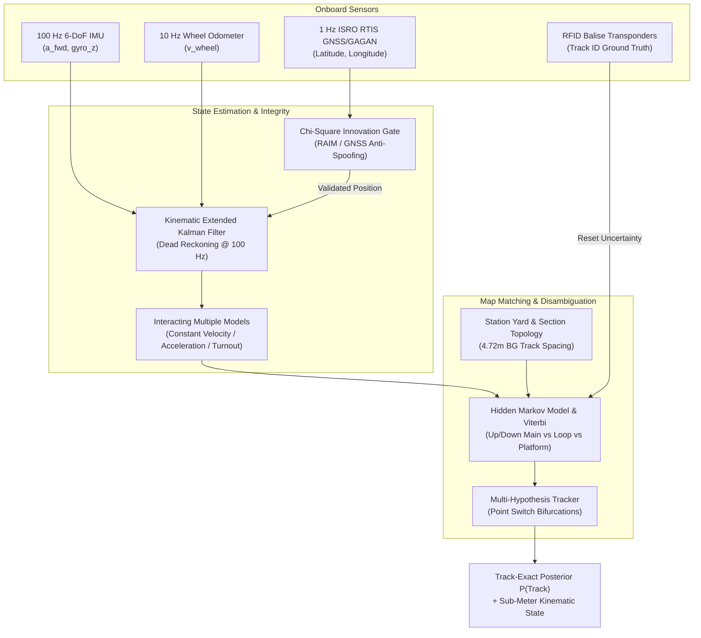

# RailTwin-X v4 Production Roadmap: Track-Exact & ISRO RTIS High-Frequency Sensor Fusion

## Executive Overview

This directory (`docs/v4_architecture/`) preserves the comprehensive architectural blueprint, sensor fusion pipelines, mathematical formulations, and validation test suites for **Track-Exact** — the high-frequency locomotive localization and track-level state estimation subsystem of RailTwin-X.

While the primary production system operates on real-time macro telemetry, timetable events, and network topology features (23 feature pipeline with GRU and LightGBM quantile estimators), the **Track-Exact** architecture serves as the **future production roadmap** for direct integration with **ISRO RTIS (Real-Time Train Information System)** hardware and locomotive-mounted onboard units (OBUs).

---

## RTIS High-Frequency Architecture

When raw high-rate sensor streams from locomotive OBUs become available, Track-Exact provides the complete multi-rate state estimation pipeline:

---

## Architectural Modules

### 1. Extended Kalman Filter (`track_exact/ekf.py`)
- **Multi-rate dead reckoning**: 100 Hz IMU integration with 10 Hz odometer updates.
- **Measurement fusion**: Loose GNSS position fusion at 1 Hz with statistical noise covariance tuning.
- **Kinematic state**: $[x, y, v, \theta]$ with forward acceleration $a$ and yaw rate $\omega$.

### 2. RAIM & GNSS Anti-Spoofing
- **Mahalanobis / Chi-square innovation gating**: Rejects anomalous GNSS position jumps caused by multipath interference, tunnel outages, or deliberate signal spoofing/jamming.
- Automatic fallback to high-integrity inertial dead reckoning when GNSS signal degrades.

### 3. Interacting Multiple Model (`track_exact/imm.py`)
- Manages three parallel discrete kinematic dynamic modes:
  1. *Constant Velocity (CV)*: High-speed tangent track cruising.
  2. *Constant Acceleration (CA)*: Acceleration out of halts or dynamic braking.
  3. *Coordinated Turn (CT)*: Turnout divergence over 1:12 and 1:8.5 points/crossings.
- Dynamically computes mode probabilities via Markov transition matrix.

### 4. HMM Track Map-Matching (`track_exact/hmm_mapmatch.py`)
- Disambiguates parallel tracks separated by standard Indian Railways Broad Gauge track center distance ($4.72\text{ m}$).
- Uses Viterbi dynamic programming over emission probabilities (spatial distance to track centerline) and transition probabilities (turnout topology).
- Integrates discrete RFID Balise triggers for instantaneous uncertainty collapse to $P(\text{track}) = 1.0$.

### 5. Multi-Hypothesis Tracking (`track_exact/mht.py`)
- Maintains multiple tree-structured track hypotheses across diverging switches until subsequent sensor observations (e.g. balise or gyro lateral displacement) prune unlikely paths.

### 6. Sensor Fusion Hub (`track_exact/fusion.py`)
- Master orchestrator binding asynchronous multi-rate sensor inputs into a single real-time telemetry stream.

---

## Integration with RailTwin-X Core

In future deployments with direct Indian Railways RTIS OBU access:
1. The **Track-Exact Hub** consumes raw RTIS packet streams over MQTT/Kafka.
2. The resolved track state $P(\text{track})$ feeds directly into station Gantt platform assignment and interlocking conflict detection.
3. The deterministic Safety Interlock Layer verifies Bayesian track integrity ($P \ge 0.80$) prior to clearing signal advisories.
