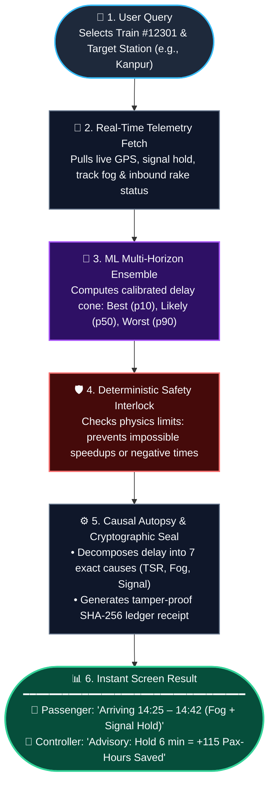
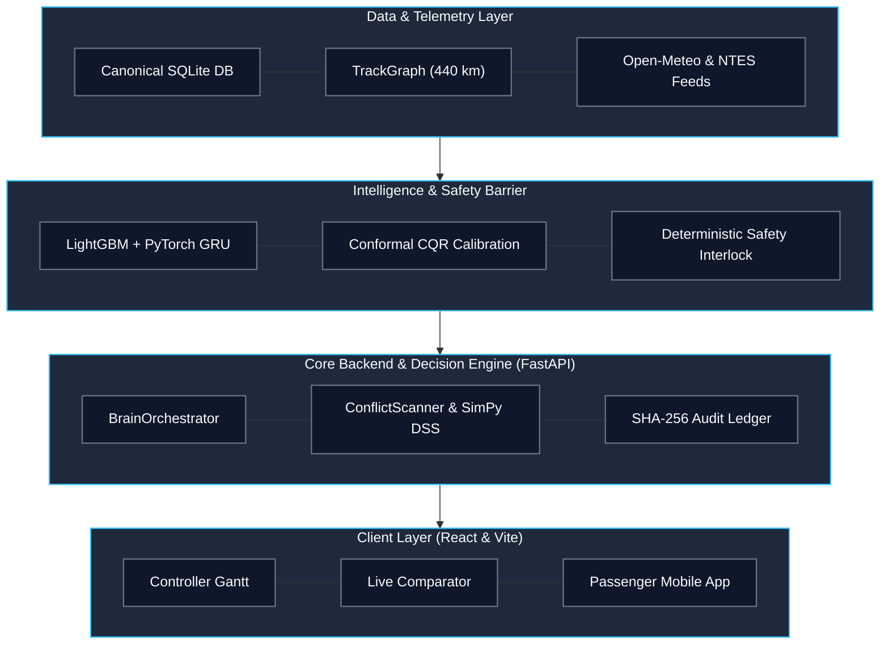
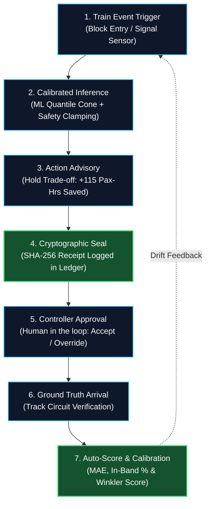

# 🚆 RailTwin-X — Flowcharts & Architecture Diagrams
> **SIH 2026 · Problem Statement 26028**  
> *Dynamic Forecast of Expected Time of Arrival (ETA) for Coaching Trains*

---

## 1. Quick "User to Result" Flowchart (Slide-Ready)
> **PPT Purpose:** Ideal for a 30-second elevator pitch slide showing the journey from user input to the final result.

### PPT Slide Notes:
- **Query**: User enters train number and destination.
- **Telemetry Fetch**: Queries live GPS, signals, weather fog (Open-Meteo), and turnaround rake link in <20ms.
- **AI Prediction**: Computes multi-horizon quantile cone ($p_{10}$ best, $p_{50}$ likely, $p_{90}$ worst).
- **Safety Interlock**: 100% Zero-ML physics barrier clamps unrealistic speedups and maintains quantile order.
- **Causal & Ledger**: Decomposes delay into 7 exact additive causes and seals prediction in a SHA-256 hash-chain receipt.
- **Outputs**: Passenger gets an honest arrival window with root causes; Controller gets an advisory calculating net passenger-hours saved.

---

## 2. Detailed Technical Working Flowchart
> **PPT Purpose:** Detailed technical flow for judges asking about the internal machine learning and physics pipeline.

```mermaid
flowchart TD
    classDef inputStyle fill:#1E293B,stroke:#38BDF8,stroke-width:2px,color:#F8FAFC
    classDef featStyle fill:#0F172A,stroke:#818CF8,stroke-width:2px,color:#F8FAFC
    classDef mlStyle fill:#312E81,stroke:#A78BFA,stroke-width:2px,color:#F8FAFC
    classDef safetyStyle fill:#7F1D1D,stroke:#F87171,stroke-width:2px,color:#F8FAFC
    classDef engineStyle fill:#064E3B,stroke:#34D399,stroke-width:2px,color:#F8FAFC
    classDef ledgerStyle fill:#78350F,stroke:#FBBF24,stroke-width:2px,color:#F8FAFC
    classDef outStyle fill:#14532D,stroke:#4ADE80,stroke-width:2px,color:#F8FAFC

    subgraph S1 ["1. Real-Time Event Ingestion & Corroboration"]
        EV1["Station Event Tick<br/>(Track Circuit Arrival / Dep)"]:::inputStyle
        EV2["Live GPS Dead-Reckoning<br/>(Speed & Section KM)"]:::inputStyle
        EV3["External Condition Streams<br/>(Open-Meteo Fog/Rain & TSR Speed Orders)"]:::inputStyle
        EV4["Network Rake Turnaround<br/>(Feeder Inbound Buffer Link)"]:::inputStyle
    end

    subgraph S2 ["2. Leakage-Safe Feature Snapshot Assembly"]
        SN["SnapshotGenerator & TrackGraph<br/>(Corridor State Context)"]:::featStyle
        VEC["23-Feature Vector (F1–F23)<br/>• Current delay & headway buffer<br/>• Remaining km & hops<br/>• Visibility & track speed ceiling<br/>• Inbound rake deficit"]:::featStyle
    end

    subgraph S3 ["3. Multi-Horizon Neural Ensemble Inference"]
        HORIZON{"Distance Horizon<br/>Routing"}:::mlStyle
        
        MODELS["Multi-Model Candidate Pool<br/>1. LightGBM Direct (Hops ≤ 3)<br/>2. LightGBM Delta Autoregressive<br/>3. PyTorch 2-Layer Non-Crossing GRU<br/>4. Baseline 1: Frozen Delay Momentum<br/>5. Baseline 3: Timetable Linear Mean"]:::mlStyle
        
        STACK["NNLS Convex Stacking Optimizer<br/>Short ≤ 90 km: Frozen Delay (85%)<br/>Medium 90–250 km: Balanced Blend<br/>Long > 250 km: GRU + Delta (70%)"]:::mlStyle
        
        CQR["Mondrian Conformal Calibration (CQR)<br/>Produces Calibrated [p10, p50, p90] Cone<br/>Guaranteed 80% Empirical Coverage"]:::mlStyle
    end

    subgraph S4 ["4. 100% Deterministic Safety Interlock (Zero ML)"]
        CHK1["Rule 1: Input Sanity Check<br/>(Finite values, delay ≥ −30m, km ≥ 0)"]:::safetyStyle
        CHK2["Rule 2: Kinematic Feasibility<br/>(Recovery capped at 15–40 km/min max)"]:::safetyStyle
        CHK3["Rule 3: Monotonic Quantile Guard<br/>(Enforce p10 ≤ p50 ≤ p90, width ≤ 180m)"]:::safetyStyle
        CHK4["Rule 4: Absolute Domain Clamping<br/>(Hard clamp bounds [−5m, 720m])"]:::safetyStyle
        REPORT["SafetyInterlockReport<br/>(Clamp status, tier downgrade, human_ack_required = True)"]:::safetyStyle
    end

    subgraph S5 ["5. Parallel Downstream Operational Intelligence"]
        AUTOPSY["D3: Causal Delay Autopsy<br/>7 Mechanistic Buckets:<br/>• Inbound Rake Deficit<br/>• TSR Restriction<br/>• Signal Hold / Congestion<br/>• Weather Fog (Vis < 200m)<br/>• Dwell Overrun / Loco Recovery<br/>100% Exact Mathematical Sum Additivity"]:::engineStyle
        
        DSS["D4: Cascade & Custody DSS<br/>• ConflictScanner (Single-line & loop hold)<br/>• Connection Custody Trade-off:<br/>Hold feeder 6m = +115 pax-hrs saved<br/>Advisory Only (Human in the Loop)"]:::engineStyle

        LEDGER["D5: SHA-256 Tamper-Evident Ledger<br/>• Sealed BEFORE train arrival<br/>• Hash-chained with previous block<br/>• Public tamper-proof audit receipt"]:::ledgerStyle
    end

    subgraph S6 ["6. Client Presentation & Ground Truth Verification"]
        UI1["Controller Gantt & Conflict Feed"]:::outStyle
        UI2["Passenger Mobile Uncertainty Cone"]:::outStyle
        EVAL["Post-Arrival Ground Truth Verification<br/>• Automated grading against track circuit<br/>• Winkler Score & Empirical Coverage Log"]:::outStyle
    end

    EV1 & EV2 & EV3 & EV4 --> SN
    SN --> VEC
    VEC --> HORIZON
    HORIZON --> MODELS
    MODELS --> STACK
    STACK --> CQR
    CQR --> CHK1
    CHK1 --> CHK2 --> CHK3 --> CHK4 --> REPORT
    
    REPORT --> AUTOPSY
    REPORT --> DSS
    REPORT --> LEDGER

    AUTOPSY & DSS --> UI1
    REPORT --> UI2
    LEDGER --> EVAL
```

---

## 3. Project Architecture Diagram (4-Tier Modular Stack)
> **PPT Purpose:** Clear architectural overview showing system tiers, boundaries, and separation of concerns.

---

## 4. End-to-End Operational Workflow Diagram
> **PPT Purpose:** Closed-loop operational view showing real-time event processing and post-arrival auto-grading.

