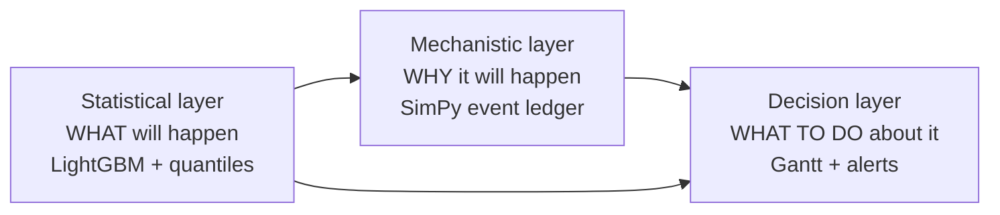
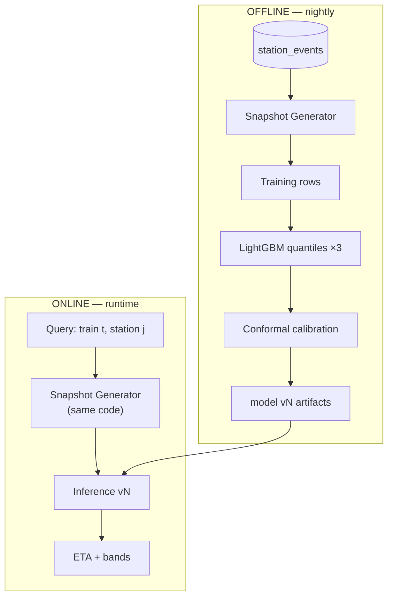
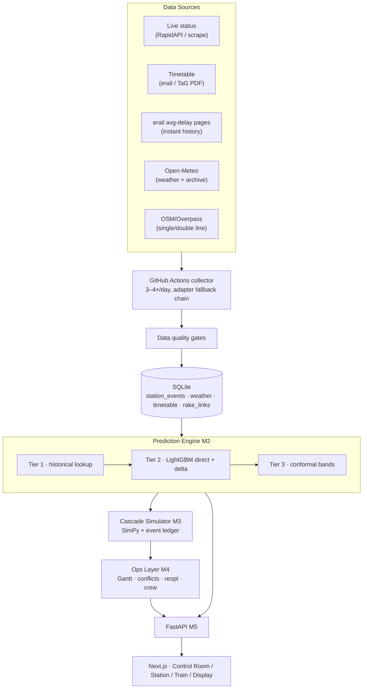
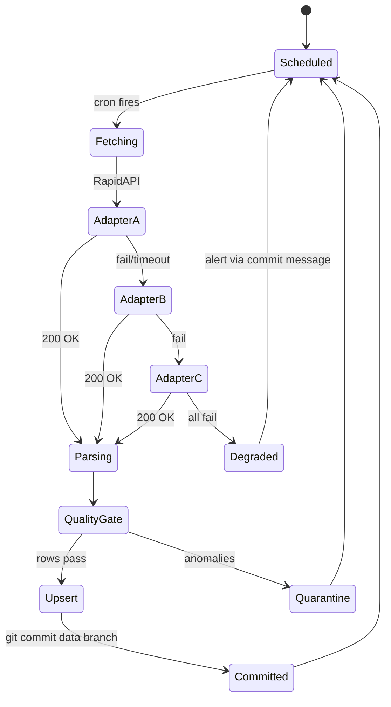
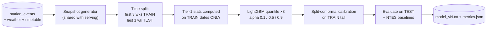
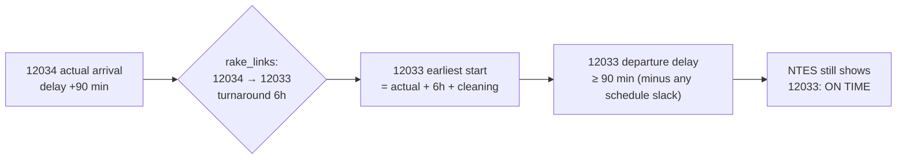
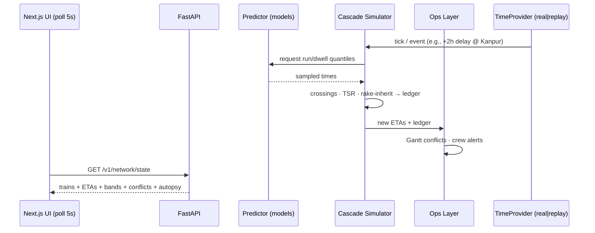

# 🚆 RailTwin-X — Real-Time Railway Delay Intelligence Engine

**SIH 2026 · PS 26028 — Dynamic Forecast of Expected Time of Arrival (ETA) for Coaching Trains**
**Version 2.0 · Status: Engineering Blueprint (every module buildable in hackathon window)**
**Team: [TEAM NAME] · Members: 6 · Roles: 2 Data/ML · 1 Backend · 2 Frontend · 1 Integration/Pitch**

> **Pitch:** Indian Railways predicts arrivals with `sched + current_delay − assumed_recovery`.
> We replace that formula with a **predictive, causal, and operational engine**: ETAs with
> calibrated confidence bands, exact minute-by-cause delay attribution, network cascade
> simulation (crossings, speed restrictions, same-rake linking), and self-healing platform
> allocation — trained on real collected NTES data, served to the control room via API.

---

## 0. HOW TO READ THIS DOCUMENT

| Section | For |
|---|---|
| §1–2 | **Everyone** — problem intelligence & solution theory (pitch material) |
| §3–4 | Data team — architecture & data engineering |
| §5 | ML team — model training, end to end |
| §6–7 | Backend team — simulator & ops layer |
| §8–9 | Backend + Frontend — services, API, UI |
| §10–19 | Leads — inventory, workflow, plan, risks, glossary |

**Non-negotiable scope law:** if a feature is not in §2.4, it is not built. It goes on the
roadmap slide (§19), not into code.

---

# PART I — PROBLEM INTELLIGENCE

## 1. The Problem, Formally

### 1.1 Notation

```
G = (V, E)          railway corridor graph: V = stations, E = block sections
P_t = (s₁ … sₙ)     ordered route of train t
τ^arr_i, τ^dep_i    scheduled arrival/departure of t at station sᵢ
a^arr_i, a^dep_i    actual arrival/departure
D_i = a^arr_i − τ^arr_i          delay at station i
m_i = scheduled recovery margin  padding baked into the timetable on section i
S(t) = (k, D_k, t)  system state at clock time t: last passed station k, delay D_k
C(t)                context: weather, congestion, train class, history, restrictions
```

### 1.2 The official method (what we beat)

```
ETA_official(j) = τ^arr_j + D_k − Σ_{i=k..j−1} mᵢ
```

Three embedded assumptions, all false in practice:
1. **Recovery is deterministic** — the timetable's margin `mᵢ` is treated as guaranteed
   clawback. Reality: recovery depends on traffic, terrain, loco, time of day.
2. **The train evolves in isolation** — no crossings on single-line sections, no platform
   blocked by a late predecessor, no rake that hasn't arrived yet.
3. **A number with no error bar** — "18:40" stated with total confidence is a lie
   told to 1,000 passengers.

### 1.3 What we actually predict (the ML task)

> **Given state S(t) = (k, D_k, t) and context C(t), estimate quantiles of D_j for every
> future station j > k:**
>
> ```
> Q_q( D_j | S(t), C(t) ),  q ∈ {0.1, 0.5, 0.9}
> ```
>
> Plus two derived tasks: **attribution** (decompose ΔD into causes) and
> **intervention** (simulate controller actions).

### 1.4 Root-cause analysis — why ETAs fail (five forces)

| # | Force | Mechanism | Current system |
|---|---|---|---|
| F1 | Variable recovery | Margin consumption varies with traffic/terrain | Fixed `mᵢ` assumption |
| F2 | Section contention | Single-line crossings force holds | Invisible |
| F3 | Causal chaining | Same-rake, preceding-train, crew | Invisible |
| F4 | Exogenous events | TSRs, weather, maintenance blocks | Reactive at best |
| F5 | No uncertainty | Point estimates only | Zero trust calibration |

### 1.5 Stakeholder pain matrix (who suffers, how much)

| Stakeholder | Pain today | Cost type | Our feature |
|---|---|---|---|
| Passenger | Can't plan pickup/connection | Time, trust | F2–F4, F12 |
| Station master | Platform plan invalid 30 min before arrival | Operational chaos | F8, F9 |
| Cleaning/catering | Windows planned on fiction | Wasted crews | F8 |
| Crew controller | Duty breaches discovered too late | Safety + money | F13 |
| Section controller | Cascades seen only as they happen | Network melt | F6, F7, F10 |
| Feeder transport | No reliable arrival signal | Missed handoffs | F11 API |

### 1.6 Requirement traceability matrix (PS text → our build)

Every sentence of the PS mapped. Judges check this; most teams can't produce it.

| PS requirement (verbatim fragment) | Our answer | Feature | Proof artifact |
|---|---|---|---|
| "forecast the ETA of trains at various points in their journey" | 3-tier predictor, all upcoming stations | F2 | Live demo + backtest |
| "using real-time data feeds… historical delay patterns, weather, congestion" | Collector + feature set (§5.2) | M1/M2 | Provenance slide |
| "dynamically update ETAs in response to real-time events" | Event-driven recompute + replay engine | F1 | Delay-inject demo |
| "machine learning or statistical forecasting" | LightGBM quantiles + conformal calibration | F3 | Calibration chart |
| "station planning, crew scheduling, platform allocation, cleaning operations" | Ops layer | F7–F9, F13 | Gantt self-heal demo |
| "APIs for integration with mobile apps, station displays, control room dashboards" | REST API + display widget | F11, F12 | Swagger + JSON |
| "scalable to thousands of trains" | Design argument + scale path | §19 | Roadmap slide |

---

## 2. Solution Theory

### 2.1 The core insight

> **Delay is compositional and causal.** A train's delay at station j is
> `D_j = D_k + Σ (section deltas) + Σ (event shocks)` — and each term has a *mechanism*:
> a crossing hold, a TSR, an extended dwell, a late rake. Model the mechanism and you get
> prediction, explanation, and intervention **from the same engine**.

This drives the whole architecture:



Rival teams build layer A alone (a black box that guesses). We fuse A + B: the ML layer
predicts; the simulator *computes* the causal path; attribution falls out exactly.

### 2.2 Design decisions (chosen vs. rejected — the engineering honesty table)

| Decision | Options | Chosen | Why | Rejected because |
|---|---|---|---|---|
| ML model | LightGBM / XGBoost / Neural nets / GNN+TFT | **LightGBM (quantile)** | Best on 50k tabular rows, trains in minutes, natively supports quantile objective, explainable | GNN/TFT need data volumes we can't collect in 4 weeks (would be bluff) |
| Prediction target | Direct D_j / section-delta δᵢ | **Direct for ≤3 hops, delta-composition for far stations** | Direct is robust short-range; delta is more stationary long-range (§5.1) | Pure delta accumulates error; pure direct ignores structure |
| Uncertainty | Quantile reg / deep ensembles / conformal | **Quantile + split-conformal adjustment** | Conformal gives distribution-free coverage guarantee | Ensembles need 5× training for marginal gain |
| Simulator | Hand-rolled heap / SimPy | **SimPy** | PriorityResource *is* the crossing rule; battle-tested | Hand-rolled = subtle bugs in the exact module judges will probe |
| Attribution | SHAP / mechanistic ledger | **Mechanistic ledger** | "We know 18 min = 18 min because the simulator held it 18 min" — exact, not statistical | SHAP-on-synthetic = circular reasoning, dies under cross-examination |
| Store | Postgres / SQLite | **SQLite** | 200 MB, zero ops, single-file demo portability | A DB server for a 60-node graph is cosplay |
| Live sync | WebSocket / polling | **5-sec polling** | Demo reliability > elegance | WS adds failure modes for zero demo value |
| Platform optimizer | OR-Tools CP-SAT / greedy+local search | **Greedy + local search** | 90% of value, 5% of effort, debuggable at 3 AM | CP-SAT cold-start and infeasibility debugging at a hackathon = suicide |
| Scale story | Build K8s now / argue scale path | **Scale-path slide** | Judges reward judgment, punish bluff | v1 doc's Kafka/K8s stack was resume-driven and indefensible |

### 2.3 Offline/online duality (the MLOps discipline)

One **Snapshot Generator** produces training rows offline AND live query features online.
Same code path ⇒ no train/serve skew. This is a real production ML practice — say the
phrase "train/serve parity" to judges and watch them sit up.



### 2.4 Scope lock (14 features — the law)

| # | Feature | Module | P |
|---|---|---|---|
| F1 | Live train state (position/delay/next) | M1 | P0 |
| F2 | ETA, all upcoming stations | M2 | P0 |
| F3 | Confidence band best/likely/worst | M2 | P0 |
| F4 | Journey timeline sched-vs-predicted | M2/M5 | P0 |
| F5 | Delay autopsy (exact cause ledger) | M3 | P0 |
| F6 | Cascade view (ripple across network) | M3 | P0 |
| F7 | Same-rake doom tracker | M3 | P0 |
| F8 | Platform Gantt + conflict detection | M4 | P0 |
| F9 | One-click re-optimize (self-heal) | M4 | P0 |
| F10 | Corridor schematic, delay-colored | M5 | P0 |
| F11 | REST API (all consumers) | M5 | P1 |
| F12 | Station display widget | M5 | P1 |
| F13 | Crew duty-breach alert | M3 | P1 |
| F14 | Backtest proof table vs NTES method | M2 | **P0 — wins** |

---

# PART II — DATA ENGINEERING

## 3. Master Architecture



## 4. Data Engineering Detail

### 4.1 Database schema (full)

```sql
-- Master data (one-time load)
CREATE TABLE stations (
  code TEXT PRIMARY KEY, name TEXT, lat REAL, lon REAL,
  is_junction INT DEFAULT 0, platforms INT DEFAULT 2
);
CREATE TABLE trains (
  train_no TEXT PRIMARY KEY, name TEXT,
  class TEXT CHECK(class IN ('rajdhani','shatabdi','superfast','mail','passenger')),
  priority INT CHECK(priority BETWEEN 1 AND 4)   -- 1 highest
);
CREATE TABLE route_stations (
  train_no TEXT, seq INT, station_code TEXT,
  sched_arr TEXT, sched_dep TEXT, halt_min INT, distance_km REAL,
  PRIMARY KEY (train_no, seq)
);
CREATE TABLE sections (                        -- corridor graph edges
  from_code TEXT, to_code TEXT, distance_km REAL,
  single_line INT, max_speed_kmph INT,
  PRIMARY KEY (from_code, to_code)
);
CREATE TABLE rake_links (                      -- same-rake dependencies
  incoming_train TEXT, outgoing_train TEXT,
  station_code TEXT, turnaround_min INT,
  PRIMARY KEY (incoming_train, outgoing_train)
);

-- Collected data (the moat)
CREATE TABLE station_events (
  train_no TEXT, run_date TEXT, seq INT, station_code TEXT,
  sched_arr TEXT, actual_arr TEXT, sched_dep TEXT, actual_dep TEXT,
  delay_arr_min INT, delay_dep_min INT,
  collected_at TEXT,
  PRIMARY KEY (train_no, run_date, seq)
);
CREATE TABLE weather (
  date TEXT, station_code TEXT,
  temp REAL, precip_mm REAL, humidity REAL, fog_flag INT,
  PRIMARY KEY (date, station_code)
);

-- Simulator/runtime state (rebuilt on demand)
CREATE TABLE sim_ledger (                      -- the attribution gold
  run_id TEXT, sim_time TEXT, train_no TEXT,
  event_type TEXT,          -- CROSSING_HOLD | TSR | EXT_DWELL | RAKE_INHERIT | PLATFORM_WAIT
  minutes INT, cause TEXT, counterparty TEXT, station_code TEXT
);
```

### 4.2 Collector — state machine + adapter pattern



**Adapter interface (all three sources implement it):**

```python
class LiveSource(ABC):
    @abstractmethod
    def fetch_running_status(self, train_no: str, run_date: date)
        -> list[StationEvent]: ...
    # Invariant: output is NORMALIZED regardless of source.
    # Parsing logic borrowed from: pyinrail / indian-rail-api (see §11),
    # endpoints rewritten against today's live source.
```

**Quality gates (reject, never guess):**
1. Freshness — event older than last committed snapshot → skip
2. Sanity — |delay| > 600 min → quarantine row (likely parse error)
3. Monotonicity — actual times must not go backwards along seq
4. Completeness — train with zero station rows for 3 consecutive days → flag dead/unofficial

**Polling math:** 150 daily trains × 3 polls/day = 450 calls/day → ~2,700 events/day →
**~75,000 station events by finale.** Fleet mix: 30 Rajdhani-class / 70 Superfast /
30 Mail-Passenger, one corridor (NDLS–CNB–LKO or NDLS–BCT). Daily trains only.

### 4.3 Backfill & provenance

- **Weather gaps:** Open-Meteo **historical archive** re-pulls any missed date exactly.
- **Delay history before Day 0:** erail avg-delay scrape → seeds Tier-1 stats instantly.
- **Provenance slide (appendix):** every table → its source, license, collection method,
  date range. One slide. Total judge-proofing.

---

# PART III — MACHINE LEARNING (M2)

## 5. Model Training, End to End

### 5.1 Task formulation — snapshot rows

A training row is the world **as it existed at query time t**, predicting the future:

```
Row = ( features(S(t), C(t), j)  →  target D_j )
where t is chosen so that station k is the last station actually passed.
```

**Two model families (the advanced split):**

```
(a) DIRECT model:      target = D_j            (used for j ≤ 3 hops ahead — robust)
(b) DELTA model:       target = δᵢ = D_{i+1} − D_i   (per section; composed
                        for far stations: D_j ≈ D_k + Σ δᵢ — stationary, because
                        delta strips the train's chronic lateness baseline)
```

Delta composition is how real railway forecasting systems think — mention
"section-level delta models" in the pitch; zero rival teams will have it.

### 5.2 Feature dictionary (complete — 17 features)

| # | Feature | Type | Source | Leakage-safe rule |
|---|---|---|---|---|
| 1 | current delay D_k | int | station_events | snapshot by construction |
| 2 | hops k→j | int | route_stations | static |
| 3 | km remaining | float | route_stations | static |
| 4 | hour of day (at t) | int | derived | snapshot |
| 5 | day-type (wd/we/holiday) | cat | derived | snapshot |
| 6 | train class / priority | cat | trains | static |
| 7 | target is junction | bool | stations | static |
| 8 | target is terminus | bool | route_stations | static |
| 9 | **hist. avg delay of THIS train at j** | float | **train-split only** | ⚠ computed from TRAIN period dates only |
| 10 | hist. p90 of this train at j | float | ⚠ same | ⚠ same |
| 11 | sched halt at j | int | route_stations | static |
| 12 | congestion proxy: # trains sched to arrive j within ±30 min | int | route_stations (SCHEDULED only) | ⚠ never actual times |
| 13 | fog flag at j, that date | bool | weather | known day-of |
| 14 | rain mm at j | float | weather | same |
| 15 | corridor load: # active trains at snapshot | int | station_events up to t | snapshot |
| 16 | delay velocity: D_k − D_{k−1} | int | station_events | snapshot — captures "currently recovering" |
| 17 | train's chronic baseline (mean D over train split) | float | ⚠ train-split only | ⚠ same |

### 5.3 Training pipeline (nightly, automated)



**LightGBM config (starting point — tune with Optuna only if time permits):**

```python
params = dict(objective="quantile", alpha=q,      # q ∈ {0.1, 0.5, 0.9}
              num_leaves=63, learning_rate=0.05,
              n_estimators=600, min_child_samples=40,
              subsample=0.8, colsample_bytree=0.8)
# DIRECT model + DELTA model, each × 3 quantiles = 6 model files. Trains in minutes.
```

### 5.4 Uncertainty & calibration (the differentiator math)

**Step 1 — Quantile regression** gives raw bands `[Q̂_0.1, Q̂_0.9]`.
**Step 2 — Conformalized Quantile Regression (CQR)** repairs coverage:

```
Calibration scores:  sᵢ = max( Q̂_lo(xᵢ) − yᵢ ,  yᵢ − Q̂_hi(xᵢ) )
Adjustment:          q̂ = ⌈(n+1)(1−α)⌉/n quantile of {sᵢ}
Final interval:      [ Q̂_lo(x) − q̂ ,  Q̂_hi(x) + q̂ ]
```

Distribution-free guarantee: the true delay lands in the interval ~80% of the time
(α=0.2). **Nobody at the finale will know this exists.** Reliability diagram = proof chart.

### 5.5 Baselines we must beat (both implemented, same test week)

| Baseline | Formula | Identity |
|---|---|---|
| B1 frozen | `pred D_j = D_k` | "train is 2h late, will stay 2h late" |
| B2 official-style | `pred D_j = D_k − Σ mᵢ` | sched + current delay − assumed recovery (closest to NTES logic) |

### 5.6 Evaluation protocol & metrics (formulas)

Held-out last week, re-run as rolling day-by-day backtest (honest deployment simulation):

```
MAE_h       = mean | D̂_j − D_j |                  per horizon h ∈ {1h, 3h, 6h}
HitRate10_h = fraction with | D̂_j − D_j | ≤ 10
Coverage    = fraction of actuals inside conformal 80% band      (target ≈ 0.80)
Pinball(q)  = mean over i of:  q·eᵢ if eᵢ≥0 else (1−q)·|eᵢ|,
              eᵢ = yᵢ − Q̂_q(xᵢ)                                   (quantile quality)
```

**Proof table (F14) — the single most valuable artifact we produce:**

| Horizon | B1 MAE | B2 MAE | **RailTwin MAE** | HitRate10 | Coverage |
|---|---|---|---|---|---|
| 1 h | [fill] | [fill] | **[fill]** | [fill] | [fill] |
| 3 h | [fill] | [fill] | **[fill]** | [fill] | [fill] |
| 6 h | [fill] | [fill] | **[fill]** | [fill] | [fill] |

### 5.7 Leakage control (one owner: "leakage patrol")

1. ❌ Random split → **time split only** (first 3 wks / last week)
2. ❌ Features 9/10/17 computed over all dates → **TRAIN-period dates only**
3. ❌ Congestion from actual arrivals → **scheduled times only**
4. ❌ Weather "forecast" features → use same-day observed + flags known by morning

---

# PART IV — CAUSAL & OPERATIONS ENGINES

## 6. Cascade Simulator (M3)

### 6.1 Why mechanistic beats statistical here

The ML layer answers *what*. It cannot answer *why* or *what if*. A discrete-event
simulation of the corridor answers both — and every simulated minute carries its cause
in the event ledger. Attribution becomes **accounting, not estimation**.

### 6.2 SimPy design

| Entity | SimPy construct | Railway meaning |
|---|---|---|
| Single-line section | `PriorityResource(capacity=1)` | Only one train in the block; **priority = train class** → lower-priority train automatically waits = crossing hold |
| Double-line section | `Resource(capacity=1)` per direction | Free flow, no crossing hold |
| Platform at station | `Resource(capacity=N_platforms)` | Occupancy; full → platform wait event |
| Train | `simpy.Process` | Walks its route: request section → run (sampled run time) → arrive → dwell → next |
| Run/dwell time sampler | reads Tier-2/3 quantiles + scheduled times | ML feeds the physics |

```python
def train_process(env, t, graph, ledger, rng):
    for sec in t.remaining_sections():
        res = graph.resource(sec)                    # PriorityResource if single_line
        with res.request(priority=t.priority) as req:
            yield req
            if req.waited_minutes > 0:               # attribute BEFORE running
                ledger.log(t, "CROSSING_HOLD", req.waited_minutes,
                           cause="crossing", counterparty=req.held_for)
            run = sample_run_time(sec, t)            # from model quantiles + TSR factors
            yield env.timeout(run)
        # arrival → dwell (scheduled halt + EXT_DWELL if predicted) → platform resource
        # ... platform wait / TSR injection / rake-inherit logged identically
```

### 6.3 Same-rake doom tracker (F7)



Define ~15–20 rake links from timetable logic (same station, turnaround window, matching
route pattern). **The NTES-screenshot-vs-us slide is the single most persuasive visual
in the deck.**

### 6.4 Attribution ledger → Delay Autopsy (F5)

Ledger rows (§4.1 `sim_ledger`) group into the autopsy card:

```
Total predicted delay: 43 min
├─ 18 min · signal_congestion   @ Kanpur outer   (crossings ×3)
├─ 12 min · speed_restriction   @ Ratlam section (TSR 60 km/h)
├─  8 min · extended_dwell      @ Kota junction
├─  5 min · preceding_train     @ 12381 crossing
└─ the numbers SUM EXACTLY to the total — by construction, not estimation
```

**Judge question "how do you know it's 18?" → "Because the simulator held that train
for exactly 18 minutes at Kanpur outer — here is the event log."** Unanswerable against.

## 7. Operations Layer (M4)

### 7.1 Platform Gantt data structure

```python
PlatformBoard = {
  "NDLS": [ {"platform": p, "blocks": [ (train, start_pred, end_pred) ... ]} for p in 1..8 ]
}
# block duration = predicted dwell + turnaround (from rake_links if outgoing exists)
# Conflict = pairwise interval overlap on same platform
```

### 7.2 Re-optimizer (greedy + local search)

```python
def reoptimize(board):
    for _ in range(MAX_PASSES=50):
        c = earliest_conflict(board)
        if not c: break
        best = argmin(platforms, key=lambda p: new_conflicts(move(c.block, p)) + swap_cost(p))
        move(c.block, best)                     # prefer fewest swaps from CURRENT plan
    local_search: try pairwise swaps while conflicts decrease
    return diff(current, board)                 # "2 swaps resolved 5 conflicts"
```

Complexity O(n·m·passes) — trivial for ≤60 trains × 8 platforms. Formal framing for
judges: *"interval scheduling on parallel machines; NP-hard in general, near-optimal
heuristically at station scale."*

### 7.3 Crew alert (F13, rules — labeled advisory)

```
IF crew_signon_time + predicted_trip_completion > duty_cap − buffer
THEN alert: "Crew C-219 projected breach 22:40 — relief recommended at Kanpur"
```

---

# PART V — BACKEND & FRONTEND

## 8. Backend Engineering

### 8.1 Services & runtime sequence



**TimeProvider abstraction:** the entire app reads the clock through one injectable
interface — `RealClock` for live, `ReplayClock` for the recorded feed. This single
pattern makes the demo deterministic and WiFi-proof.

### 8.2 API contract (v1)

```
GET  /v1/trains/{train_no}/eta?station=CNB
     → { sched, predicted, band{best,likely,worst}, delay, confidence, updated_at }
GET  /v1/trains/{train_no}/journey          → per-station ETA timeline
GET  /v1/trains/{train_no}/autopsy          → cause ledger breakdown
GET  /v1/network/state                      → all trains, colors, conflicts feed
GET  /v1/stations/{code}/gantt              → platform board + conflicts
POST /v1/stations/{code}/reoptimize         → { before, after, swaps, resolved }
POST /v1/simulate/what-if                   → { scenario_in, cascade_out, autopsy }
GET  /v1/crew/alerts                        → duty breach projections
GET  /v1/meta/models                        → versions, training window, metrics
GET  /v1/health                             → { db, models, clock_mode }
```

Errors: `{ "error": {"code","message","retryable"} }`. All responses carry `updated_at`
and `clock_mode: live|replay` (honesty in the payload itself).

### 8.3 Fallback chains (demo cannot die)

```
Prediction: Tier2 → Tier1 → sched+current_delay
Data:        AdapterA → B → C → replay file
Demo:        live → replay → backup video on 2 devices
```

## 9. Frontend (M5)

| Screen | Components | Data source |
|---|---|---|
| Control Room | corridor schematic (metro-style, NOT geo map), moving dots green/amber/red by predicted band, conflict feed, autopsy drawer | `/network/state` |
| Station | platform Gantt (custom SVG blocks; red = conflict), arrivals board, alert cards, **REOPTIMIZE button** | `/stations/{code}/*` |
| Train | journey timeline (recharts), band card, autopsy breakdown | `/trains/*` |
| Display kiosk | next 5 arrivals + bands, large type | polling |

State: Zustand store per screen; 5-sec polling via TanStack Query; no WebSockets.

---

# PART VI — INVENTORY, WORKFLOW, PLAN

## 10. Algorithms & Data Structures Inventory

| Item | Where | Class |
|---|---|---|
| Quantile gradient boosting (pinball loss) | M2 | ML |
| Split-conformal / CQR calibration | M2 | Statistical guarantee |
| Section-delta delay composition | M2 | Railway-standard forecasting structure |
| Discrete-event simulation w/ priority resources | M3 | OR / SimPy |
| Priority preemption = train class precedence | M3 | Scheduling theory |
| Rake dependency graph (DAG) | M3 | Causal chaining |
| Greedy + local-search interval scheduling | M4 | Approximation heuristic |
| Idempotent upsert (composite PK) | M1 | Data engineering |
| Time-based split + leakage patrol | M2 | ML hygiene |
| Adapter pattern + fallback chain | M1 | Resilience |
| Clock injection (TimeProvider) | Backend | Testability pattern |
| Event ledger → exact attribution | M3 | Accounting, not estimation |

## 11. Stack & Repos

```
Python: lightgbm · simpy · networkx · pandas · scikit-learn · fastapi · uvicorn · openmeteo-requests
JS:     next · recharts · zustand · @tanstack/react-query
Infra:  SQLite · GitHub Actions (collector cron + tests) · private GitHub repo
```

| Repo | Role | Status discipline |
|---|---|---|
| github.com/microsoft/LightGBM | quantile engine | core |
| github.com/simpy/simpy | simulator | core |
| github.com/networkx/networkx | corridor graph | core |
| github.com/fastapi/fastapi · vercel/next.js · recharts/recharts · pandas-dev/pandas · scikit-learn/scikit-learn | platform | core |
| open-meteo (python client) | weather + archive | core |
| **github.com/nikhilkumarsingh/pyinrail** | live-status adapter reference (erail parsing) | pip-test; extract parsing logic |
| **github.com/AniCrad/indian-rail-api** | adapter reference | 10-min aliveness test |
| **github.com/AniCrad/indian-rail** | frontend reference | patterns only |
| **github.com/DeepakDevelops/Real-Time-Train-Tracker-INDIA** | tracker UI reference | patterns only |
| **github.com/HARIOM317/Rail-Netra** | visualization reference | ideas only |
| MobilityData/gtfs-realtime-bindings | *(stretch)* GTFS-RT output shape → "plugs into any transit system" answer | weekend 4, optional |

**Repo rules:** last commit < 6 months, run demo before trusting, extract parsing not
endpoints, license check (MIT/Apache), never touch IRCTC-booking/captcha repos.
**None of these supply history — the collector IS the moat.**

**Non-GitHub data:** erail.in (timetable + avg delays) · Trains-at-a-Glance PDF ·
data.gov.in (punctuality stats, free key) · OSM/Overpass (single/double-line flags) ·
Open-Meteo · RapidAPI live status.

## 12. Repository Structure

```
railtwin-x/
├── collector/
│   ├── adapters/           # rapidapi.py · scrape.py · pyinrail_ref.py (LiveSource impls)
│   ├── quality.py          # gates
│   ├── collect.py          # entrypoint (cron target)
│   └── weather.py
├── data/                   # sqlite db + csv exports (data branch via git)
├── ml/
│   ├── snapshots.py        # SHARED snapshot generator (train + serve parity)
│   ├── features.py         # feature dictionary §5.2, single source of truth
│   ├── train.py            # quantile models + conformal
│   ├── evaluate.py         # baselines B1/B2 + proof table printer
│   └── artifacts/          # model_vN.txt + metrics.json
├── engine/                 # backend
│   ├── graph.py            # corridor graph + SimPy resources
│   ├── simulator.py        # train processes, ledger
│   ├── rakes.py            # same-rake resolver
│   ├── ops.py              # gantt, conflicts, reoptimizer, crew
│   ├── clocks.py           # TimeProvider: real | replay
│   └── replay/             # recorded feed files
├── api/                    # FastAPI routes + schemas
├── web/                    # Next.js app
├── .github/workflows/      # collect.yml (cron) · tests.yml
└── docs/PROJECT_OVERVIEW.md
```

## 13. Development Workflow

- **Trunk-based:** short-lived branches → PR → 1 review → merge. CI = ruff + pytest.
- **Data branch:** collector commits DB diffs to `data/` — history is versioned.
- **Definition of done per module:** works on replay data, has a test, has a demo path.
- **Nightly (optional but cheap):** retrain on fresh data, overwrite metrics.json —
  *the system visibly improves itself during the run-up* = great pitch line.

## 14. Build Plan

**Pre-finale (4 weekends):**

| Wk | Must exist Sunday night | Gate |
|---|---|---|
| 1 | Collector on Actions cron · timetable + graph + rake_links loaded · erail shortcut scraped · adapters A/B/C tested | DB > 2,000 events |
| 2 | Snapshot generator · features · LightGBM v1 · baselines B1/B2 · **proof table v1** | MAE < B2 on paper |
| 3 | Quantiles + conformal + reliability diagram · SimPy cascade + ledger + rake tracker | Autopsy sums exactly |
| 4 | Gantt + reopt · 3 screens + kiosk · replay recording · backup video · pitch ×3 | Full dry run < 3 min |

**Finale 36h:** h0–6 pipelines on venue data · h6–18 backtest regen + tuning · h18–26
cascade polish + Gantt · h26–32 crew alert + kiosk + API docs · h32–36 freeze, backup
video, rehearse ×3. **Arrive 80% built.**

## 15. Proof Artifacts (deliverables list)

1. Proof table (§5.6) — real numbers, held-out week
2. Reliability diagram (calibration)
3. NTES-screenshot vs our prediction (same train, same moment)
4. SQLite with ~75k events + provenance slide
5. Backup demo video ×2 devices

## 16. Demo Script (3 min)

1. Control room live → 2. inject "+2h @ Kanpur" → cascade animates, 4 trains turn red →
3. same-rake card: 12033 doomed, NTES says on-time (side-by-side screenshot) →
4. Gantt explodes red → one click → self-heals ("2 swaps, 5 conflicts") →
5. autopsy card (sums exactly) → 6. crew alert + API JSON on screen →
7. proof table → close: *"From a formula to a network brain — the control room sees
the ripple three hours early."*

## 17. Judge Q&A (top 8, prepared)

| Q | A (essence) |
|---|---|
| Training data source? | 4+ weeks self-collected NTES actuals (~75k events), erail historical averages, weather joins — provenance slide |
| Different from RailYatri/ixigo? | They: single-train black-box, passenger-only. We: network-wide, causal, calibrated, control-room-first, API-native |
| Signal/GPS data is internal? | Adapter pattern — prototype runs on public actuals; internal feeds activate the same pipeline unchanged |
| How do you know 18 min was congestion? | Mechanistic ledger — the simulator held it exactly 18 min; log attached |
| Scale to 11,000 trains? | Event-driven + O(1) historical lookups; streaming/serving enter at stated thresholds (§19) |
| Model wrong? | Conformal bands with coverage guarantee + tiered fallbacks + advisory-only design |
| Why no passenger app? | Railways has NTES/RailMadad — we are the engine + control-room layer, exposed via API |
| Weather accuracy? | Features are flags (fog/rain) joined per date — measured, not forecast; degradation is graceful |

## 18. Risk Register

| Risk | Likelihood | Mitigation |
|---|---|---|
| Live API dies pre-finale | High | 3-adapter chain + replay corpus |
| Model ≤ baseline MAE | Medium | Tier-1 stats alone beat B1/B2 on chronic trains; report honestly per-horizon |
| Fog-season data thin | Medium | Open-Meteo archive backfill; fog as flag not continuous feature |
| Gantt demo breaks | Low | Pre-baked reopt result + backup video |
| Simulator edge cases | Medium | Cap demo fleet to 25 trains with clean data; "demo corridor" is a design choice, not a limitation |
| Team scope creep | **High** | §2.4 is law; roadmap slide absorbs all new ideas |

## 19. Deferred Scale Path (one slide, zero bluff)

| Threshold | Enters |
|---|---|
| >1,000 trains | Event streaming (Kafka), per-train partitioning |
| Multi-zone | Distributed serving (K8s), model registry per zone |
| Years of network data | Graph learning for propagation, ensemble with mechanistic sim |
| Official integration | FOIS/CONTROL adapters; GTFS-RT output (already shaped) |

## 20. Glossary (speak railway in the room)

**Block section** — track between two signals, only one train at a time · **Crossing** —
opposing trains meeting on single line; lower priority waits · **TSR** — temporary speed
restriction (maintenance/weather) · **Dwell** — halt time at a station · **Recovery
margin** — timetable padding meant to absorb delay · **Rake** — coach set; reused across
train numbers after turnaround · **Priority** — class precedence (Rajdhani > Mail).

---

*RailTwin-X v2.0 — scope-locked, leakage-patrolled, calibration-proven. Build the 14. Ship the proof table.*
